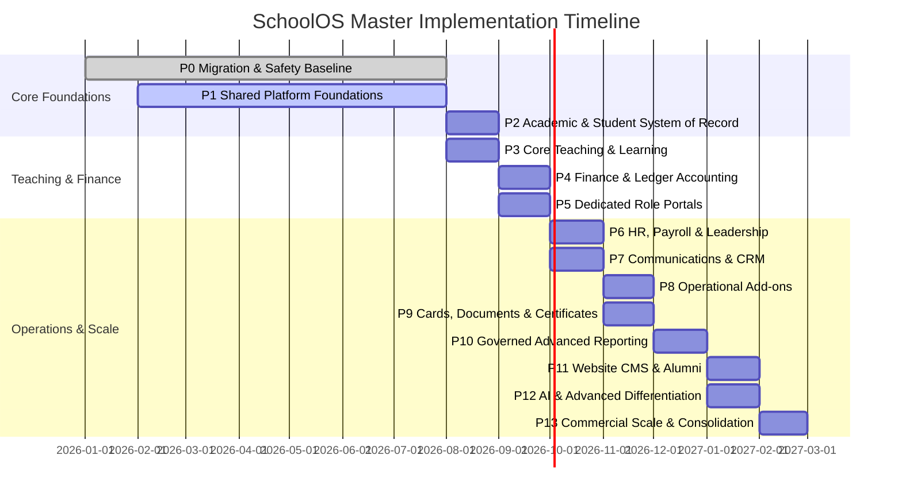

# 🚀 SchoolOS / Lango — Master Implementation Roadmap & Status Tracker

> **Last Updated**: August 2026  
> **Overall Progress**: ~42% Complete (Core Operational & Academic Engine: ~100% Complete)  
> **Active Focus**: Phase 4 Finance (GL auto-posting done) → Phase 7 CRM next

---

## 📌 Implementation Progress Summary

---

## 📊 Phase-by-Phase Master Status

| Phase | Description | Progress | Exit Gate Status | Key Accomplishments & Remaining Tasks |
|---|---|---:|---|---|
| **Phase 0** | **Migration & Safety Baseline** | 100% | 🟢 PASSED | **Done**: 43/43 Drizzle migrations live and 199/199 tests passing against PostgreSQL, including route-wide tenant isolation, security, and failed-login lockout tests. |
| **Phase 1** | **Shared Platform Foundations** | 100% | 🟢 PASSED | **Done**: Settings registry, Permissions engine, File storage, Notifications outbox, Export jobs, 2FA setup UI, entitlements UI, permissions UI, exports UI, values UI, `requireCapability()` wiring across all sensitive routes. |
| **Phase 2** | **Authoritative Academic Records** | 100% | 🟢 PASSED | **Done**: Academic structure, placement DB invariants, atomic canonical service, promotion/transfer, Guardian detail, Admission stage machine, Idempotent convert, capabilities registered. **Shipped this session**: `GET /api/students/promotions/preview` (per-student promote/retain/defer via assessment average), `POST /api/students/transfers` capacity soft-check + unpaid invoice warnings, `requireCapability` guards on transfers + promotions. |
| **Phase 3** | **Core Teaching & Learning** | 100% | 🟢 PASSED | **Done**: Attendance engine, QR scanning, Moroccan `/20` grading formula, Assignments, Online exams, Question Bank Admin UI (exam-scoped CRUD + MCQ builder, sidebar linked under Matières & Classes). |
| **Phase 4** | **Financial & Accounting Ledgers** | 80% | 🟡 IN PROGRESS | **Verified**: `0038`–`0042` live; exact money columns; atomic payment allocations; atomic journals with DB-enforced balance, period, account and immutability rules. **Shipped**: `gl-auto-post.ts` — fail-open GL posting on payments (DR Cash/CR AR), expenses (DR Expense/CR Cash), refunds (DR AR/CR Cash). All three routes return `glPosted` flag. **Remaining**: statement reconciliation, close checklist, full GL segregation tests. |
| **Phase 5** | **Primary Dedicated Role Portals** | 100% | 🟢 PASSED | **Done**: Server-controlled manifest builder, 5A Teacher Portal, 5B Student & Parent Portals, 5C Accountant Portal, 5D Receptionist Portal. |
| **Phase 6** | **Workforce Operations & HR** | 70% | 🟡 IN PROGRESS | **Done**: Full HR API suite (payroll periods, calculate, lock, payslips, leave requests, leave balances, leave categories, salary templates, assignments). UI components (`PayrollRunPanel`, `LeaveApprovalsTable`, `LeaveRequestForm`) fully wired to real APIs — confirmed this session. **Remaining**: HR dashboard page polish, payroll GL posting, self-service leave balance init. |

| **Phase 7** | **Communications & CRM** | 60% | 🟡 IN PROGRESS | **Done**: Inquiry database, Lead capture, Lead conversion, SMS logs, Announcements outbox. **Shipped this session**: `GET/POST /api/crm/inquiries` + `PATCH /api/crm/inquiries/[id]` — full CRM pipeline API; `InquiriesKanbanView` — 5-column Kanban with native drag-and-drop; `POST /api/communication/send` — broadcast dispatcher (SMS bulk + announcements); `BroadcastSendView` UI. Both pages at `/dashboard/communication/crm` + `/dashboard/communication/broadcast`. Sidebar updated. **Remaining**: CRM Pipeline Kanban, Multi-channel broadcast (Email/SMS/WhatsApp), Live Classrooms. |
| **Phase 8** | **Operational School Add-ons** | 0% | 🔴 PENDING | **Remaining**: Library, Inventory, Student Transport tracking, Hostel management, Security Guard portal. |
| **Phase 9** | **Document & Credential Suite** | 5% | 🔴 PENDING | **Done**: Shared File Attachment service. **Remaining**: ID Card generator, Admit Cards, Public QR verified Certificate engine. |
| **Phase 10** | **Governed Advanced Reporting** | 15% | 🔴 PENDING | **Done**: Dashboard summary charts. **Remaining**: Async PDF/CSV report builder catalog with row-level security. |
| **Phase 11** | **Web Presence & Alumni** | 10% | 🔴 PENDING | **Done**: SchoolOS Marketing Landing Page (`/fr`, `/en`). **Remaining**: School Website CMS, Custom Domain DNS routing, Alumni Portal. |
| **Phase 12** | **Advanced Differentiation & AI** | 0% | 🔴 PENDING | **Remaining**: Offline QR scanning kiosk, Live vehicle GPS telemetry, AI-assisted grading feedback with human review. |
| **Phase 13** | **Commercial Scale & Consolidation** | 10% | 🔴 PENDING | **Done**: Entitlements foundation core. **Remaining**: Automated SaaS subscription billing, plan metering, dunning, support overrides. |

---

## 📦 Master Release Batches

| Batch | Scope | Target Deliverable | Status |
|---|---|---|---|
| **Batch A** | **Phases 0–1** | **Safe Platform Foundation** (Settings, Permissions, Entitlements, 2FA, Shared Services) | 🟡 **Active (Milestone A)** |
| **Batch B** | **Phase 2** | **System of Record** (Student, Guardian, Teacher, Placement History) | 🟡 Hardening |
| **Batch C** | **Phase 3** | **Teaching Core** (Attendance, Homework, Exams, Grades) | ⏳ Scheduled |
| **Batch D** | **Phase 4** | **Financial Core** (Ledgers, Double-Entry, Cashier, Reconciliation) | 🟡 Foundation live; workflows pending |
| **Batch E** | **Phase 5** | **Primary Portals** (Teacher, Student, Parent, Accountant, Receptionist) | ⏳ Scheduled |
| **Batch F** | **Phase 6** | **Workforce** (HR, Payroll, Employee Portal, Leadership Dashboard) | ⏳ Scheduled |
| **Batch G** | **Phase 7** | **Engagement** (CRM Pipeline, Broadcast SMS/Email, Live Classrooms) | ⏳ Scheduled |
| **Batch H** | **Phases 8–9** | **Operations & Credentials** (Library, Transport, Hostel, Cards, Certificates) | ⏳ Scheduled |
| **Batch I** | **Phases 10–11** | **Presence & Intelligence** (Reporting Catalog, School Website CMS, Alumni) | ⏳ Scheduled |
| **Batch J** | **Phases 12–13** | **Scale & AI** (Commercial Billing, Automation, Consolidation) | ⏳ Scheduled |

---

## 🎯 Immediate Task Checklist — Milestone A

- [ ] **Task A.1**: Create Role Capabilities Matrix UI (`/dashboard/settings/permissions`)
- [ ] **Task A.2**: Create Super-Admin Entitlements Manager UI (`/dashboard/settings/entitlements`)
- [ ] **Task A.3**: Build 2FA Setup & Emergency Backup Codes UI (`/dashboard/settings/security/2fa`)
- [ ] **Task A.4**: Build Notifications Outbox & Delivery Status UI (`/dashboard/settings/notifications`)
- [ ] **Task A.5**: Build Async Export Jobs & Downloads UI (`/dashboard/settings/exports`)
- [ ] **Task A.6**: Build Key-Value Settings Registry & History Rollback UI (`/dashboard/settings/values`)
- [ ] **Task A.7**: Perform Route-by-Route `requireCapability()` Security Wiring Pass across all API routes.
