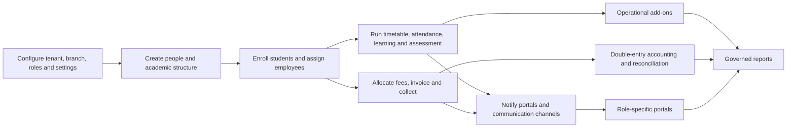

# SchoolOS Future Product Context

## Executive summary

SchoolOS is a multi-tenant, multilingual school operating system for Moroccan private K-12 schools, language centers, and higher-education institutions. It must unify admissions, people, academics, attendance, assessment, finance, communication, workforce, physical operations, documents, reporting, public websites, and SaaS administration without duplicating student, employee, money, permission, or tenant data.

The target outcome is a dependable system of record: every role sees a focused portal, every sensitive action is scoped and audited, every add-on can be licensed independently, and every official report can be traced to authoritative transactions.

## Primary users

| User | Main jobs | High-stress moments |
|---|---|---|
| Super administrator | Provision schools, plans, domains, infrastructure and support | Tenant outage, entitlement dispute, failed migration |
| School director/admin | Govern school operations and approve sensitive workflows | Enrollment season, incidents, end-of-term reporting |
| Teacher | Teach assigned classes, take attendance, publish work and grades | Start of class, grade deadline, parent meeting |
| Student | Follow schedule, work, attendance, results and balances | Exam period, overdue work, result publication |
| Parent/guardian | Monitor linked children, pay, consent and communicate | Absence alert, overdue invoice, academic concern |
| Accountant | Bill, collect, reconcile and close periods | Cash close, settlement mismatch, month/year close |
| Receptionist | Manage enquiries, visitors, appointments and safe lookup | Busy arrival time, urgent guardian request |
| HR/payroll officer | Maintain employment records, leave and payroll | Payroll approval, offboarding, compliance deadline |
| Librarian | Catalog, circulate and reconcile library stock | Overdue queue, stocktake, lost copy |
| Transport operator | Plan routes, vehicles, riders and trips | Missing rider, late vehicle, route incident |
| Hostel supervisor | Allocate beds and manage welfare and visitors | Roll call mismatch, incident, emergency leave |
| Guard/security | Verify people and movements with minimal private data | Unrecognized pickup, denied visitor, emergency |
| Leadership/auditor | Review governed indicators and exceptions | Inspection, board report, compliance review |
| Alumni | Maintain post-school relationship with consent | Data correction, event registration, certificate request |

## Core workflow

## Core objects

- Tenant, branch, academic year, term, class offering, section, subject offering and timetable version.
- User, role, capability, permission override, session, second factor and audit event.
- Student, guardian, household, relationship, application, enrollment, placement and transition.
- Employee, employment, department, designation, assignment, leave, salary structure and payroll run.
- Attendance session, register, event, excuse, flag, QR credential and device.
- Assignment, resource, submission, assessment, question, attempt, result and publication.
- Fee rule, charge, invoice, allocation, payment, refund, journal, account, period and reconciliation.
- Lead, segment, consent, template, campaign, delivery and provider connection.
- Book/title/copy/loan, inventory item/movement, route/stop/trip/rider, hostel/bed/allocation.
- Template/version, generation job, issued document, verification token and revocation.
- Report definition, parameter schema, run, snapshot, export and scheduled delivery.
- Subscription, entitlement, quota, custom domain, website page and publication.

## Feature map

### Current foundation

- Multi-tenancy, authentication, audit trail, role permissions, settings registry, add-on entitlements.
- Student/guardian/admission workflows, academic structure, scheduling, attendance, grading, homework, online-exam basics.
- Basic invoices, payments, expenses, SMS logs, announcements, files, notifications and export jobs.

### Critical next work

- Migration safety gates, authoritative placement history, finance ledgers, role portal shells, report-card truth.
- Office accounting, payment allocation/refunds/reconciliation and finance close.

### Future add-ons

- HR/payroll, library, events, live classrooms, attachments, inventory, transport, hostel.
- Cards, admit cards, certificates, advanced reporting, CMS, domains, alumni and commercial licensing.

## Page inventory structure

The complete page inventory is divided into prompt packs referenced by `SCHOOLOS_FUTURE_IMPLEMENTATION_PROMPTS.md`. Each page is classified as foundation, core, add-on or public surface and includes its required role, data, interactions, states and exclusions.

## Constraints

### Technical

- Next.js App Router, React, TypeScript, Drizzle ORM and PostgreSQL.
- Tenant and branch scope must be applied server-side; client filtering is never authorization.
- Additive migrations first; backfill, verify, cut over and only later remove legacy writes.
- Shared services for files, notifications, exports, audit, settings and document rendering.
- Provider-neutral adapters for payments, messaging and meetings.

### Security and privacy

- Deny by default, capability-driven access and object-level relationship checks.
- Encrypt and mask secrets; never place provider secrets in UI payloads.
- Minimize child, financial, HR, location and identity data.
- Require approvals for money posting, payroll, publication, revocation and bulk messaging.
- Public verification pages reveal only the minimum necessary document status.

### Performance

- Server pagination and filtering for operational lists.
- Background jobs for imports, bulk generation, exports, reconciliation and campaigns.
- Idempotency for imports, payments, webhooks, attendance scans and generation jobs.

### Design

- French, Arabic RTL and English from the same component system.
- Mobile-first teacher, parent, student, security and trip workflows.
- Desktop-optimized administration, finance, scheduling and reporting.
- No fake metrics, decorative controls or fabricated compliance claims.

## Non-goals

- No generic no-code page builder in the first CMS release.
- No blockchain credential dependency.
- No AI making final disciplinary, grading, employment or financial decisions.
- No provider-specific domain model.
- No separate copy of student or finance logic inside portals.
- No add-on bypassing the shared permission, audit, settings or entitlement systems.
