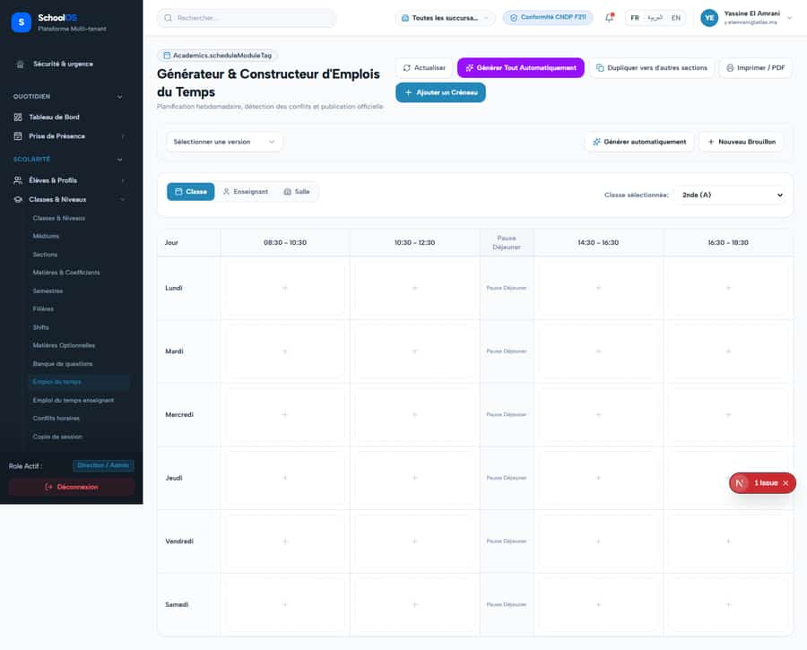
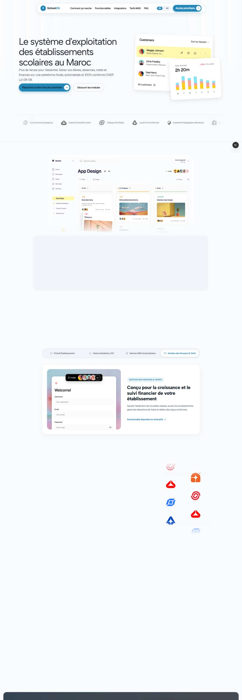

# S-12 · Timetable: duplicate generate buttons, 2-hour grid

**Severity: P2** · Source report: [2026-09-23-deep-visual-sweep.md](../../2026-09-23-deep-visual-sweep.md) · Pages affected: 1

**Code check (2026-09-23):** Not re-checked since the sweep.

## What is wrong

Two near-identical "Générer … automatiquement" buttons; grid fixed to 2-hour blocks.

## Why

Two generator entry points; fixed slot size.

## Fix

One generate button; slot size from school settings (hourly default).

## Plan

1. Remove the duplicate.
2. Read slot length from settings.

## Done when

Hourly timetable renders.

## Pages

- [`/dashboard/academics/schedule`](../pages/academics/academics__schedule.md) · NEEDS FIX (P1)

## Screenshots

`/dashboard/academics/schedule` · Pass A · school_admin

`/dashboard/academics/schedule` · Pass A · teacher

