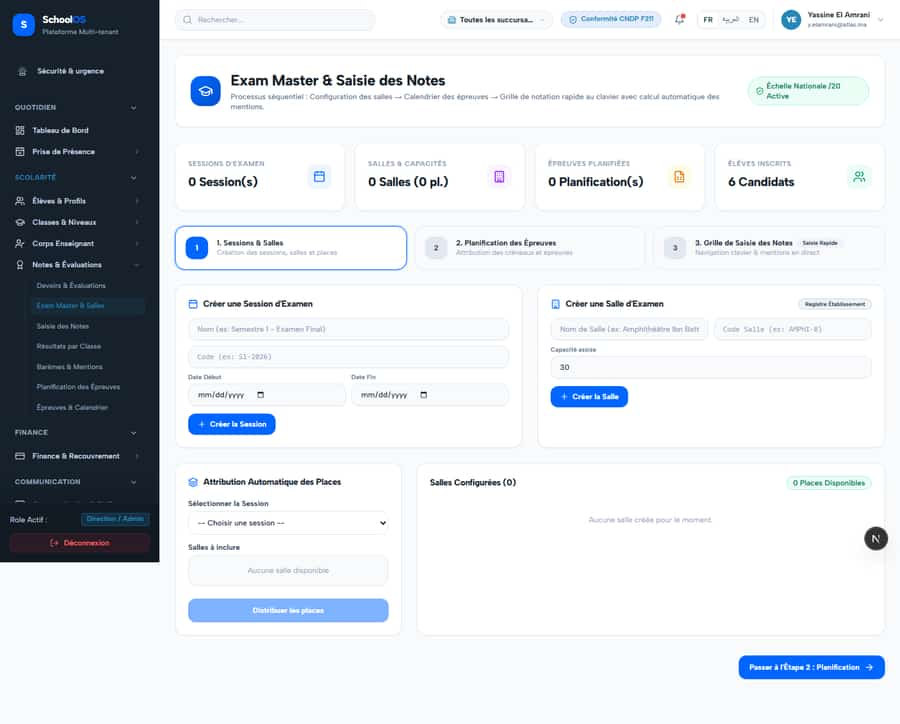

# S-13 · Exam planning exists twice

<!-- status -->
> **Status (2026-09-23): OPEN.** /academics/exams and /assessment/exam-master both still exist.
<!-- /status -->

**Severity: P2** · Source report: [2026-09-23-deep-visual-sweep.md](../../2026-09-23-deep-visual-sweep.md) · Pages affected: 2

**Code check (2026-09-23):** Not re-checked since the sweep.

## What is wrong

Exam Master & Salles vs Planification / Épreuves & Calendrier cover the same job.

## Why

Two generations of the same feature.

## Fix

Keep one, redirect the other.

## Plan

1. Decide the survivor.
2. Redirect and remove the nav entry.

## Done when

One exam planning screen.

## Pages

- [`/dashboard/academics/assessment/exam-master`](../pages/academics/academics__assessment__exam-master.md) · NEEDS FIX (P1)
- [`/dashboard/academics/exams`](../pages/academics/academics__exams.md) · NEEDS FIX (P2)

## Screenshots

`/dashboard/academics/assessment/exam-master` · Pass A · school_admin

`/dashboard/academics/exams` · Pass A · school_admin

