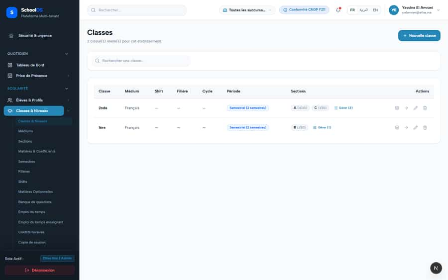

# S-17 · Classes page developer copy; Filière/Cycle empty for lycée classes

**Severity: P2** · Source report: [2026-09-23-deep-visual-sweep.md](../../2026-09-23-deep-visual-sweep.md) · Pages affected: 1

**Code check (2026-09-23):** Not re-checked since the sweep.

## What is wrong

"2 classe(s) réelle(s)"; Filière / Cycle empty.

## Why

Copy and missing join.

## Fix

Remove copy; show filière/cycle.

## Plan

1. Fix copy.
2. Join filière data.

## Done when

Lycée classes show their filière.

## Pages

- [`/dashboard/academics/classes`](../pages/academics/academics__classes.md) · NEEDS FIX (P1)

## Screenshots

`/dashboard/academics/classes` · Pass A · school_admin

`/dashboard/academics/classes` · Pass A · teacher

