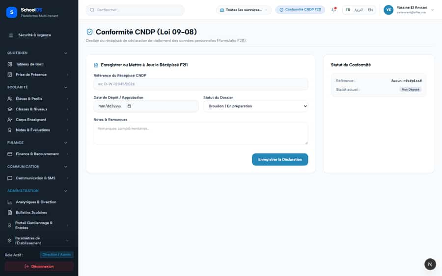

# S-18 · Header claims CNDP compliance on every page; the school has not filed

**Severity: P1** · Source report: [2026-09-23-deep-visual-sweep.md](../../2026-09-23-deep-visual-sweep.md) · Pages affected: 1 (plus cross-cutting on every page for roles: *)

**Code check (2026-09-23):** Not re-checked since the sweep.

## What is wrong

Blue badge "Conformité CNDP F211" everywhere; `/settings/cndp` says "Non Déposé".

## Why

Static text in `components/shared/header.tsx:221`.

## Fix

Show the real CNDP status (Non déposé / Déposé / Approuvé) or remove the badge. Hide it for parents and students.

## Plan

1. Read status from the CNDP registry.
2. Render the matching badge.
3. Test both states.

## Done when

Badge matches `/settings/cndp`.

## Pages

- [`/dashboard/settings/cndp`](../pages/settings/settings__cndp.md) · NEEDS FIX (P1)

## Screenshots

`/dashboard/settings/cndp` · Pass A · school_admin

