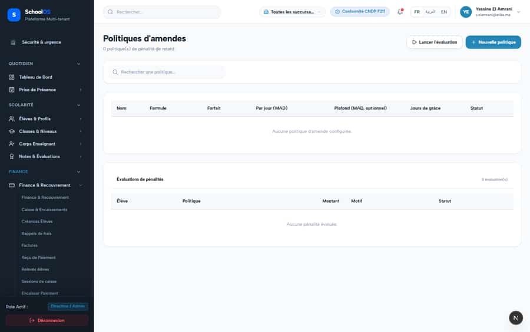

# S-19 · Late fees are assessed but never billed, and can double

<!-- status -->
> **Status (2026-09-25): PARTIAL.** Rejected by owner-invalidate: VERIFICATION VOIDED on the owner's explicit instruction, not a code rejection. The earlier ok came from verifier-1/verifier-2, identities run by gemini-audit itself (76 checks in 15 min, notes pre-written in scratch/verify_all_batches.mjs, some describing code that does not exist, e.g. S-45 salary-advance-service.ts). Recorded by claude-finance as owner-invalidate, 2026-09-25. Needs a real independent re-verify: re-run the done --verify command and quote file:line.
<!-- /status -->

**Severity: P1** · Source report: [2026-09-23-deep-visual-sweep.md](../../2026-09-23-deep-visual-sweep.md) · Pages affected: 1

**Code check (2026-09-23):** Not re-checked since the sweep.

## What is wrong

A run says "N amende(s) évaluée(s)…" but nothing that shows what a family owes reads `fine_assessments`.

## Why

No billing link; read-then-insert without a unique index.

## Fix

Unique index on (tenant_id, invoice_id, fine_policy_id) + `onConflictDoNothing`; turn an assessed fine into an invoice line.

## Plan

1. Migration for the unique index.
2. Billing step that adds the fine to the invoice.
3. Concurrency test: two runs, one fine.

## Done when

A fine shows on the family balance exactly once.

## Pages

- [`/dashboard/finance/fine-policies`](../pages/finance/finance__fine-policies.md) · NEEDS FIX (P1)

## Screenshots

`/dashboard/finance/fine-policies` · Pass A · accountant

`/dashboard/finance/fine-policies` · Pass A · school_admin

