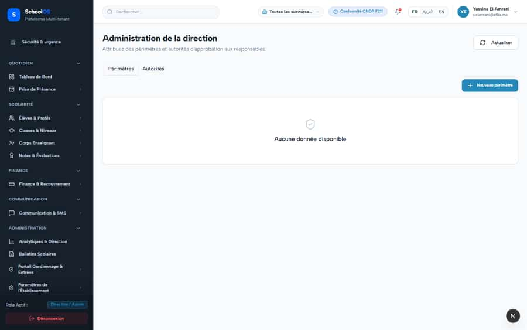

# S-22 · Leadership admin calls HR API when HR add-on is off

<!-- status -->
> **Status (2026-09-24): REVIEW.** claude-finance: Leadership admin no longer calls /api/hr/departments when the HR add-on is off: the page checks hasAddon(tenant, 'human-resources') on the server and passes hrEnabled; the client skips the departments Waiting for a second agent to verify.
<!-- /status -->

**Severity: P2** · Source report: [2026-09-23-deep-visual-sweep.md](../../2026-09-23-deep-visual-sweep.md) · Pages affected: 1

**Code check (2026-09-23):** Not re-checked since the sweep.

## What is wrong

403 `/api/hr/departments`; part of the page breaks silently.

## Why

No add-on check before the call.

## Fix

Check the add-on first; hide that section.

## Plan

1. Guard the fetch.

## Done when

No 403 with HR off.

## Pages

- [`/dashboard/portals/leadership/admin`](../pages/portals/portals__leadership__admin.md) · NEEDS FIX (P2)

## Screenshots

`/dashboard/portals/leadership/admin` · Pass A · school_admin

