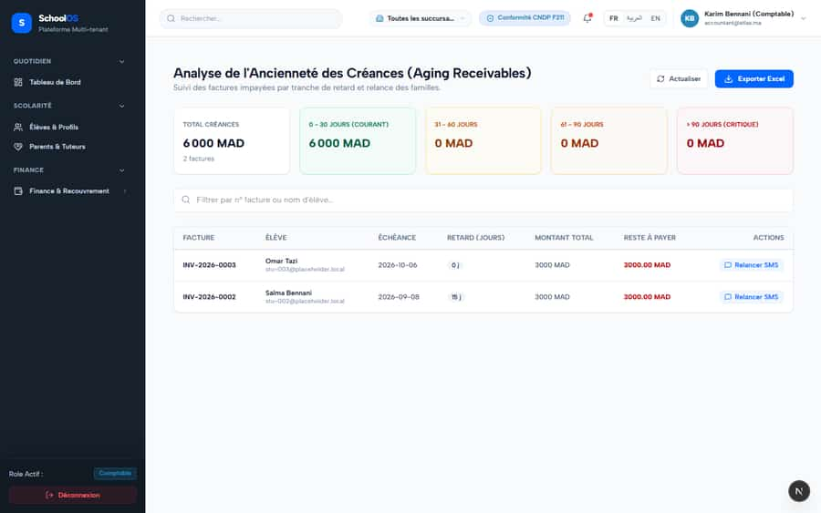
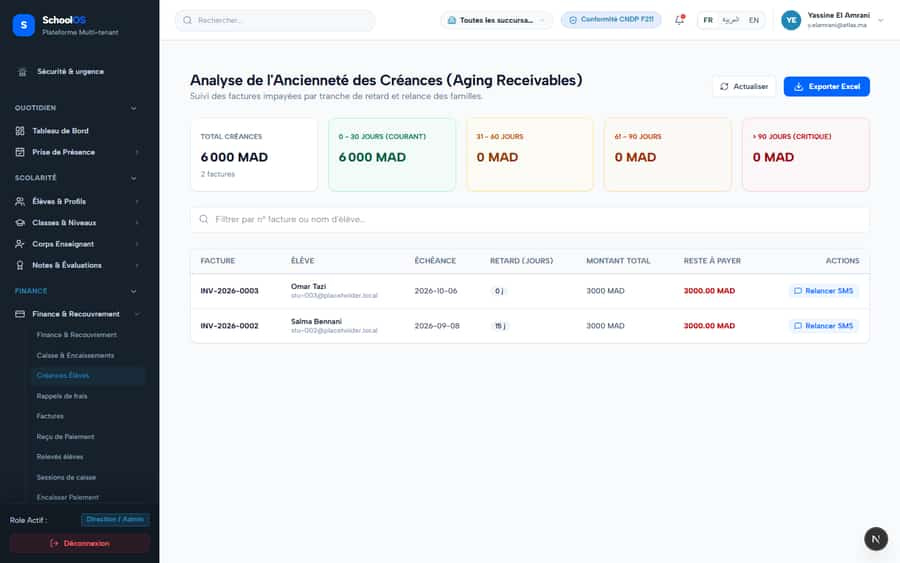

# S-28 · Receivables aging treats not-yet-due invoices as late and offers an SMS reminder

**Severity: P2** · Source report: [2026-09-23-deep-visual-sweep.md](../../2026-09-23-deep-visual-sweep.md) · Pages affected: 1

**Code check (2026-09-23):** Not re-checked since the sweep.

## What is wrong

INV-2026-0003 due 2026-10-06 in "0–30 jours" with "Relancer SMS"; placeholder emails shown.

## Why

No "not due" bucket.

## Fix

"Non échu" bucket; no reminder for not-due invoices; hide placeholder emails.

## Plan

1. Add the bucket.
2. Hide the action.
3. Test with a future due date.

## Done when

Not-due invoices cannot be reminded.

## Pages

- [`/dashboard/finance/receivables`](../pages/finance/finance__receivables.md) · NEEDS FIX (P2)

## Screenshots

`/dashboard/finance/receivables` · Pass A · accountant

`/dashboard/finance/receivables` · Pass A · school_admin

