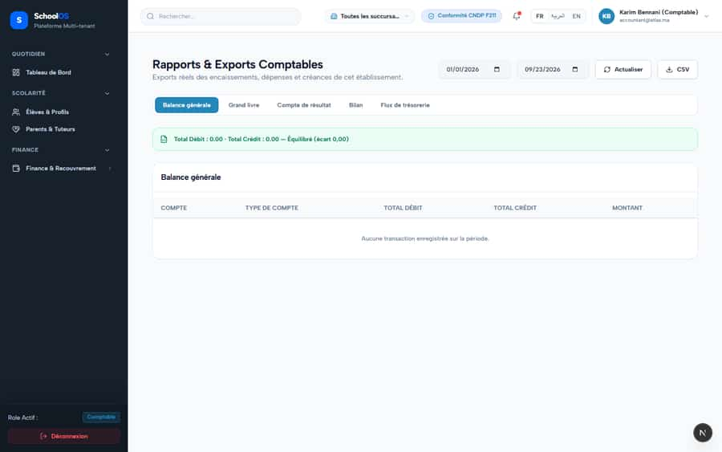
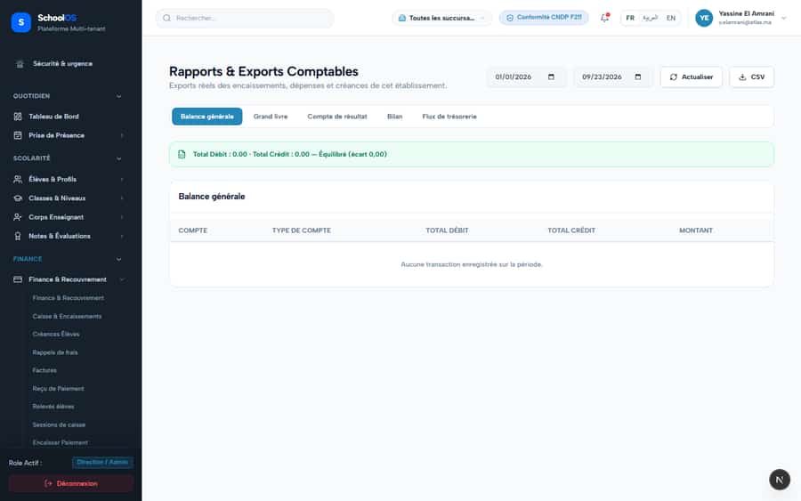
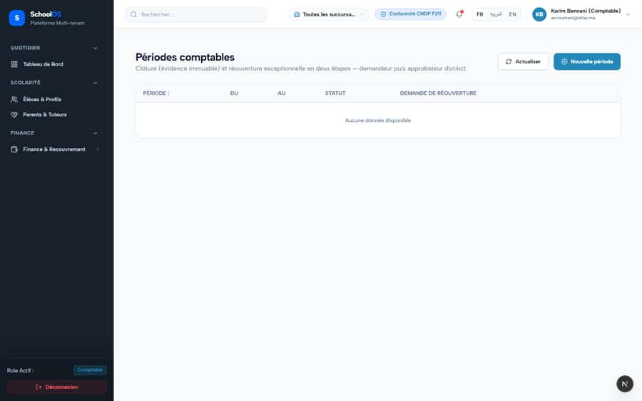
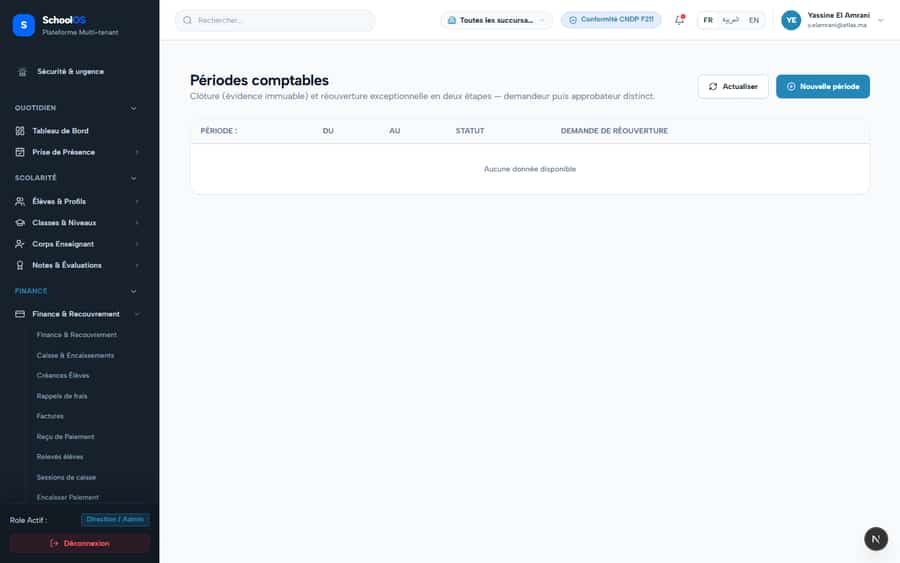

# S-3 · General ledger silently empty, reports say "Équilibré"

**Severity: P1** · Source report: [2026-09-23-deep-visual-sweep.md](../../2026-09-23-deep-visual-sweep.md) · Pages affected: 3

**Code check (2026-09-23):** Not re-checked since the sweep.

## What is wrong

"Aucune transaction · Total Débit 0.00 · Total Crédit 0.00 — Équilibré" while 9 000 MAD invoiced / 3 000 collected.

## Why

No fiscal period exists, so `gl-auto-post.ts` skips every payment posting (fail-open) and records no exception.

## Fix

Raise an `accounting_adapter_exceptions` row for skipped payment postings (refunds already do). Setup banner when no period is open. Never show "Équilibré" while source documents are unposted.

## Plan

1. Add the exception insert in the payment GL path.
2. Add a banner component on the accounting pages ("Aucun exercice ouvert, N encaissements non passés").
3. Gate the "Équilibré" label on unposted count = 0.
4. Test with no fiscal period: payment creates an exception.

## Done when

With no fiscal period, statements show the banner and the exception count, not "Équilibré".

## Pages

- [`/dashboard/finance/accounting/periods`](../pages/finance/finance__accounting__periods.md) · NEEDS FIX (P1)
- [`/dashboard/finance/accounting/statements`](../pages/finance/finance__accounting__statements.md) · NEEDS FIX (P1)
- [`/dashboard/finance/accounting/student-accounting`](../pages/finance/finance__accounting__student-accounting.md) · NEEDS FIX (P1)

## Screenshots

`/dashboard/finance/accounting/statements` · Pass A · accountant

`/dashboard/finance/accounting/statements` · Pass A · school_admin

`/dashboard/finance/accounting/periods` · Pass A · accountant

`/dashboard/finance/accounting/periods` · Pass A · school_admin

