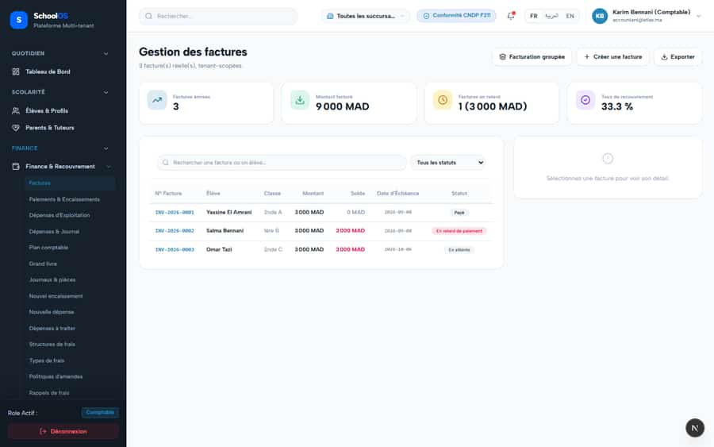
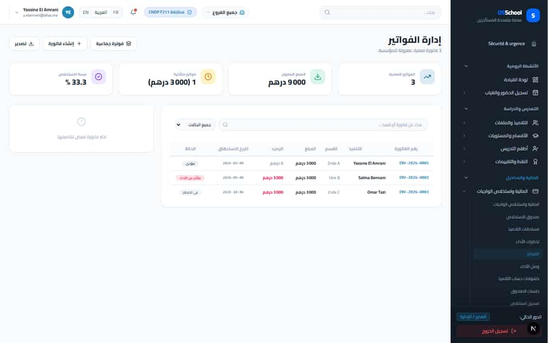
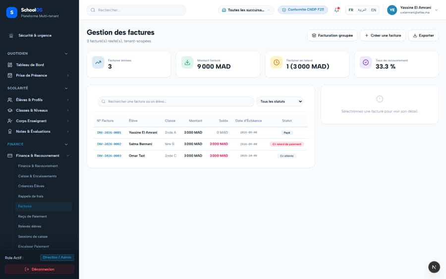
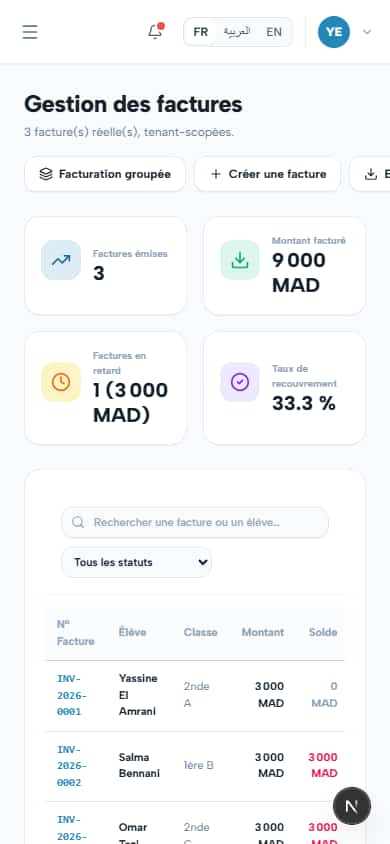

# S-31 · Developer copy on finance screens

**Severity: P2** · Source report: [2026-09-23-deep-visual-sweep.md](../../2026-09-23-deep-visual-sweep.md) · Pages affected: 4

**Code check (2026-09-23):** Not re-checked since the sweep.

## What is wrong

"3 facture(s) réelle(s), tenant-scopées", "SMS simulé via le module Finance réel"; two pages titled "Rapports & Exports Comptables".

## Why

Placeholder copy.

## Fix

User-facing wording; distinct titles.

## Plan

1. Edit copy.

## Done when

No developer wording.

## Pages

- [`/dashboard/finance/accounting/statements`](../pages/finance/finance__accounting__statements.md) · NEEDS FIX (P1)
- [`/dashboard/finance/fee-structures`](../pages/finance/finance__fee-structures.md) · NEEDS FIX (P1)
- [`/dashboard/finance/invoices`](../pages/finance/finance__invoices.md) · NEEDS FIX (P2)
- [`/dashboard/finance/reports`](../pages/finance/finance__reports.md) · NEEDS FIX (P2)

## Screenshots

`/dashboard/finance/invoices` · Pass A · accountant

`/dashboard/finance/invoices` · Pass A · school_admin

`/dashboard/finance/invoices` · Pass A · school_admin

`/dashboard/finance/invoices` · Pass A · school_admin

