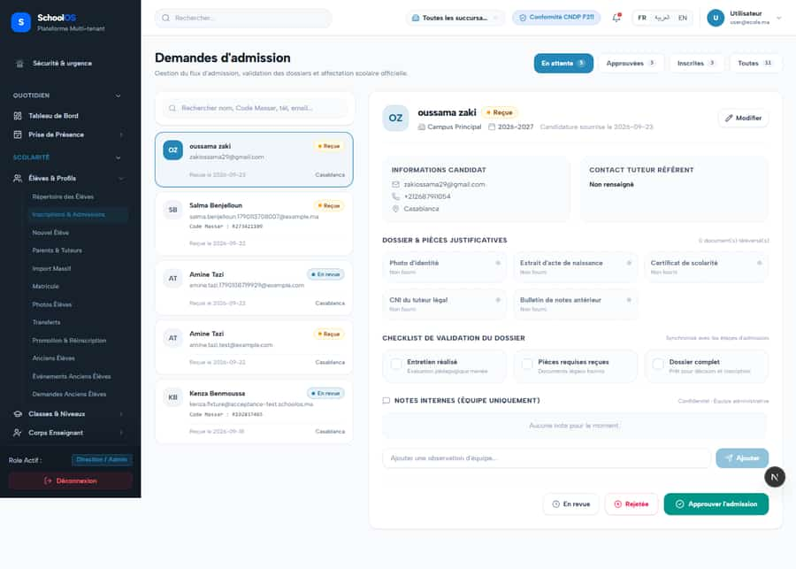
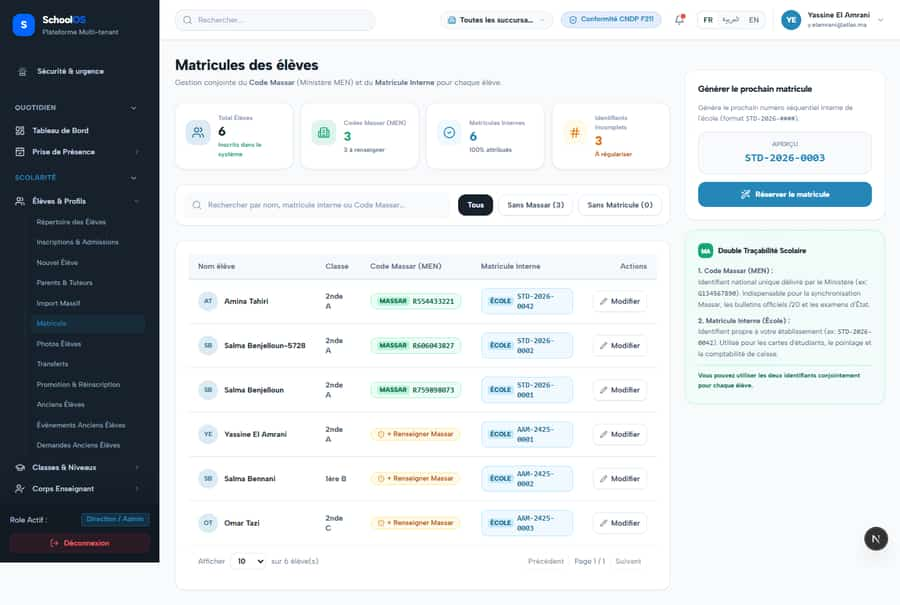
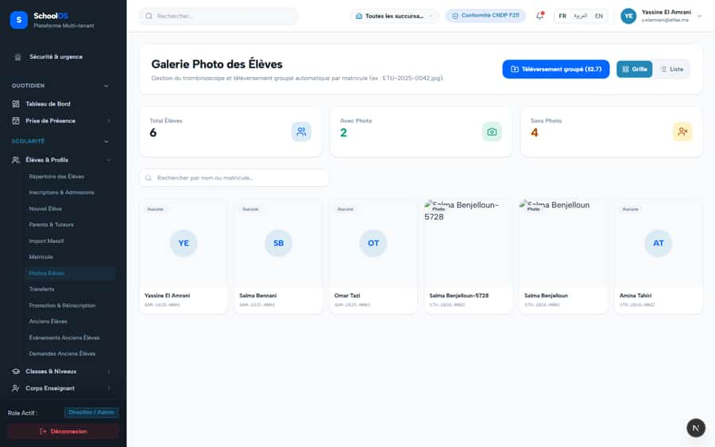

# S-32 · Sidebar links looser than their page; denied users land on the public homepage

**Severity: P1** · Source report: [2026-09-23-deep-visual-sweep.md](../../2026-09-23-deep-visual-sweep.md) · Pages affected: 91

**Code check (2026-09-23):** Not re-checked since the sweep.

## What is wrong

86 mismatches in `docs/audit/2026-09-23-nav-permission-mismatch.txt`; teacher "Emploi du temps", "Classes", "Banque de questions" bounce to `/fr`. 2 dead links.

## Why

Sidebar permission and page `requiredCapability` defined separately; `page-guard.ts` redirects to `/${locale}`.

## Fix

Derive the sidebar permission from the page guard; denial renders in-app "Accès refusé"; remove dead links; test that walks sidebar vs guards.

## Plan

1. Single permission source per route.
2. Access-denied page (now exists at `/dashboard/access-denied`, verify every guard uses it).
3. Sidebar-vs-guard unit test.

## Done when

Re-sweep teacher/accountant: 0 redirects to `/fr`.

## Pages

- [`/dashboard/academics/assessment/exam-master`](../pages/academics/academics__assessment__exam-master.md) · NEEDS FIX (P1)
- [`/dashboard/academics/assessment/homework`](../pages/academics/academics__assessment__homework.md) · NEEDS FIX (P1)
- [`/dashboard/academics/assessment/online-exams`](../pages/academics/academics__assessment__online-exams.md) · NEEDS FIX (P1)
- [`/dashboard/academics/assignments`](../pages/academics/academics__assignments.md) · NEEDS FIX (P1)
- [`/dashboard/academics/classes`](../pages/academics/academics__classes.md) · NEEDS FIX (P1)
- [`/dashboard/academics/conflicts`](../pages/academics/academics__conflicts.md) · NEEDS FIX (P1)
- [`/dashboard/academics/mediums`](../pages/academics/academics__mediums.md) · NEEDS FIX (P1)
- [`/dashboard/academics/optional-subjects`](../pages/academics/academics__optional-subjects.md) · NEEDS FIX (P1)
- [`/dashboard/academics/question-bank`](../pages/academics/academics__question-bank.md) · NEEDS FIX (P1)
- [`/dashboard/academics/readiness`](../pages/academics/academics__readiness.md) · NEEDS FIX (P1)
- [`/dashboard/academics/schedule`](../pages/academics/academics__schedule.md) · NEEDS FIX (P1)
- [`/dashboard/academics/sections`](../pages/academics/academics__sections.md) · NEEDS FIX (P1)
- [`/dashboard/academics/semesters`](../pages/academics/academics__semesters.md) · NEEDS FIX (P1)
- [`/dashboard/academics/shifts`](../pages/academics/academics__shifts.md) · NEEDS FIX (P1)
- [`/dashboard/academics/streams`](../pages/academics/academics__streams.md) · NEEDS FIX (P1)
- [`/dashboard/academics/subjects`](../pages/academics/academics__subjects.md) · NEEDS FIX (P1)
- [`/dashboard/academics/syllabus`](../pages/academics/academics__syllabus.md) · NEEDS FIX (P1)
- [`/dashboard/analytics`](../pages/analytics/analytics.md) · NEEDS FIX (P1)
- [`/dashboard/attendance/badges`](../pages/attendance/attendance__badges.md) · NEEDS FIX (P1)
- [`/dashboard/attendance/excuses`](../pages/attendance/attendance__excuses.md) · NEEDS FIX (P1)
- [`/dashboard/attendance/flags`](../pages/attendance/attendance__flags.md) · NEEDS FIX (P1)
- [`/dashboard/broadcast/automations`](../pages/broadcast/broadcast__automations.md) · NEEDS FIX (P1)
- [`/dashboard/broadcast/connections`](../pages/broadcast/broadcast__connections.md) · NEEDS FIX (P1)
- [`/dashboard/broadcast/segments`](../pages/broadcast/broadcast__segments.md) · NEEDS FIX (P1)
- [`/dashboard/broadcast/templates`](../pages/broadcast/broadcast__templates.md) · NEEDS FIX (P1)
- [`/dashboard/certificates/requests`](../pages/certificates/certificates__requests.md) · NEEDS FIX (P1)
- [`/dashboard/communication/reminders`](../pages/communication/communication__reminders.md) · NEEDS FIX (P1)
- [`/dashboard/communication/templates`](../pages/communication/communication__templates.md) · NEEDS FIX (P1)
- [`/dashboard/content/library`](../pages/content/content__library.md) · NEEDS FIX (P1)
- [`/dashboard/documents/generator`](../pages/documents/documents__generator.md) · NEEDS FIX (P1)
- [`/dashboard/finance/allocation`](../pages/finance/finance__allocation.md) · NEEDS FIX (P1)
- [`/dashboard/finance/allocations`](../pages/finance/finance__allocations.md) · NEEDS FIX (P1)
- [`/dashboard/finance/approvals`](../pages/finance/finance__approvals.md) · NEEDS FIX (P1)
- [`/dashboard/finance/collection-desk`](../pages/finance/finance__collection-desk.md) · NEEDS FIX (P1)
- [`/dashboard/finance/credit-notes`](../pages/finance/finance__credit-notes.md) · NEEDS FIX (P1)
- [`/dashboard/finance/fee-assignments`](../pages/finance/finance__fee-assignments.md) · NEEDS FIX (P1)
- [`/dashboard/finance/fee-structures`](../pages/finance/finance__fee-structures.md) · NEEDS FIX (P1)
- [`/dashboard/finance/fee-types`](../pages/finance/finance__fee-types.md) · NEEDS FIX (P1)
- [`/dashboard/finance/fine-policies`](../pages/finance/finance__fine-policies.md) · NEEDS FIX (P1)
- [`/dashboard/finance/payments/new`](../pages/finance/finance__payments__new.md) · NEEDS FIX (P1)
- [`/dashboard/finance/refunds`](../pages/finance/finance__refunds.md) · NEEDS FIX (P1)
- [`/dashboard/finance/statements`](../pages/finance/finance__statements.md) · NEEDS FIX (P1)
- [`/dashboard/homework`](../pages/homework/homework.md) · NEEDS FIX (P1)
- [`/dashboard/hostel/allocations`](../pages/hostel/hostel__allocations.md) · NEEDS FIX (P1)
- [`/dashboard/hostel/applications`](../pages/hostel/hostel__applications.md) · NEEDS FIX (P1)
- [`/dashboard/hostel/board`](../pages/hostel/hostel__board.md) · NEEDS FIX (P1)
- [`/dashboard/hostel/categories`](../pages/hostel/hostel__categories.md) · NEEDS FIX (P1)
- [`/dashboard/hostel/hostels`](../pages/hostel/hostel__hostels.md) · NEEDS FIX (P1)
- [`/dashboard/hostel/roll-call`](../pages/hostel/hostel__roll-call.md) · NEEDS FIX (P1)
- [`/dashboard/hostel/rooms`](../pages/hostel/hostel__rooms.md) · NEEDS FIX (P1)
- [`/dashboard/hostel/zones`](../pages/hostel/hostel__zones.md) · NEEDS FIX (P1)
- [`/dashboard/hr`](../pages/hr/hr.md) · NEEDS FIX (P1)
- [`/dashboard/hr/employees`](../pages/hr/hr__employees.md) · NEEDS FIX (P1)
- [`/dashboard/hr/employees/new`](../pages/hr/hr__employees__new.md) · NEEDS FIX (P1)
- [`/dashboard/hr/overview`](../pages/hr/hr__overview.md) · NEEDS FIX (P1)
- [`/dashboard/inventory/adjustments`](../pages/inventory/inventory__adjustments.md) · NEEDS FIX (P1)
- [`/dashboard/inventory/issues`](../pages/inventory/inventory__issues.md) · NEEDS FIX (P1)
- [`/dashboard/inventory/products`](../pages/inventory/inventory__products.md) · NEEDS FIX (P1)
- [`/dashboard/inventory/purchases`](../pages/inventory/inventory__purchases.md) · NEEDS FIX (P1)
- [`/dashboard/inventory/sales`](../pages/inventory/inventory__sales.md) · NEEDS FIX (P1)
- [`/dashboard/inventory/transfers`](../pages/inventory/inventory__transfers.md) · NEEDS FIX (P1)
- [`/dashboard/library/me`](../pages/library/library__me.md) · NEEDS FIX (P1)
- [`/dashboard/portals/guard/config`](../pages/portals/portals__guard__config.md) · NEEDS FIX (P1)
- [`/dashboard/portals/librarian/policies`](../pages/portals/portals__librarian__policies.md) · NEEDS FIX (P1)
- [`/dashboard/settings`](../pages/settings/settings.md) · NEEDS FIX (P1)
- [`/dashboard/settings/accounting-defaults`](../pages/settings/settings__accounting-defaults.md) · NEEDS FIX (P1)
- [`/dashboard/settings/cndp`](../pages/settings/settings__cndp.md) · NEEDS FIX (P1)
- [`/dashboard/settings/custom-fields`](../pages/settings/settings__custom-fields.md) · NEEDS FIX (P1)
- [`/dashboard/settings/drafts`](../pages/settings/settings__drafts.md) · NEEDS FIX (P1)
- [`/dashboard/settings/exports`](../pages/settings/settings__exports.md) · NEEDS FIX (P1)
- [`/dashboard/settings/jobs`](../pages/settings/settings__jobs.md) · NEEDS FIX (P1)
- [`/dashboard/settings/migration`](../pages/settings/settings__migration.md) · NEEDS FIX (P1)
- [`/dashboard/settings/notifications`](../pages/settings/settings__notifications.md) · NEEDS FIX (P1)
- [`/dashboard/settings/numbering`](../pages/settings/settings__numbering.md) · NEEDS FIX (P1)
- [`/dashboard/settings/policies`](../pages/settings/settings__policies.md) · NEEDS FIX (P1)
- [`/dashboard/settings/providers`](../pages/settings/settings__providers.md) · NEEDS FIX (P1)
- [`/dashboard/settings/scheduled-jobs`](../pages/settings/settings__scheduled-jobs.md) · NEEDS FIX (P1)
- [`/dashboard/settings/subscription`](../pages/settings/settings__subscription.md) · NEEDS FIX (P1)
- [`/dashboard/settings/translations`](../pages/settings/settings__translations.md) · NEEDS FIX (P1)
- [`/dashboard/settings/values`](../pages/settings/settings__values.md) · NEEDS FIX (P1)
- [`/dashboard/students/admissions`](../pages/students/students__admissions.md) · NEEDS FIX (P1)
- [`/dashboard/students/alumni`](../pages/students/students__alumni.md) · NEEDS FIX (P1)
- [`/dashboard/students/alumni/events`](../pages/students/students__alumni__events.md) · NEEDS FIX (P1)
- [`/dashboard/students/alumni/requests`](../pages/students/students__alumni__requests.md) · NEEDS FIX (P1)
- [`/dashboard/students/matricules`](../pages/students/students__matricules.md) · NEEDS FIX (P1)
- [`/dashboard/students/photos`](../pages/students/students__photos.md) · NEEDS FIX (P1)
- [`/dashboard/students/promotions`](../pages/students/students__promotions.md) · NEEDS FIX (P1)
- [`/dashboard/workforce/payroll/assignments`](../pages/workforce/workforce__payroll__assignments.md) · NEEDS FIX (P1)
- [`/dashboard/workforce/payroll/components`](../pages/workforce/workforce__payroll__components.md) · NEEDS FIX (P1)
- [`/dashboard/workforce/payroll/payments`](../pages/workforce/workforce__payroll__payments.md) · NEEDS FIX (P1)
- [`/dashboard/workforce/timeclock`](../pages/workforce/workforce__timeclock.md) · NEEDS FIX (P1)

Routes named in the finding that no longer exist in the app (verify they were removed on purpose): `/dashboard/academics/class-subjects`, `/dashboard/academics/class-section-teachers`

## Screenshots

`/dashboard/analytics` · Pass A · school_admin

`/dashboard/students/admissions` · Pass A · school_admin

`/dashboard/students/matricules` · Pass A · school_admin

`/dashboard/students/photos` · Pass A · school_admin

