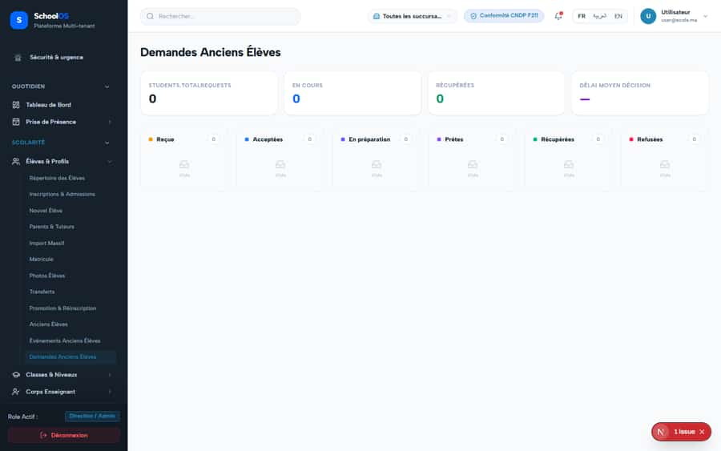

# S-33 · "{count} demandes" rendered without a value

<!-- status -->
> **Status (2026-09-23): OPEN.** alumni-requests-view still calls t('totalRequests') without count.
<!-- /status -->

**Severity: P2** · Source report: [2026-09-23-deep-visual-sweep.md](../../2026-09-23-deep-visual-sweep.md) · Pages affected: 1

**Code check (2026-09-23):** Not re-checked since the sweep.

## What is wrong

Placeholder visible.

## Why

Formatting call missing value.

## Fix

Pass `count`.

## Plan

1. Fix the call.

## Done when

Number shown.

## Pages

- [`/dashboard/students/alumni/requests`](../pages/students/students__alumni__requests.md) · NEEDS FIX (P1)

## Screenshots

`/dashboard/students/alumni/requests` · Pass A · school_admin

