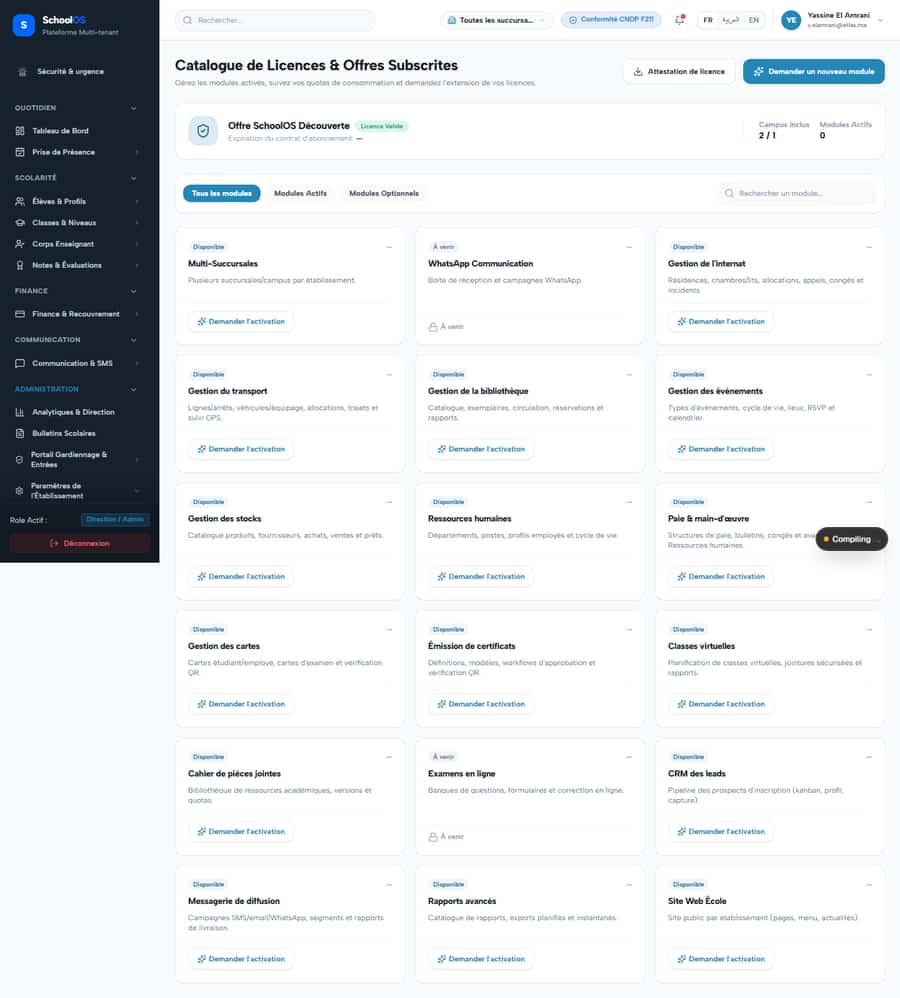
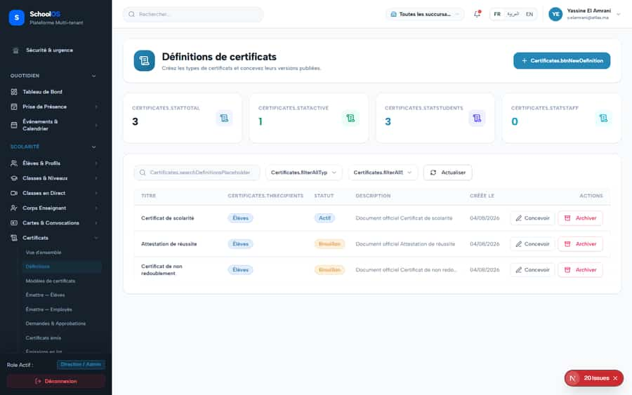
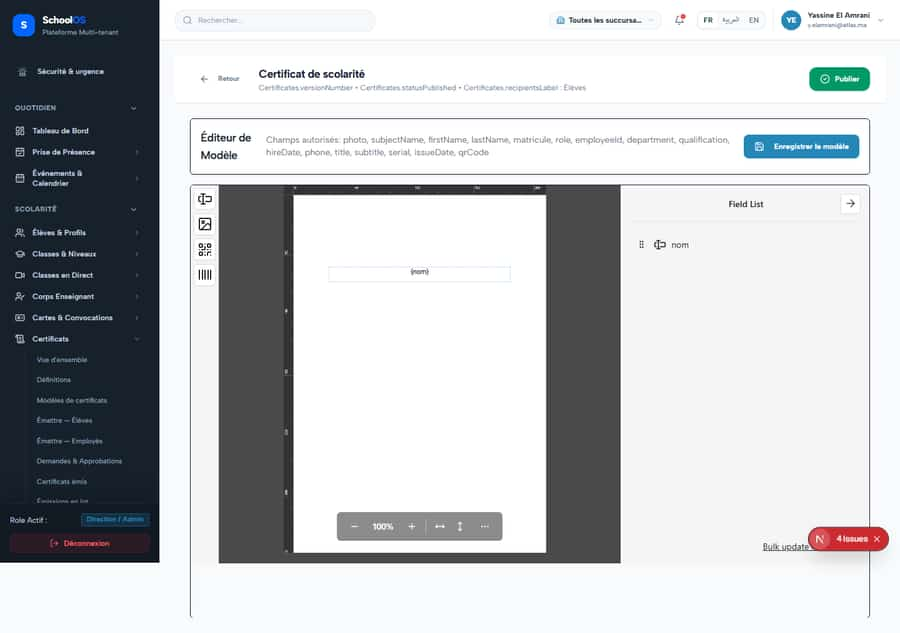

# S-42 · Certificates module untranslated; raw keys on screen

**Severity: P2** · Source report: [2026-09-23-seeded-db-role-and-addon-audit.md](../../2026-09-23-seeded-db-role-and-addon-audit.md) · Pages affected: 12

**Code check (2026-09-23):** LIKELY FIXED in the working tree: Certificates keys now exist in `locales/fr.json` (uncommitted). Confirm with a runtime sweep.

## What is wrong

Buttons read "Certificates.btnNewDefinition"; ~114 missing fr keys across 12 files.

## Why

Keys never added.

## Fix

Add all Certificates.* keys (fr/ar/en).

## Plan

1. Add keys.
2. Runtime sweep of certificates pages.

## Done when

0 MISSING_MESSAGE on certificates pages.

## Pages

- [`/dashboard/certificates`](../pages/certificates/certificates.md) · NEEDS FIX (P2)
- [`/dashboard/certificates/definitions`](../pages/certificates/certificates__definitions.md) · NEEDS FIX (P1)
- [`/dashboard/certificates/definitions/[id]`](../pages/certificates/certificates__definitions___id_.md) · NEEDS FIX (P1)
- [`/dashboard/certificates/issue/employees`](../pages/certificates/certificates__issue__employees.md) · NEEDS FIX (P1)
- [`/dashboard/certificates/issue/students`](../pages/certificates/certificates__issue__students.md) · NEEDS FIX (P1)
- [`/dashboard/certificates/issued`](../pages/certificates/certificates__issued.md) · NEEDS FIX (P1)
- [`/dashboard/certificates/issued/[id]`](../pages/certificates/certificates__issued___id_.md) · NEEDS FIX (P1)
- [`/dashboard/certificates/jobs`](../pages/certificates/certificates__jobs.md) · NEEDS FIX (P1)
- [`/dashboard/certificates/requests`](../pages/certificates/certificates__requests.md) · NEEDS FIX (P1)
- [`/dashboard/certificates/settings`](../pages/certificates/certificates__settings.md) · NEEDS FIX (P1)
- [`/dashboard/certificates/templates`](../pages/certificates/certificates__templates.md) · NEEDS FIX (P1)
- [`/dashboard/certificates/templates/[id]/edit`](../pages/certificates/certificates__templates___id___edit.md) · NEEDS FIX (P1)

## Screenshots

`/dashboard/certificates/definitions` · Pass A · school_admin

`/dashboard/certificates/definitions` · Pass B · school_admin

`/dashboard/certificates/definitions/[id]` · Pass C · school_admin

`/dashboard/certificates/definitions/[id]` · Pass C · parent

