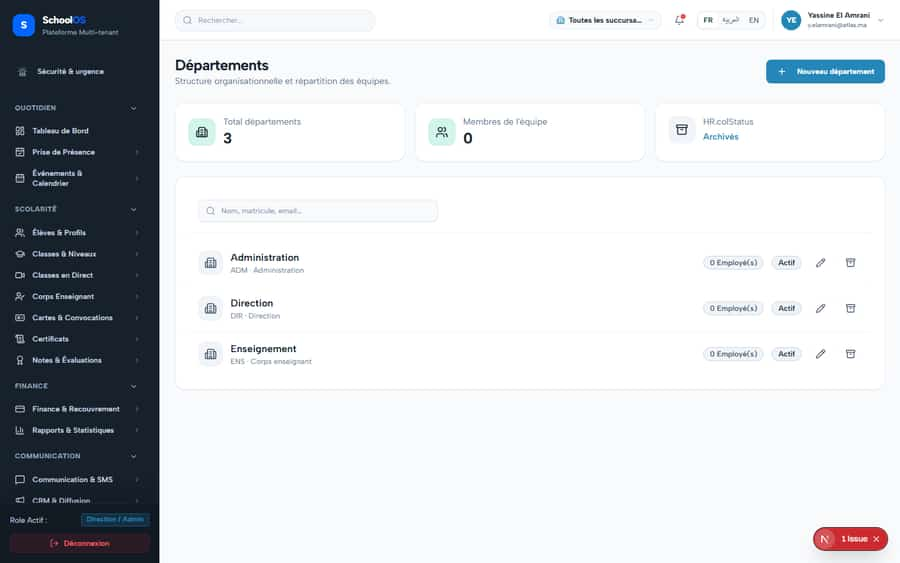

# S-43 · `HR.colStatus` missing on 3 HR pages

**Severity: P2** · Source report: [2026-09-23-seeded-db-role-and-addon-audit.md](../../2026-09-23-seeded-db-role-and-addon-audit.md) · Pages affected: 3

**Code check (2026-09-23):** LIKELY FIXED in the working tree: `HR.colStatus` / `HR.colDate` now exist in `locales/fr.json`. Confirm with a runtime sweep.

## What is wrong

Status column header blank.

## Why

Missing key.

## Fix

Add `HR.colStatus` (fr/ar/en).

## Plan

1. Add key.

## Done when

Header visible.

## Pages

- [`/dashboard/hr/departments`](../pages/hr/hr__departments.md) · NEEDS FIX (P1)
- [`/dashboard/hr/designations`](../pages/hr/hr__designations.md) · NEEDS FIX (P1)
- [`/dashboard/hr/employees`](../pages/hr/hr__employees.md) · NEEDS FIX (P1)

## Screenshots

`/dashboard/hr/departments` · Pass A · school_admin

`/dashboard/hr/departments` · Pass B · school_admin

`/dashboard/hr/designations` · Pass A · school_admin

`/dashboard/hr/designations` · Pass B · school_admin

