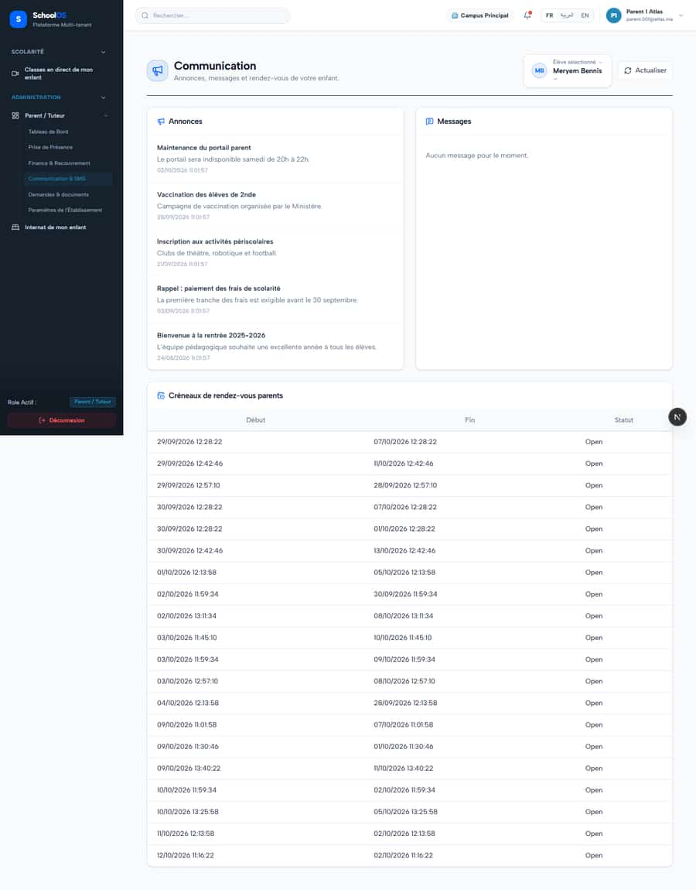
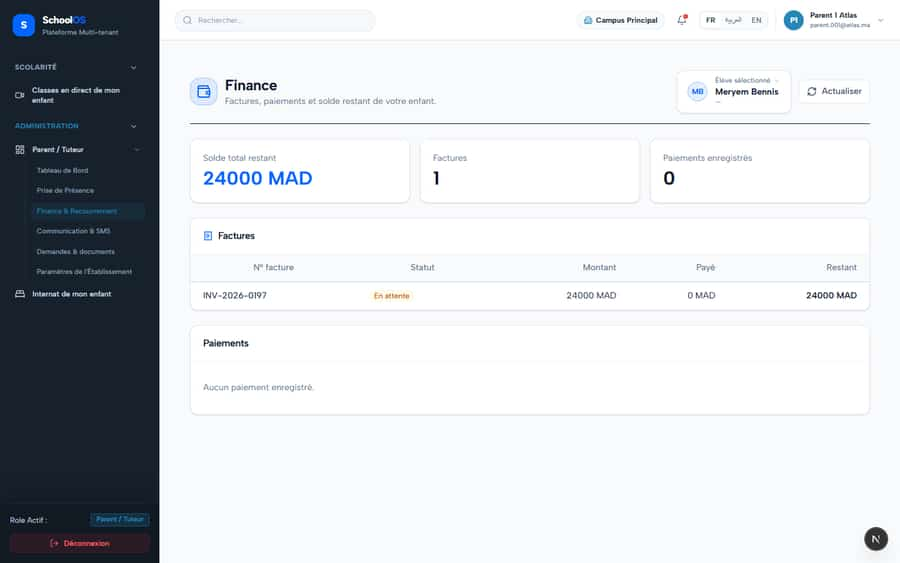
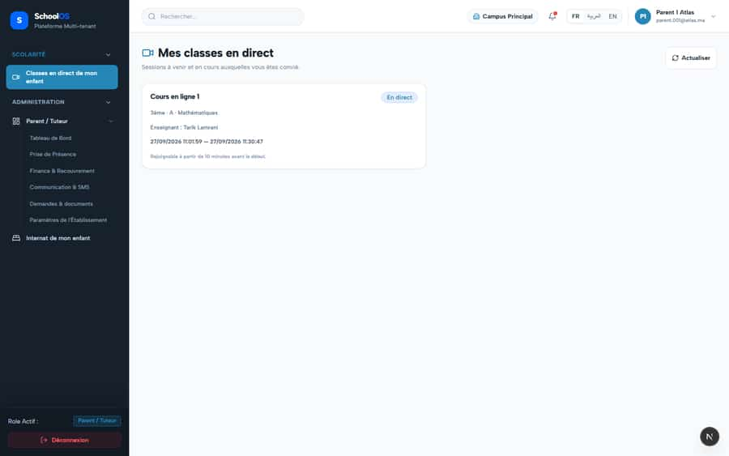

# S-45 · Parent sidebar reuses staff labels

**Severity: P2** · Source report: [2026-09-23-seeded-db-role-and-addon-audit.md](../../2026-09-23-seeded-db-role-and-addon-audit.md) · Pages affected: 7

**Code check (2026-09-23):** Not re-checked since the sweep.

## What is wrong

Section "ADMINISTRATION", "Prise de Présence", "Finance & Recouvrement", "Paramètres de l'Établissement".

## Why

Shared nav labels.

## Fix

Parent-specific labels ("Présences de mon enfant", "Paiements", "Mes paramètres").

## Plan

1. Parent nav config.

## Done when

No staff wording in the parent sidebar.

## Pages

- [`/dashboard/parent`](../pages/parent/parent.md) · NEEDS FIX (P2)
- [`/dashboard/parent/attendance`](../pages/parent/parent__attendance.md) · NEEDS FIX (P2)
- [`/dashboard/parent/communication`](../pages/parent/parent__communication.md) · NEEDS FIX (P2)
- [`/dashboard/parent/finance`](../pages/parent/parent__finance.md) · NEEDS FIX (P2)
- [`/dashboard/parent/live-classes`](../pages/parent/parent__live-classes.md) · NEEDS FIX (P2)
- [`/dashboard/parent/requests`](../pages/parent/parent__requests.md) · NEEDS FIX (P2)
- [`/dashboard/parent/settings`](../pages/parent/parent__settings.md) · NEEDS FIX (P2)

## Screenshots

`/dashboard/parent/attendance` · Pass B · parent

`/dashboard/parent/communication` · Pass B · parent

`/dashboard/parent/finance` · Pass B · parent

`/dashboard/parent/live-classes` · Pass B · parent

