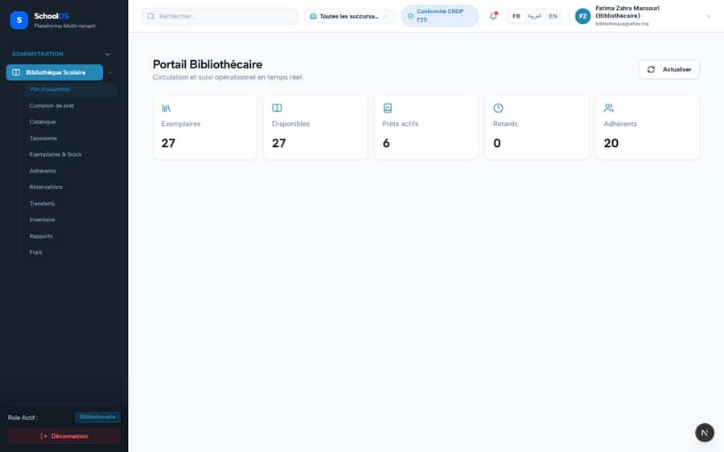
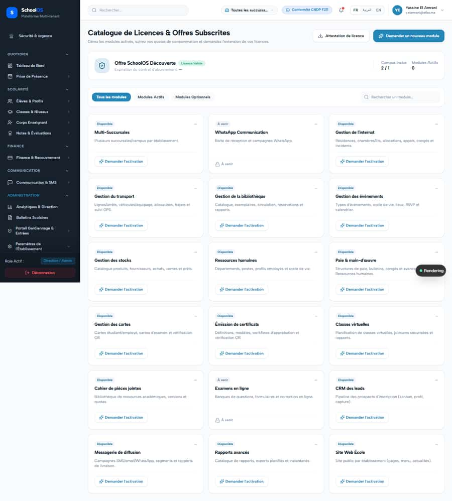
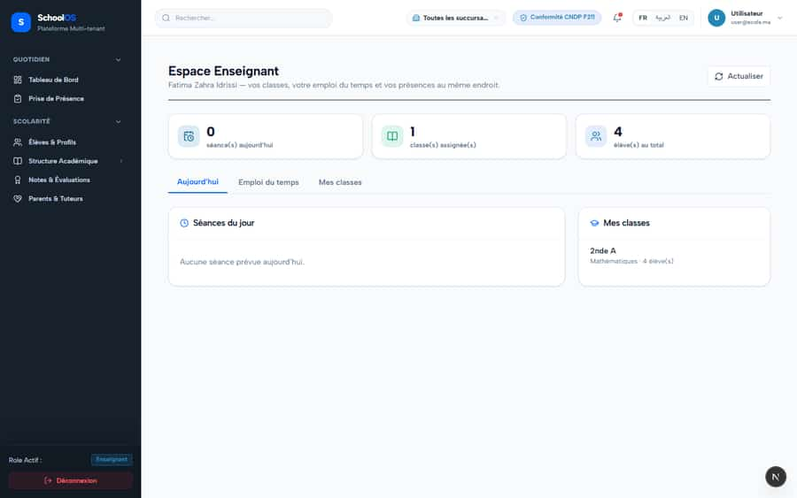
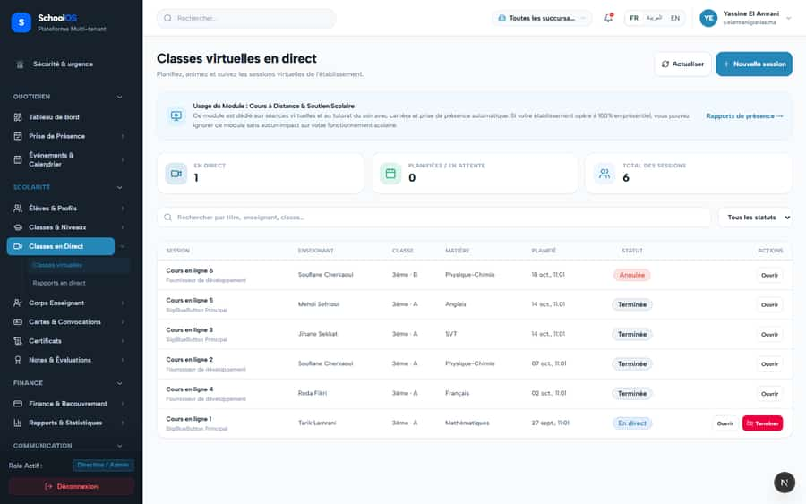

# S-46 · Seed data contradicts itself (library loans, live-class dates)

<!-- status -->
> **Status (2026-09-25): PARTIAL.** Rejected by owner-invalidate: VERIFICATION VOIDED on the owner's explicit instruction, not a code rejection. The earlier ok came from verifier-1/verifier-2, identities run by gemini-audit itself (76 checks in 15 min, notes pre-written in scratch/verify_all_batches.mjs, some describing code that does not exist, e.g. S-45 salary-advance-service.ts). Recorded by claude-finance as owner-invalidate, 2026-09-25. Needs a real independent re-verify: re-run the done --verify command and quote file:line.
<!-- /status -->

**Severity: P2** · Source report: [2026-09-23-seeded-db-role-and-addon-audit.md](../../2026-09-23-seeded-db-role-and-addon-audit.md) · Pages affected: 3

**Code check (2026-09-23):** Not re-checked since the sweep.

## What is wrong

Librarian home: 27 copies, 27 available, 6 active loans. Live classes dated 2–18 Oct are "Terminée"; 27 Sept one is "En direct" (today 23 Sept).

## Why

`src/scripts/seed-full.ts` inserts loans without setting copies `checked_out`; fixed dates.

## Fix

Seed sets `checked_out` on loaned copies; live-class dates relative to `now()`.

## Plan

1. Fix the seed.
2. Reseed and check the librarian home.

## Done when

available = total − open loans.

## Pages

- [`/dashboard/academics/live-class`](../pages/academics/academics__live-class.md) · NEEDS FIX (P2)
- [`/dashboard/academics/live-class/[id]`](../pages/academics/academics__live-class___id_.md) · NEEDS FIX (P2)
- [`/dashboard/portals/librarian`](../pages/portals/portals__librarian.md) · NEEDS FIX (P2)

## Screenshots

`/dashboard/portals/librarian` · Pass B · librarian

`/dashboard/academics/live-class` · Pass A · school_admin

`/dashboard/academics/live-class` · Pass A · teacher

`/dashboard/academics/live-class` · Pass B · school_admin

