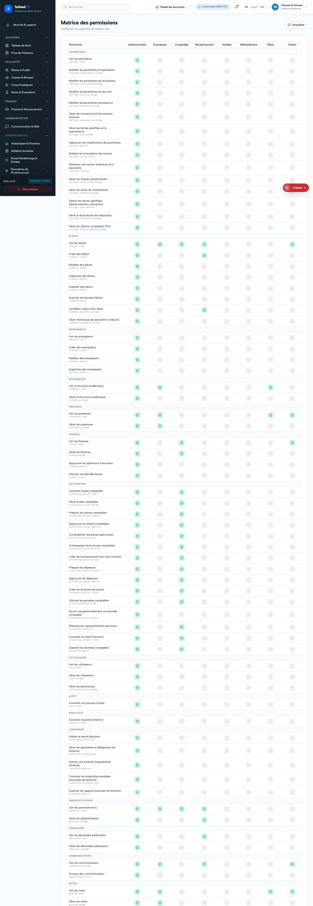

# S-50 · Transport allocations list without React keys

<!-- status -->
> **Status (2026-09-23): OPEN.** Not re-checked on screen; no fix recorded.
<!-- /status -->

**Severity: P3** · Source report: [2026-09-23-seeded-db-role-and-addon-audit.md](../../2026-09-23-seeded-db-role-and-addon-audit.md) · Pages affected: 2

**Code check (2026-09-23):** Not re-checked since the sweep.

## What is wrong

Console: "Each child in a list should have a unique key".

## Why

Missing `key`.

## Fix

Add stable keys.

## Plan

1. Add keys.

## Done when

No console warning.

## Pages

- [`/dashboard/settings/permissions`](../pages/settings/settings__permissions.md) · NEEDS FIX (P3)
- [`/dashboard/transport/allocations`](../pages/transport/transport__allocations.md) · NEEDS FIX (P3)

## Screenshots

`/dashboard/transport/allocations` · Pass A · school_admin

`/dashboard/transport/allocations` · Pass B · school_admin

`/dashboard/settings/permissions` · Pass A · school_admin

