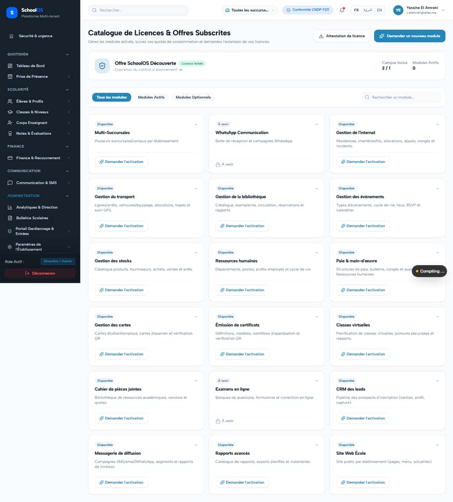
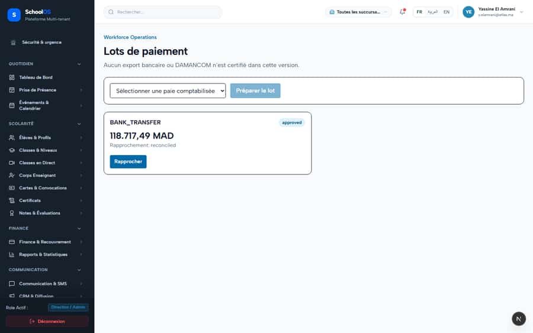
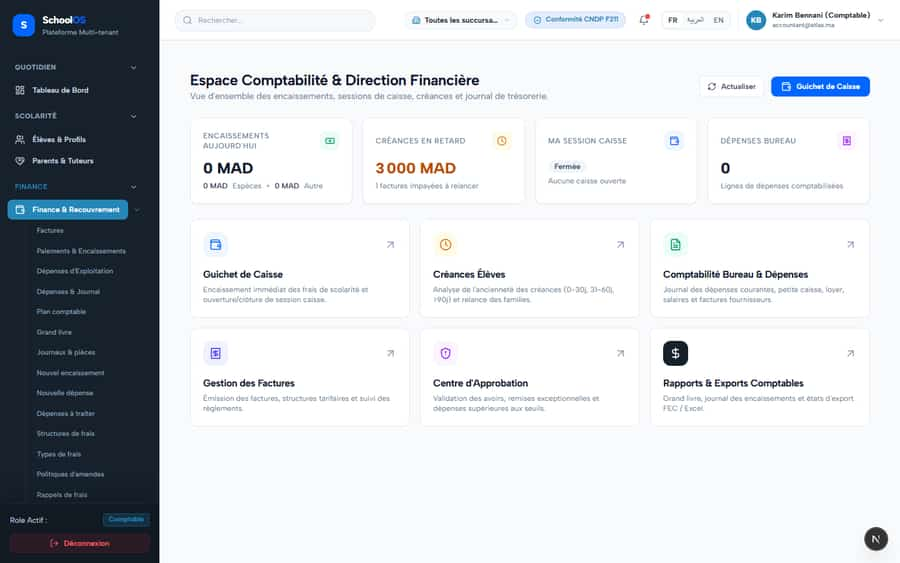

# S-53 · Salary payment batches skip the RIB check; no bank export

**Severity: P2** · Source report: [2026-09-23-seeded-db-role-and-addon-audit.md](../../2026-09-23-seeded-db-role-and-addon-audit.md) · Pages affected: 3

**Code check (2026-09-23):** STILL OPEN: payments POST has no RIB check.

## What is wrong

Teacher `prof.01` has no RIB; June run is posted; `POST /api/workforce/payroll/payments` has no bank-detail check.

## Why

Batch creation inserts every run line.

## Fix

Block or flag `bank_transfer` lines with no RIB; build the Moroccan bank transfer export or drop the claim from AGENTS.md.

## Plan

1. Validation in the POST.
2. Export format (decide with finance).
3. Test: no-RIB employee blocks or flags the batch.

## Done when

No bank batch silently includes a no-RIB employee.

## Pages

- [`/dashboard/workforce/payroll/payments`](../pages/workforce/workforce__payroll__payments.md) · NEEDS FIX (P1)
- [`/dashboard/workforce/payroll/runs`](../pages/workforce/workforce__payroll__runs.md) · NEEDS FIX (P2)
- [`/dashboard/workforce/payroll/runs/[id]`](../pages/workforce/workforce__payroll__runs___id_.md) · NEEDS FIX (P2)

## Screenshots

`/dashboard/workforce/payroll/payments` · Pass A · accountant

`/dashboard/workforce/payroll/payments` · Pass A · school_admin

`/dashboard/workforce/payroll/payments` · Pass B · school_admin

`/dashboard/workforce/payroll/runs` · Pass A · accountant

