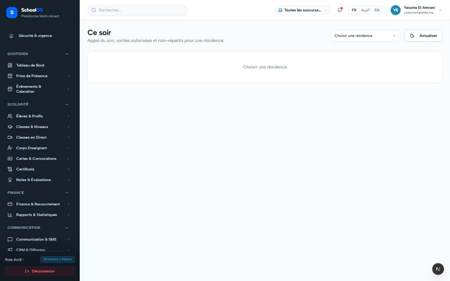
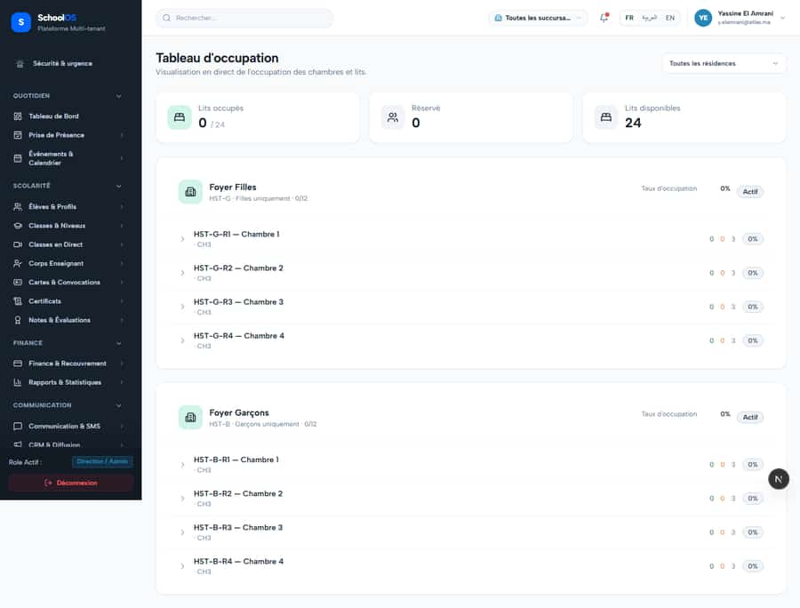

# S-54 · Expired hostel stays stay "checked_in" forever

<!-- status -->
> **Status (2026-09-24): REVIEW.** claude-finance: Expired stays no longer vanish: getTonight now also returns overdueCheckouts (checked_in allocations whose end date has passed, per hostel, with student, room/bed and end date) plus summary.overdueChe Waiting for a second agent to verify.
<!-- /status -->

**Severity: P2** · Source report: [2026-09-23-seeded-db-role-and-addon-audit.md](../../2026-09-23-seeded-db-role-and-addon-audit.md) · Pages affected: 5

**Code check (2026-09-23):** Not re-checked since the sweep.

## What is wrong

All 24 allocations ended 2026-06-30, still `checked_in`; board shows 0/24 occupied.

## Why

Board and roll call count only stays covering today; nothing detects expired stays. Seed dates too.

## Fix

Overdue-checkout list and alert; seed dates relative to `now()`.

## Plan

1. Query checked_in with end_date <= today.
2. Surface on hostel home.
3. Fix seed.

## Done when

Expired stays are listed as overdue checkout.

## Pages

- [`/dashboard/hostel`](../pages/hostel/hostel.md) · NEEDS FIX (P2)
- [`/dashboard/hostel/allocations`](../pages/hostel/hostel__allocations.md) · NEEDS FIX (P1)
- [`/dashboard/hostel/allocations/[id]`](../pages/hostel/hostel__allocations___id_.md) · NEEDS FIX (P2)
- [`/dashboard/hostel/board`](../pages/hostel/hostel__board.md) · NEEDS FIX (P1)
- [`/dashboard/hostel/roll-call`](../pages/hostel/hostel__roll-call.md) · NEEDS FIX (P1)

## Screenshots

`/dashboard/hostel` · Pass A · school_admin

`/dashboard/hostel` · Pass B · school_admin

`/dashboard/hostel/board` · Pass A · school_admin

`/dashboard/hostel/board` · Pass B · school_admin

