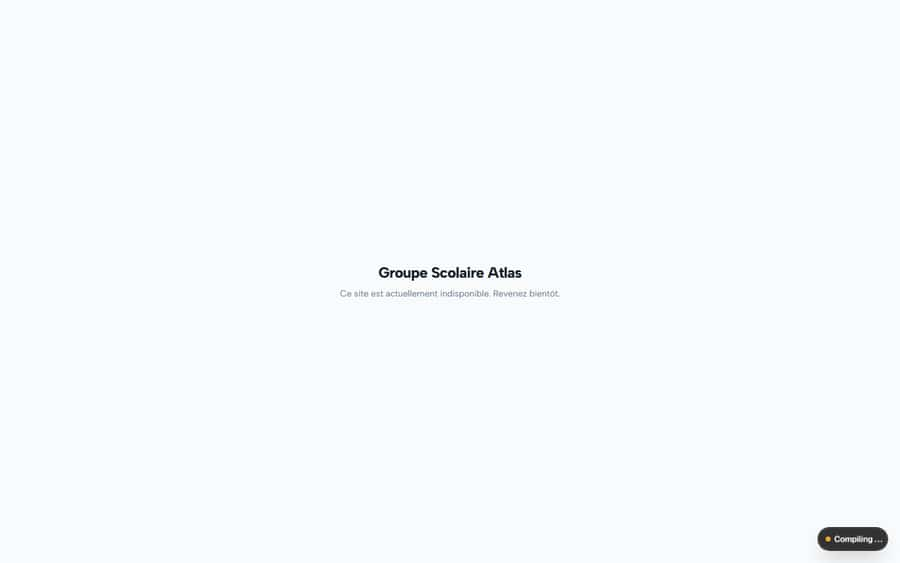
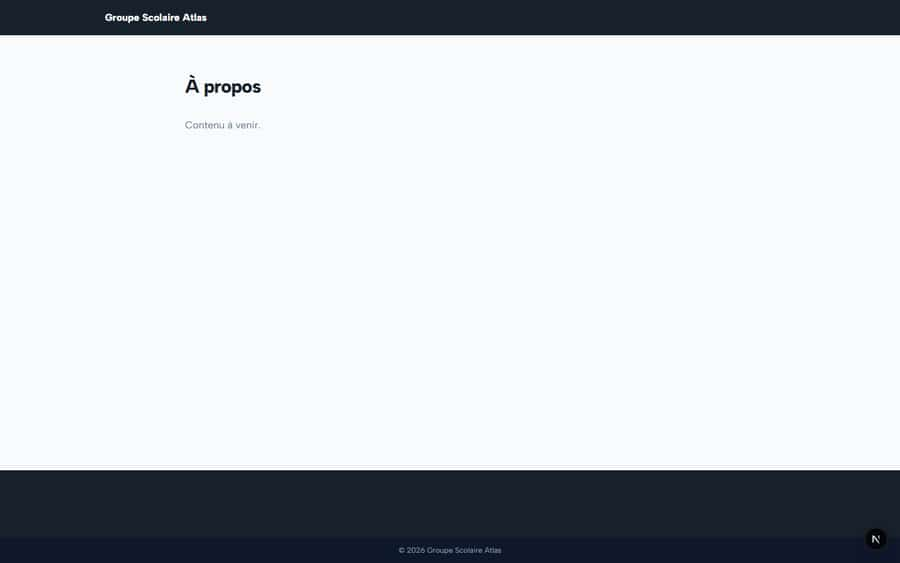
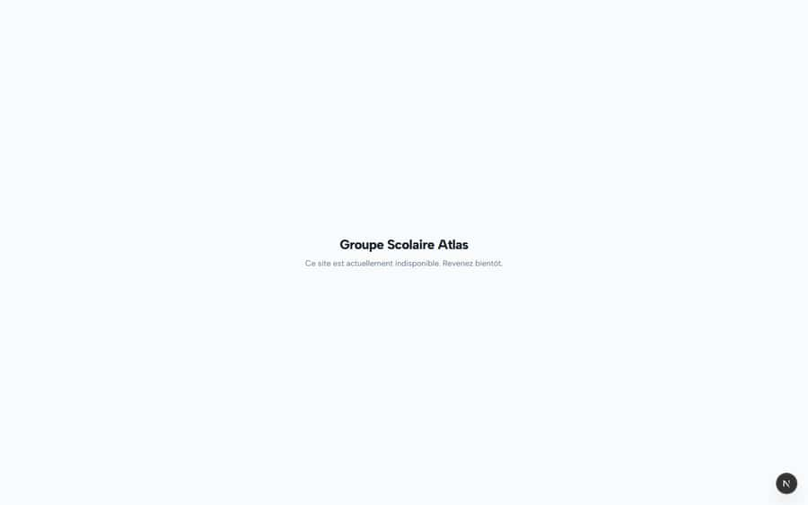
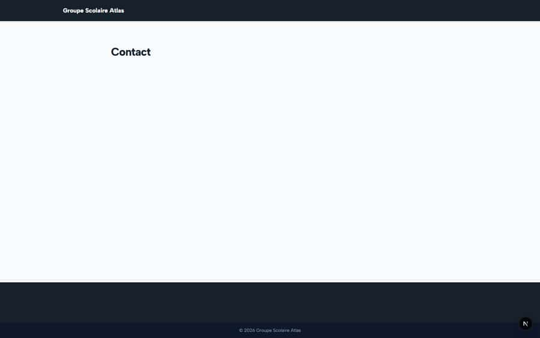

# S-55 · Public school site: no menu, home ignores news, low-contrast hero

<!-- status -->
> **Status (2026-09-25): PARTIAL.** Rejected by owner-invalidate: VERIFICATION VOIDED on the owner's explicit instruction, not a code rejection. The earlier ok came from verifier-1/verifier-2, identities run by gemini-audit itself (76 checks in 15 min, notes pre-written in scratch/verify_all_batches.mjs, some describing code that does not exist, e.g. S-45 salary-advance-service.ts). Recorded by claude-finance as owner-invalidate, 2026-09-25. Needs a real independent re-verify: re-run the done --verify command and quote file:line.
<!-- /status -->

**Severity: P3** · Source report: [2026-09-23-seeded-db-role-and-addon-audit.md](../../2026-09-23-seeded-db-role-and-addon-audit.md) · Pages affected: 9

**Code check (2026-09-23):** Not re-checked since the sweep.

## What is wrong

Header has no navigation; home does not list the published news; dark title on #2388b8.

## Why

Menu only from explicit items; home template.

## Fix

Default menu from fixed pages; latest news on home; contrast-safe hero text.

## Plan

1. Default menu fallback.
2. News block on home.
3. Contrast fix.

## Done when

Visitor can reach every page from the header.

## Pages

- [`/[tenantSlug]`](../pages/public-site/_tenantSlug_.md) · NEEDS FIX (P3)
- [`/[tenantSlug]/about`](../pages/public-site/_tenantSlug___about.md) · NEEDS FIX (P3)
- [`/[tenantSlug]/contact`](../pages/public-site/_tenantSlug___contact.md) · NEEDS FIX (P3)
- [`/[tenantSlug]/events`](../pages/public-site/_tenantSlug___events.md) · NEEDS FIX (P3)
- [`/[tenantSlug]/faq`](../pages/public-site/_tenantSlug___faq.md) · NEEDS FIX (P3)
- [`/[tenantSlug]/gallery`](../pages/public-site/_tenantSlug___gallery.md) · NEEDS FIX (P3)
- [`/[tenantSlug]/news`](../pages/public-site/_tenantSlug___news.md) · NEEDS FIX (P3)
- [`/[tenantSlug]/news/[slug]`](../pages/public-site/_tenantSlug___news___slug_.md) · NEEDS FIX (P3)
- [`/[tenantSlug]/services`](../pages/public-site/_tenantSlug___services.md) · NEEDS FIX (P3)

## Screenshots

`/[tenantSlug]/about` · Pass C · anonymous

`/[tenantSlug]/about` · Pass C · anonymous

`/[tenantSlug]/contact` · Pass C · anonymous

`/[tenantSlug]/contact` · Pass C · anonymous

