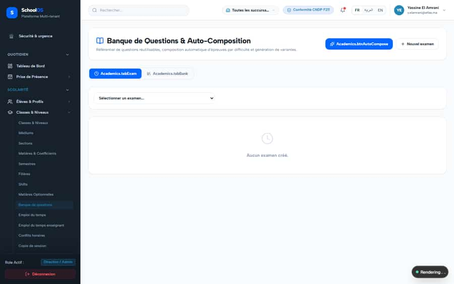
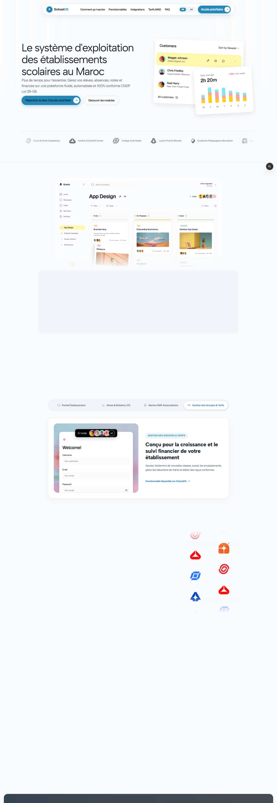
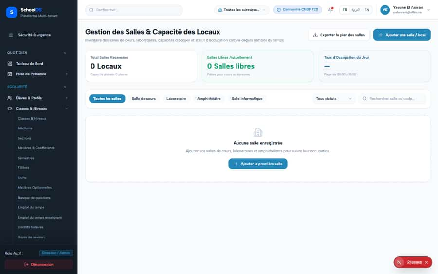

# S-6 · Translation keys used in code are missing (users see raw keys or blanks)

**Severity: P1** · Source report: [2026-09-23-deep-visual-sweep.md](../../2026-09-23-deep-visual-sweep.md) · Pages affected: 18

**Code check (2026-09-23):** LIKELY FIXED in the working tree: `check-missing-i18n-keys` now reports 3 keys (Students.uploadingId) instead of 134. Confirm with a runtime sweep.

## What is wrong

`node scripts/check-missing-i18n-keys.mjs`: 134 keys in 21 files. The runtime sweep also finds keys the checker misses (built at runtime). `/academics/rooms` renders "{capacity}" / "{type}" placeholders.

## Why

Keys added in components without adding them to `locales/fr.json` (and ar/en).

## Fix

Add every missing key in fr, ar, en; fix formatting calls that omit their values.

## Plan

1. Run the checker, add keys until it exits 0.
2. Re-run the runtime sweep on the listed pages; 0 `MISSING_MESSAGE`.
3. Add the checker to CI.

## Done when

Checker exits 0 and the runtime sweep shows no raw keys.

## Pages

- [`/dashboard/academics/question-bank`](../pages/academics/academics__question-bank.md) · NEEDS FIX (P1)
- [`/dashboard/academics/rooms`](../pages/academics/academics__rooms.md) · NEEDS FIX (P1)
- [`/dashboard/academics/schedule`](../pages/academics/academics__schedule.md) · NEEDS FIX (P1)
- [`/dashboard/certificates/definitions`](../pages/certificates/certificates__definitions.md) · NEEDS FIX (P1)
- [`/dashboard/certificates/definitions/[id]`](../pages/certificates/certificates__definitions___id_.md) · NEEDS FIX (P1)
- [`/dashboard/certificates/issue/employees`](../pages/certificates/certificates__issue__employees.md) · NEEDS FIX (P1)
- [`/dashboard/certificates/issue/students`](../pages/certificates/certificates__issue__students.md) · NEEDS FIX (P1)
- [`/dashboard/certificates/issued`](../pages/certificates/certificates__issued.md) · NEEDS FIX (P1)
- [`/dashboard/certificates/issued/[id]`](../pages/certificates/certificates__issued___id_.md) · NEEDS FIX (P1)
- [`/dashboard/certificates/jobs`](../pages/certificates/certificates__jobs.md) · NEEDS FIX (P1)
- [`/dashboard/certificates/requests`](../pages/certificates/certificates__requests.md) · NEEDS FIX (P1)
- [`/dashboard/certificates/settings`](../pages/certificates/certificates__settings.md) · NEEDS FIX (P1)
- [`/dashboard/certificates/templates`](../pages/certificates/certificates__templates.md) · NEEDS FIX (P1)
- [`/dashboard/certificates/templates/[id]/edit`](../pages/certificates/certificates__templates___id___edit.md) · NEEDS FIX (P1)
- [`/dashboard/hr/departments`](../pages/hr/hr__departments.md) · NEEDS FIX (P1)
- [`/dashboard/hr/designations`](../pages/hr/hr__designations.md) · NEEDS FIX (P1)
- [`/dashboard/hr/employees`](../pages/hr/hr__employees.md) · NEEDS FIX (P1)
- [`/dashboard/hr/employees/[id]`](../pages/hr/hr__employees___id_.md) · NEEDS FIX (P1)

## Screenshots

`/dashboard/academics/question-bank` · Pass A · school_admin

`/dashboard/academics/question-bank` · Pass A · teacher

`/dashboard/academics/rooms` · Pass A · school_admin

`/dashboard/academics/schedule` · Pass A · school_admin

