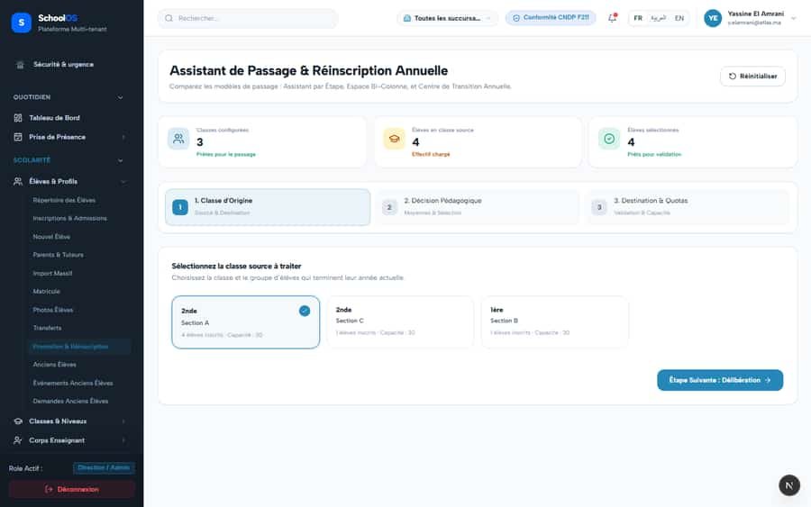

# S-9 · Promotion wizard: wrong defaults and misleading numbers

**Severity: P1** · Source report: [2026-09-23-deep-visual-sweep.md](../../2026-09-23-deep-visual-sweep.md) · Pages affected: 2

**Code check (2026-09-23):** Not re-checked since the sweep.

## What is wrong

"Effectif 4 — Élèves évalués" while all 4 are "Non évalué"; "Taux de réussite 0 %" with no marks; target session defaults to the current year; confirm enabled with 4 pending decisions.

## Why

Labels and defaults not aligned with the promotion state machine.

## Fix

Target = next year; "—" with no marks; confirm disabled while decisions are pending; correct the label.

## Plan

1. Default target to the session after the active one.
2. Guard rate and confirm button.
3. Test with 4 unevaluated students.

## Done when

Confirm is disabled until every student has a decision.

## Pages

- [`/dashboard/academics/promotions`](../pages/academics/academics__promotions.md) · NEEDS FIX (P1)
- [`/dashboard/students/promotions`](../pages/students/students__promotions.md) · NEEDS FIX (P1)

## Screenshots

`/dashboard/academics/promotions` · Pass A · school_admin

`/dashboard/students/promotions` · Pass A · school_admin

