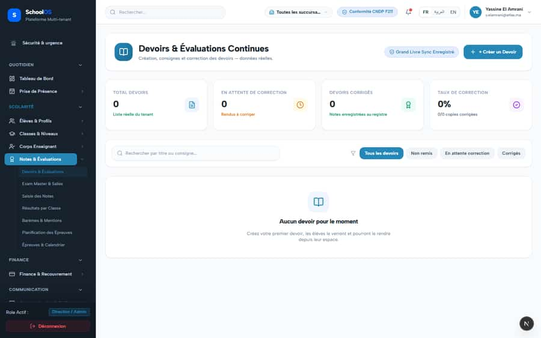
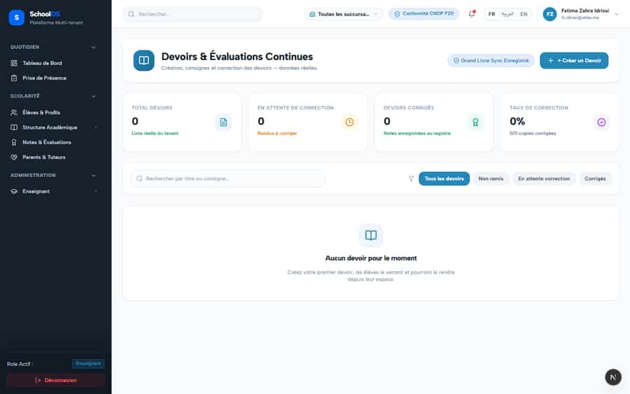
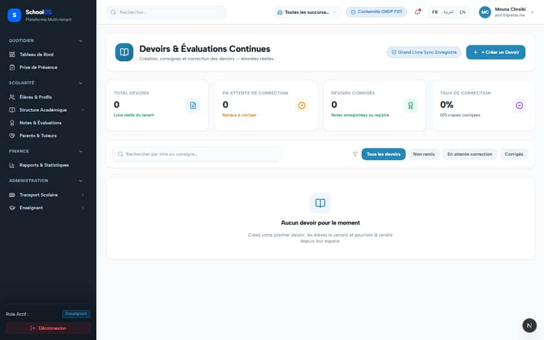

# S-10 · Homework page shows developer copy and "0 %" for 0/0

<!-- status -->
> **Status (2026-09-23): DONE.** confirmed in code by claude-auditor (not re-swept on screen): developer copy ("Liste réelle", "Grand Livre Sync", "+ +") no longer found.
<!-- /status -->

**Severity: P2** · Source report: [2026-09-23-deep-visual-sweep.md](../../../2026-09-23-deep-visual-sweep.md) · Pages affected: 2

**Code check (2026-09-23):** Not re-checked since the sweep.

## What is wrong

"Liste réelle du tenant", "données réelles", badge "Grand Livre Sync Enregistré", button "+ + Créer un Devoir", "0 %" for 0/0.

## Why

Placeholder copy left in the UI.

## Fix

Remove developer copy, fix the button label, "—" for 0/0.

## Plan

1. Edit the copy.
2. Guard the percentage.

## Done when

No developer wording on screen.

## Pages

- [`/dashboard/academics/assessment/homework`](../../pages/academics/academics__assessment__homework.md) · NEEDS FIX (P1)
- [`/dashboard/homework`](../../pages/homework/homework.md) · NEEDS FIX (P1)

## Screenshots

`/dashboard/academics/assessment/homework` · Pass A · school_admin

`/dashboard/academics/assessment/homework` · Pass A · teacher

`/dashboard/academics/assessment/homework` · Pass B · teacher

`/dashboard/homework` · Pass A · school_admin

