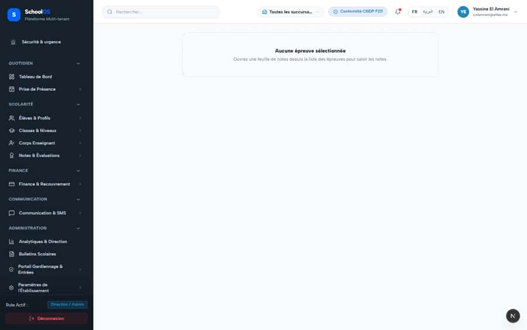
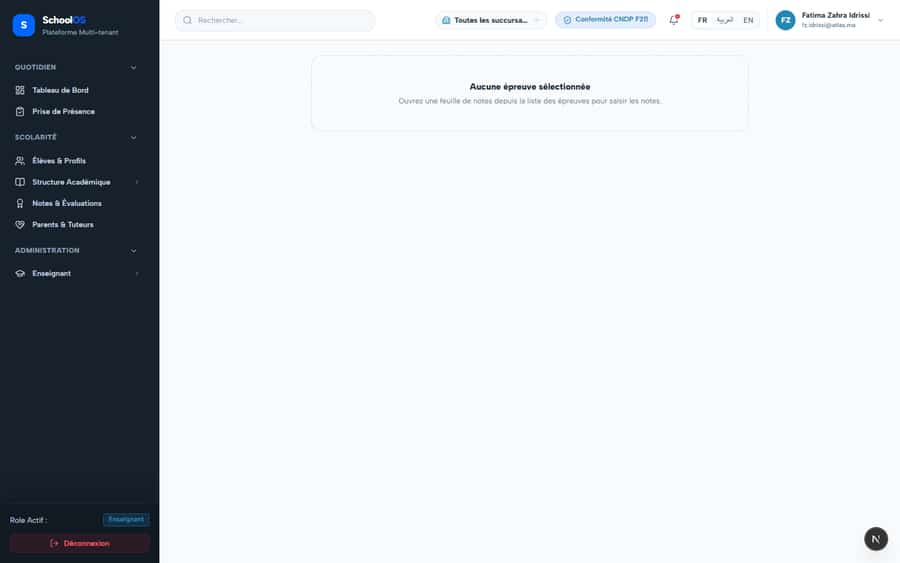
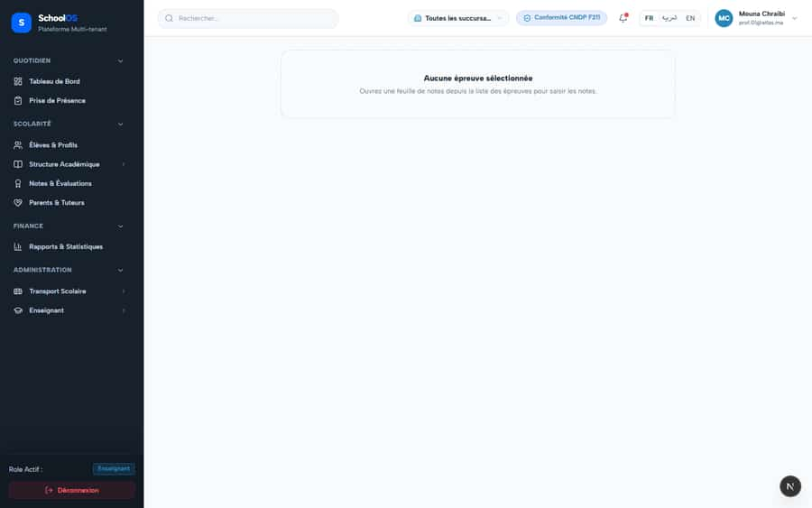

# S-11 · Marksheet and grade entry: no title or link back to the exam list

<!-- status -->
> **Status (2026-09-24): DONE.** opencode-1 fixed: Marksheet and grade-entry empty states now carry truthful titles and a translated link back to the exam list (Grading.backToExamList in fr/ar/en) pointing at /dashboard/academics/evaluations; no fabri Verified by codex-2: Independent verification on merged target f42c2bc: marksheet and grade-entry truthful empty states, translated back-to-exam-list links, and grading.manage guard pass. Read exactly at ref origin/student-directory-hardening = f42c2bc41cb2386afed52244c5355c31c8a91f96 via git show (no checkout, no edits): marksheet/page.tsx line 37 links to /dashboard/academics/evaluations and line 43 renders t(backToExamList), with requireServerPage grading.manage unchanged at line 20; grade-entry-view.tsx lines 165 and 171 link to the same evaluations route and render the same key. The key backToExamList is present once in each of locales fr.json, en.json and ar.json.
<!-- /status -->

**Severity: P2** · Source report: [2026-09-23-deep-visual-sweep.md](../../../2026-09-23-deep-visual-sweep.md) · Pages affected: 2

**Code check (2026-09-23):** Not re-checked since the sweep.

## What is wrong

Marksheet opened directly has no title; grade entry empty state names "Évaluations" with no link.

## Why

Pages assume navigation from the exam list.

## Fix

Add a title and a link to the exam list in the empty state.

## Plan

1. Add the header and empty-state link.

## Done when

Empty state links to the right page.

## Pages

- [`/dashboard/academics/assessment/marksheet`](../../pages/academics/academics__assessment__marksheet.md) · FIXED, pending re-sweep
- [`/dashboard/academics/grades/entry`](../../pages/academics/academics__grades__entry.md) · FIXED, pending re-sweep

## Screenshots

`/dashboard/academics/assessment/marksheet` · Pass A · school_admin

`/dashboard/academics/assessment/marksheet` · Pass A · teacher

`/dashboard/academics/assessment/marksheet` · Pass B · teacher

`/dashboard/academics/grades/entry` · Pass A · school_admin

