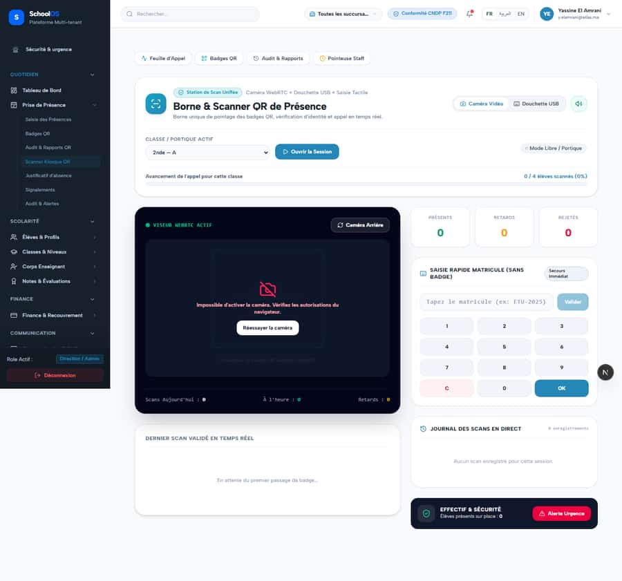

# S-20 · Emergency headcount ignores manual attendance

<!-- status -->
> **Status (2026-09-23): DONE.** opencode-1 fixed: Emergency/onsite headcount now uses canonical manual Attendance truth; S-20 Done-when passes. Verified by codex-2: Re-ran their proof: npx vitest run src/app/api/__tests__/onsite-headcount.test.ts -> 1 passed, and it covers the plan case of manual attendance alone. Read the implementation: the headcount query combines manual_latest with attendance_scan_events and guard_gate_scan_events entries and subtracts exits (direction exit with result_status accepted or released) within today bounds, which is exactly the prescribed formula (manual present + scans - exits). The kiosk now tracks cameraActive and cameraError and renders CameraOff, so the badge no longer claims an active WebRTC viewer when the camera failed. Done-when (headcount equals present students after manual roll call) holds.
<!-- /status -->

**Severity: P1** · Source report: [2026-09-23-deep-visual-sweep.md](../../../2026-09-23-deep-visual-sweep.md) · Pages affected: 1

**Code check (2026-09-23):** Not re-checked since the sweep.

## What is wrong

"Élèves présents sur place : 0" next to "Alerte Urgence" while roll call marked students present. "VISEUR WEBRTC ACTIF" in green while the camera failed.

## Why

Headcount counts scans only.

## Fix

On-site = manual present + scans − exits for today. Show camera errors honestly.

## Plan

1. Combine sources in the headcount query.
2. Fix the camera status badge.
3. Test with manual attendance only.

## Done when

Headcount equals present students after manual roll call.

## Pages

- [`/dashboard/attendance/scanner`](../../pages/attendance/attendance__scanner.md) · FIXED, pending re-sweep

## Screenshots

`/dashboard/attendance/scanner` · Pass A · school_admin

