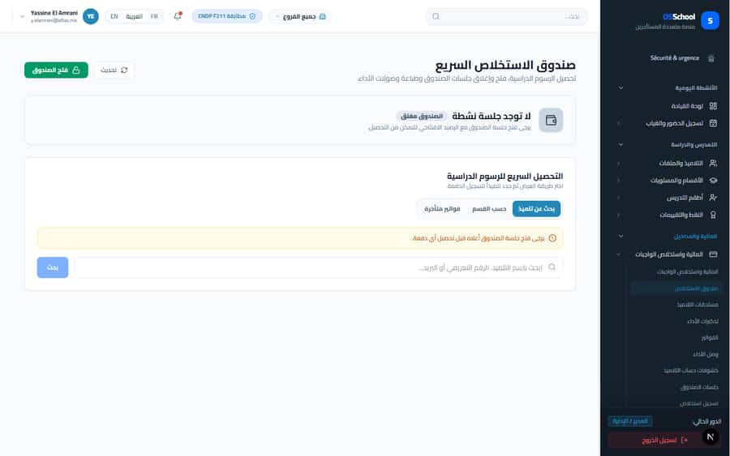

# S-35 · Accountant gets 403 on class sections and semesters on the cash desk

<!-- status -->
> **Status (2026-09-23): DONE.** claude-1 fixed; verified by a second agent in the Agent Hub (claude-auditor, code read): accountant can read class-sections and semesters; writes still academics.manage.
<!-- /status -->

**Severity: P1** · Source report: [2026-09-23-deep-visual-sweep.md](../../../2026-09-23-deep-visual-sweep.md) · Pages affected: 4

**Code check (2026-09-23):** Not re-checked since the sweep.

## What is wrong

403 `/api/academics/class-sections`, `/api/academics/semesters` as accountant.

## Why

Lookups require `academics.read`.

## Fix

Finance-scoped lookup endpoint or read projection for accountant.

## Plan

1. Add the lookup.
2. Re-sweep as accountant.

## Done when

No 403 for accountant.

## Pages

- [`/dashboard/finance/collection-desk`](../../pages/finance/finance__collection-desk.md) · NEEDS FIX (P1)
- [`/dashboard/finance/fee-structures`](../../pages/finance/finance__fee-structures.md) · NEEDS FIX (P1)
- [`/dashboard/finance/payments`](../../pages/finance/finance__payments.md) · NEEDS FIX (P2)
- [`/dashboard/finance/payments/new`](../../pages/finance/finance__payments__new.md) · NEEDS FIX (P1)

## Screenshots

`/dashboard/finance/collection-desk` · Pass A · accountant

`/dashboard/finance/collection-desk` · Pass A · school_admin

`/dashboard/finance/collection-desk` · Pass A · school_admin

`/dashboard/finance/collection-desk` · Pass A · school_admin

