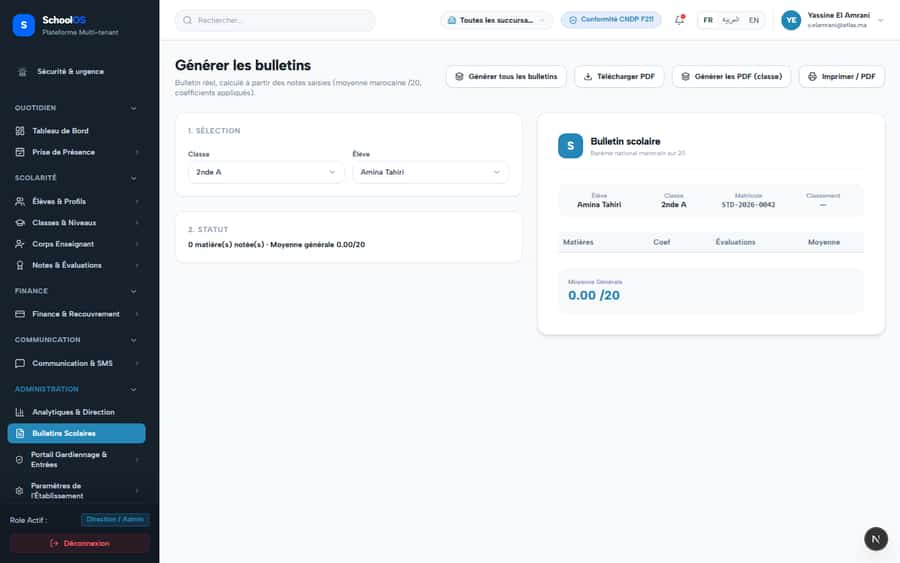
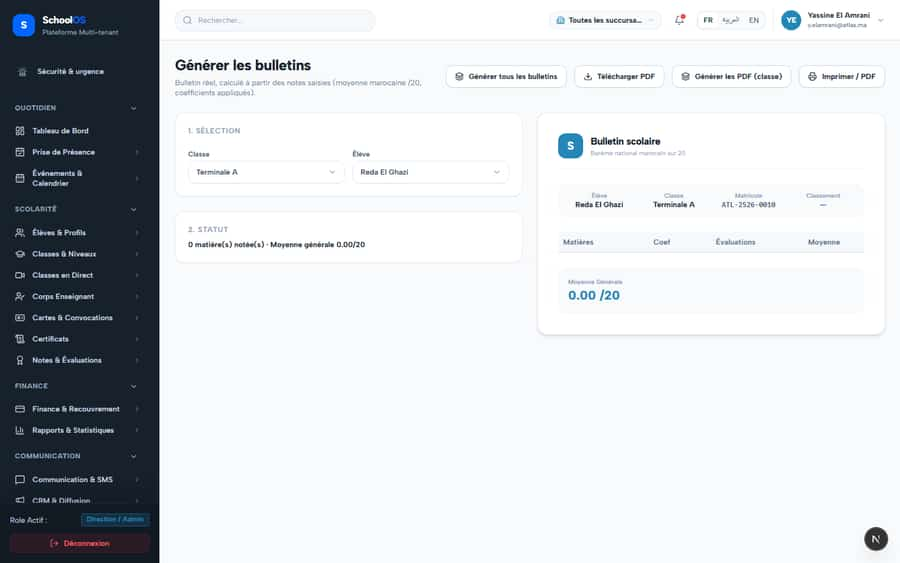

# S-5 · Report card generator: "Moyenne générale 0.00/20" with no marks, print enabled

<!-- status -->
> **Status (2026-09-23): DONE.** already fixed in tree, closed by claude-1; verified by a second agent in the Agent Hub (claude-auditor): report-card tests 6 passed, print gated on graded card, term required.
<!-- /status -->

**Severity: P1** · Source report: [2026-09-23-deep-visual-sweep.md](../../../2026-09-23-deep-visual-sweep.md) · Pages affected: 1

**Code check (2026-09-23):** Not re-checked since the sweep.

## What is wrong

"0 matière(s) notée(s) · Moyenne générale 0.00/20", PDF and print buttons active, no term selector.

## Why

Average computed over an empty set defaults to 0; the page predates term-scoped report cards.

## Fix

Show "—" and disable print/PDF when no subject is graded. Add a term selector passing `examTermId`.

## Plan

1. Guard the average and buttons on graded count > 0.
2. Add the term selector and pass `examTermId` to the API.
3. Test: a student with no marks gets "—" and disabled buttons.

## Done when

No 0.00/20 for ungraded students; the term changes the report.

## Pages

- [`/dashboard/documents/generator`](../../pages/documents/documents__generator.md) · NEEDS FIX (P1)

## Screenshots

`/dashboard/documents/generator` · Pass A · school_admin

`/dashboard/documents/generator` · Pass B · school_admin

