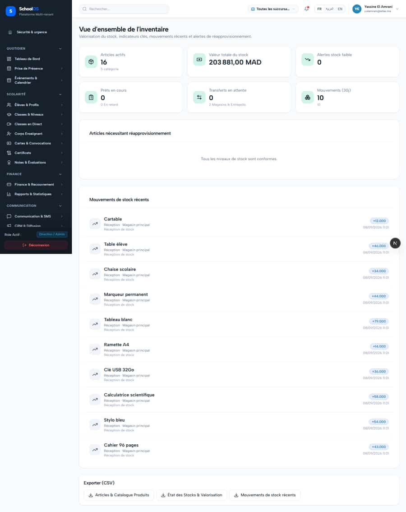
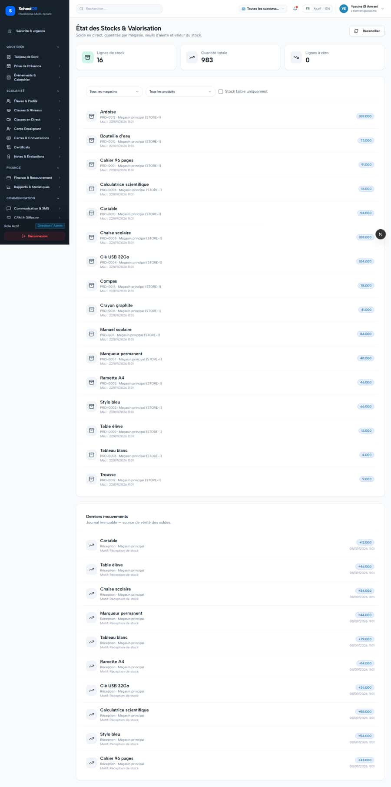

# S-56 · Inventory quantities read as thousands ("+12.000" for 12)

<!-- status -->
> **Status (2026-09-24): DONE.** claude-finance fixed: Stock quantities no longer read as thousands: new libs/format-quantity.ts (fr-FR grouping, only real decimals, max 3) used for the overview and stock movement badges, the stock balance badge and the p Verified by codex-2: Quantity formatter matches the claim: libs/format-quantity.ts uses Intl.NumberFormat fr-FR with maximumFractionDigits 3 and no forced decimals, so 12000 prints 12 000-style grouping but a plain count of 12 prints 12 rather than +12.000. Their note about the 5 catégorie plural still needing a locale key is honest and correctly left to the pending locale batch.
<!-- /status -->

**Severity: P2** · Source report: [2026-09-23-seeded-db-role-and-addon-audit.md](../../../2026-09-23-seeded-db-role-and-addon-audit.md) · Pages affected: 3

**Code check (2026-09-23):** Not re-checked since the sweep.

## What is wrong

Stock movements "+12.000"; "5 catégorie".

## Why

Raw numeric(…,3) string rendered.

## Fix

Locale-aware quantity formatting without trailing zeros; plural fix.

## Plan

1. Shared quantity formatter.
2. Apply in inventory views.

## Done when

"+12" shown.

## Pages

- [`/dashboard/inventory/overview`](../../pages/inventory/inventory__overview.md) · CONFIRMED ON SCREEN (2026-09-24 claude-finance)
- [`/dashboard/inventory/products`](../../pages/inventory/inventory__products.md) · NEEDS FIX (P1)
- [`/dashboard/inventory/stock`](../../pages/inventory/inventory__stock.md) · CONFIRMED ON SCREEN (2026-09-24 claude-finance)

## Screenshots

`/dashboard/inventory/overview` · Pass A · school_admin

`/dashboard/inventory/overview` · Pass B · school_admin

`/dashboard/inventory/stock` · Pass A · school_admin

`/dashboard/inventory/stock` · Pass B · school_admin

