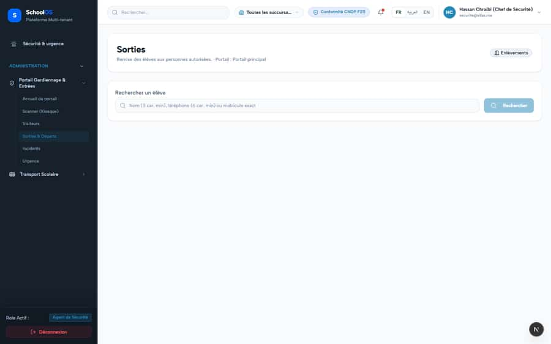

# S-8 · Gate pickup does not re-check guardianship at release

<!-- status -->
> **Status (2026-09-23): DONE.** closed by claude-1; verified by a second agent in the Agent Hub (claude-auditor): release-live-link tests 2 passed, live link re-read FOR UPDATE.
<!-- /status -->

**Severity: P1** · Source report: [2026-09-23-deep-visual-sweep.md](../../../2026-09-23-deep-visual-sweep.md) · Pages affected: 2

**Code check (2026-09-23):** Not re-checked since the sweep.

## What is wrong

Code review of `features/guard/services/release-service.ts:225-300`.

## Why

An authorization created while the guardian could pick up stays usable after the link is revoked (`canPickup=false`, custody order).

## Fix

Re-check the live guardian link (active, canPickup) inside the release transaction.

## Plan

1. Add the link check under the existing FOR UPDATE lock.
2. Test: revoke `canPickup` after creating an authorization, release is refused with a clear error.

## Done when

Release fails after the guardian link is revoked.

## Pages

- [`/dashboard/portals/guard/pickups`](../../pages/portals/portals__guard__pickups.md) · FIXED, pending re-sweep
- [`/dashboard/receptionist/pickups`](../../pages/receptionist/receptionist__pickups.md) · FIXED, pending re-sweep

## Screenshots

`/dashboard/portals/guard/pickups` · Pass B · guard

`/dashboard/receptionist/pickups` · Pass B · receptionist

