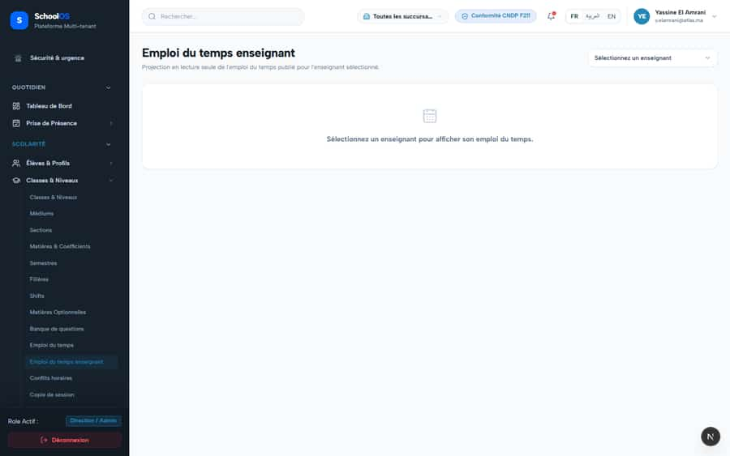

# `/dashboard/academics`

**Status: FIXED, pending re-sweep** · Module: `academics` · Source: [`src/app/[locale]/(dashboard)/dashboard/academics/page.tsx`](<../../../../../src/app/[locale]/(dashboard)/dashboard/academics/page.tsx>)

**Progress (2026-09-24):** S-16 DONE

Guard: `requireServerPage` · capability `academics.read` · redirect-only page

**Verdict:** 1 finding(s), worst P2. 1 sweep run(s): 0 clean or expected, 1 flagged. 1 screenshot(s).

## Findings on this page

| ID | Sev | Problem | Fix | Code now |
|---|---|---|---|---|
| [S-16](../../findings/done/S-16.md) | P2 | Academics index redirects the director to the teacher schedule | Land on an academics overview or classes. | Not re-checked since the sweep. |

## Sweep results

| Pass | Role | URL tested | Result |
|---|---|---|---|
| Pass A | school_admin | `/dashboard/academics` | **S-16**: → /fr/dashboard/academics/teacher-schedule |

## Screenshots

**Pass A · main DB (:3111/:3222), 2026-09-22/23** · school_admin · fr · `/dashboard/academics`

## Plan

- [ ] **S-16 (P2)** Academics index redirects the director to the teacher schedule
  - [ ] Change the redirect.
  - [ ] Accept: Director lands on an academics page.
- [ ] Re-run this page: `echo "/dashboard/academics" > r.txt && AUDIT_BASE=http://localhost:3333 node scripts/visual-sweep.mjs school_admin r.txt`

## Cross-cutting findings that also show here

- [S-7](../../findings/S-7.md) (P1) ~1 375 hardcoded French UI strings bypass translation (Arabic UI stays French)
- [S-14](../../findings/S-14.md) (P2) Sidebar lists add-on modules the tenant has not enabled
- [S-18](../../findings/done/S-18.md) (P1) Header claims CNDP compliance on every page; the school has not filed
- [S-25](../../findings/done/S-25.md) (P2) Header shows a fake identity when the session call is slow
- [S-37](../../findings/S-37.md) (P2) Arabic: dashboard widgets stay French; brand renders "OSSchool" in RTL
- [S-41](../../findings/done/S-41.md) (P1) Auth rate limit counts every page's session check, per IP
