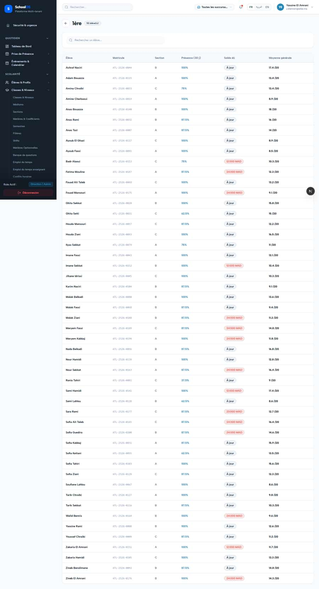
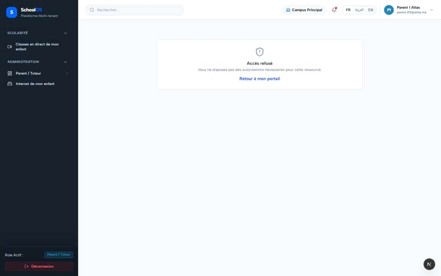

# `/dashboard/academics/classes/[id]`

**Status: PASS** · Module: `academics` · Source: [`src/app/[locale]/(dashboard)/dashboard/academics/classes/[id]/page.tsx`](<../../../../../src/app/[locale]/(dashboard)/dashboard/academics/classes/[id]/page.tsx>)

Guard: `requireServerPage` · capability `academics.read`

**Verdict:** No page-specific finding. 2 sweep run(s): 2 clean or expected, 0 flagged. 2 screenshot(s).

## Findings on this page

None specific to this page.

## Sweep results

| Pass | Role | URL tested | Result |
|---|---|---|---|
| Pass C | school_admin | `/dashboard/academics/classes/6da6042f-7a46-44cd-89f2-a511ec691c1d` | ok |
| Pass C | parent | `/dashboard/academics/classes/6da6042f-7a46-44cd-89f2-a511ec691c1d` | ok, blocked → /fr/dashboard/access-denied ok, 403 /api/settings/branches (data blocked, expected) |

## Screenshots

**Pass C · detail + public pages, 2026-09-23** · school_admin · fr · `/dashboard/academics/classes/6da6042f-7a46-44cd-89f2-a511ec691c1d`

**Pass C · parent typing staff URLs (expected: blocked)** · parent · fr · `/dashboard/academics/classes/6da6042f-7a46-44cd-89f2-a511ec691c1d`

## Plan

- No action. Keep this page in the regression sweep.

## Cross-cutting findings that also show here

- [S-7](../../findings/S-7.md) (P1) ~1 375 hardcoded French UI strings bypass translation (Arabic UI stays French)
- [S-14](../../findings/done/S-14.md) (P2) Sidebar lists add-on modules the tenant has not enabled
- [S-18](../../findings/done/S-18.md) (P1) Header claims CNDP compliance on every page; the school has not filed
- [S-25](../../findings/done/S-25.md) (P2) Header shows a fake identity when the session call is slow
- [S-37](../../findings/S-37.md) (P2) Arabic: dashboard widgets stay French; brand renders "OSSchool" in RTL
- [S-41](../../findings/done/S-41.md) (P1) Auth rate limit counts every page's session check, per IP
- [S-44](../../findings/done/S-44.md) (P2) Staff campus switcher renders for parents, students and super admin (403 on every page)
