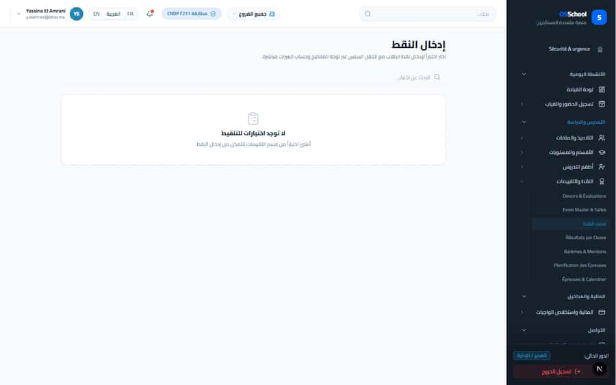
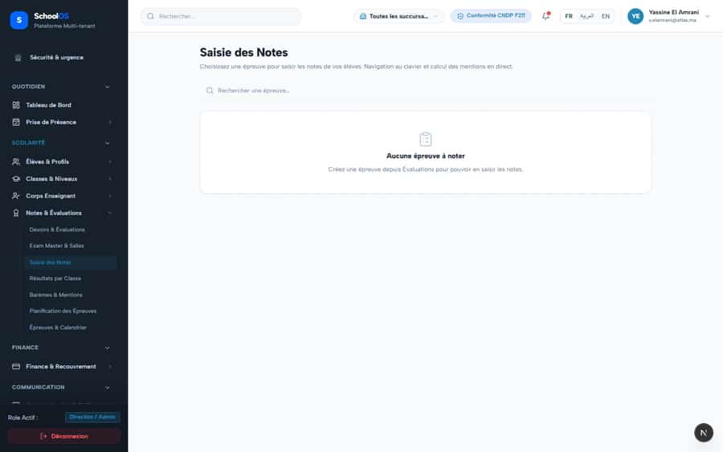
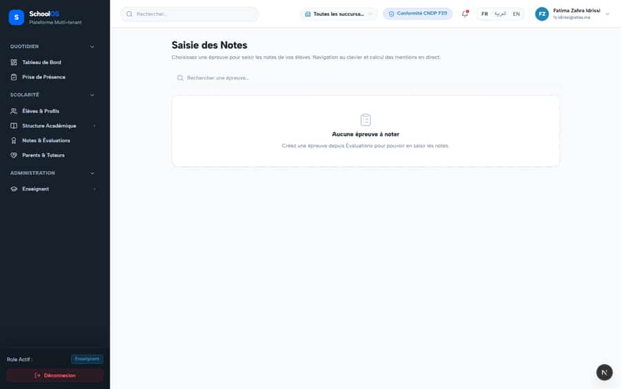
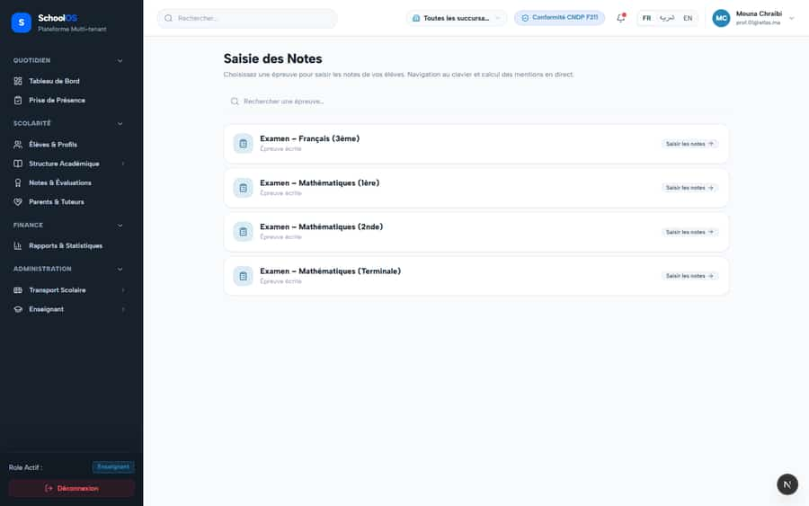

# `/dashboard/academics/grades/entry`

**Status: NEEDS FIX (P2)** · Module: `academics` · Source: [`src/app/[locale]/(dashboard)/dashboard/academics/grades/entry/page.tsx`](<../../../../../src/app/[locale]/(dashboard)/dashboard/academics/grades/entry/page.tsx>)

Guard: `requireServerPage` · capability `grading.manage`

**Verdict:** 1 finding(s), worst P2. 5 sweep run(s): 5 clean or expected, 0 flagged. 5 screenshot(s).

## Findings on this page

| ID | Sev | Problem | Fix | Code now |
|---|---|---|---|---|
| [S-11](../../findings/S-11.md) | P2 | Marksheet and grade entry: no title or link back to the exam list | Add a title and a link to the exam list in the empty state. | Not re-checked since the sweep. |

## Sweep results

| Pass | Role | URL tested | Result |
|---|---|---|---|
| Pass A | school_admin | `/dashboard/academics/grades/entry` | ok |
| Pass A | school_admin (ar) | `/dashboard/academics/grades/entry` | ok |
| Pass A | school_admin (phone) | `/dashboard/academics/grades/entry` | ok |
| Pass A | teacher | `/dashboard/academics/grades/entry` | ok |
| Pass B | teacher (prof.01) | `/dashboard/academics/grades/entry` | ok |

## Screenshots

**Pass A · main DB (:3111/:3222), 2026-09-22/23** · school_admin · ar · `/dashboard/academics/grades/entry`

**Pass A · main DB (:3111/:3222), 2026-09-22/23** · school_admin · fr · `/dashboard/academics/grades/entry`

**Pass A · main DB (:3111/:3222), 2026-09-22/23** · school_admin · fr phone · `/dashboard/academics/grades/entry`

**Pass A · main DB (:3111/:3222), 2026-09-22/23** · teacher · fr · `/dashboard/academics/grades/entry`

**Pass B · seeded audit DB, all add-ons, 2026-09-23** · teacher · fr · `/dashboard/academics/grades/entry`

## Plan

- [ ] **S-11 (P2)** Marksheet and grade entry: no title or link back to the exam list
  - [ ] Add the header and empty-state link.
  - [ ] Accept: Empty state links to the right page.
- [ ] Re-run this page: `echo "/dashboard/academics/grades/entry" > r.txt && AUDIT_BASE=http://localhost:3333 node scripts/visual-sweep.mjs school_admin r.txt`

## Cross-cutting findings that also show here

- [S-7](../../findings/S-7.md) (P1) ~1 375 hardcoded French UI strings bypass translation (Arabic UI stays French)
- [S-14](../../findings/S-14.md) (P2) Sidebar lists add-on modules the tenant has not enabled
- [S-18](../../findings/S-18.md) (P1) Header claims CNDP compliance on every page; the school has not filed
- [S-25](../../findings/S-25.md) (P2) Header shows a fake identity when the session call is slow
- [S-37](../../findings/S-37.md) (P2) Arabic: dashboard widgets stay French; brand renders "OSSchool" in RTL
- [S-41](../../findings/S-41.md) (P1) Auth rate limit counts every page's session check, per IP
