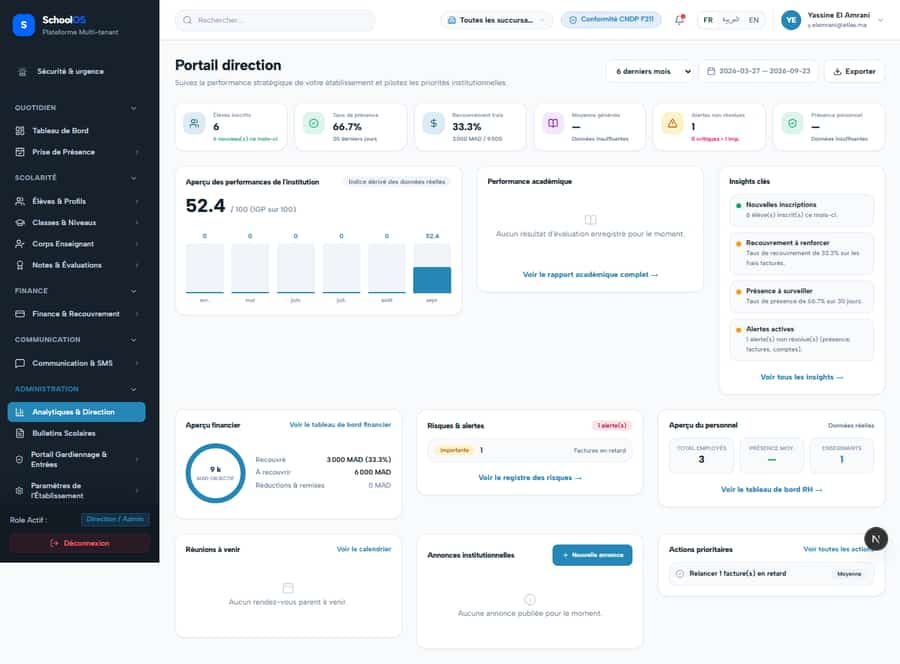

# `/dashboard/analytics`
<!-- swept: 2026-09-24 claude-finance | school_admin sweep :3466 schoolos_audit 2026-09-24: loads, no failed API, no h-scroll, no text defects -->

**Status: NEEDS FIX (P1)** · Module: `analytics` · Source: [`src/app/[locale]/(dashboard)/dashboard/analytics/page.tsx`](<../../../../../src/app/[locale]/(dashboard)/dashboard/analytics/page.tsx>)

**Progress (2026-09-25):** S-32 PARTIAL · S-15 PARTIAL

Guard: `requireServerPage` · capability `analytics.read`

**Verdict:** 2 finding(s), worst P1. 1 sweep run(s): 1 clean or expected, 0 flagged. 1 screenshot(s).

## Findings on this page

| ID | Sev | Problem | Fix | Code now |
|---|---|---|---|---|
| [S-32](../../findings/S-32.md) | P1 | Sidebar links looser than their page; denied users land on the public homepage | Derive the sidebar permission from the page guard; denial renders in-app "Accès refusé"; remove dead links; test that walks sidebar vs guards. | Not re-checked since the sweep. |
| [S-15](../../findings/S-15.md) | P2 | Two director dashboards with overlapping KPIs; IGP unexplained | Merge or clearly separate; explain IGP on screen; rename "Objectif". | Not re-checked since the sweep. |

## Sweep results

| Pass | Role | URL tested | Result |
|---|---|---|---|
| Pass A | school_admin | `/dashboard/analytics` | ok |

## Screenshots

**Pass A · main DB (:3111/:3222), 2026-09-22/23** · school_admin · fr · `/dashboard/analytics`

## Plan

- [ ] **S-32 (P1)** Sidebar links looser than their page; denied users land on the public homepage
  - [ ] Single permission source per route.
  - [ ] Access-denied page (now exists at `/dashboard/access-denied`, verify every guard uses it).
  - [ ] Sidebar-vs-guard unit test.
  - [ ] Accept: Re-sweep teacher/accountant: 0 redirects to `/fr`.
- [ ] **S-15 (P2)** Two director dashboards with overlapping KPIs; IGP unexplained
  - [ ] Pick one home dashboard.
  - [ ] Add an IGP tooltip with weights.
  - [ ] Accept: Each KPI appears once with a clear definition.
- [ ] Re-run this page: `echo "/dashboard/analytics" > r.txt && AUDIT_BASE=http://localhost:3333 node scripts/visual-sweep.mjs school_admin r.txt`

## Cross-cutting findings that also show here

- [S-7](../../findings/S-7.md) (P1) ~1 375 hardcoded French UI strings bypass translation (Arabic UI stays French)
- [S-14](../../findings/done/S-14.md) (P2) Sidebar lists add-on modules the tenant has not enabled
- [S-18](../../findings/done/S-18.md) (P1) Header claims CNDP compliance on every page; the school has not filed
- [S-25](../../findings/done/S-25.md) (P2) Header shows a fake identity when the session call is slow
- [S-37](../../findings/S-37.md) (P2) Arabic: dashboard widgets stay French; brand renders "OSSchool" in RTL
- [S-41](../../findings/done/S-41.md) (P1) Auth rate limit counts every page's session check, per IP
