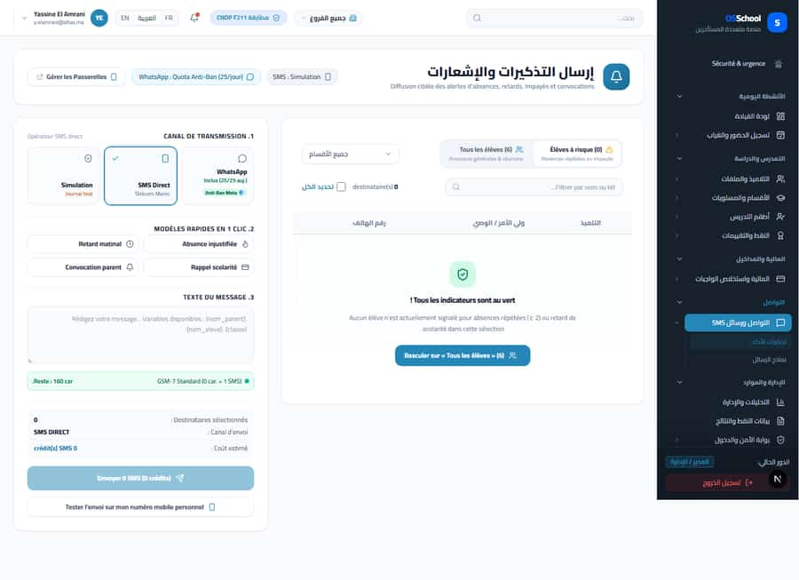
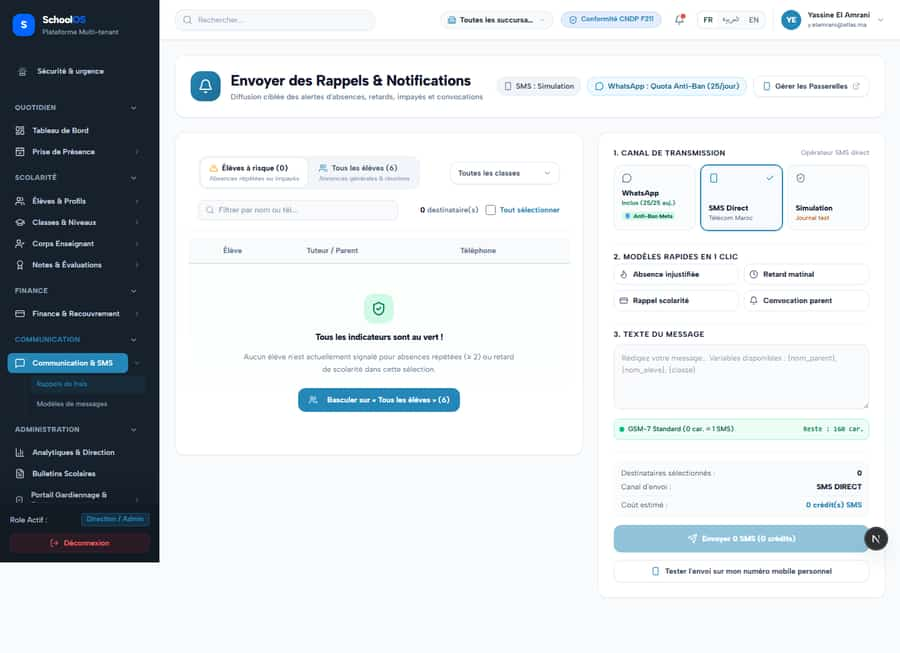

# `/dashboard/communication/reminders`

**Status: NEEDS FIX (P1)** · Module: `communication` · Source: [`src/app/[locale]/(dashboard)/dashboard/communication/reminders/page.tsx`](<../../../../../src/app/[locale]/(dashboard)/dashboard/communication/reminders/page.tsx>)

**Progress (2026-09-25):** S-2 DONE · S-32 PARTIAL

Guard: `requireServerPage` · capability `communication.send`

**Verdict:** 2 finding(s), worst P1. 3 sweep run(s): 3 clean or expected, 0 flagged. 3 screenshot(s).

## Findings on this page

| ID | Sev | Problem | Fix | Code now |
|---|---|---|---|---|
| [S-2](../../findings/done/S-2.md) | P1 | SMS reminders page shows a false all-clear | Add a dedicated at-risk endpoint (full list, class filter) and consume it. Show an error, never "au vert", when the fetch fails. Make simulation vs real sending unambiguous. | Not re-checked since the sweep. |
| [S-32](../../findings/S-32.md) | P1 | Sidebar links looser than their page; denied users land on the public homepage | Derive the sidebar permission from the page guard; denial renders in-app "Accès refusé"; remove dead links; test that walks sidebar vs guards. | Not re-checked since the sweep. |

## Sweep results

| Pass | Role | URL tested | Result |
|---|---|---|---|
| Pass A | school_admin | `/dashboard/communication/reminders` | ok |
| Pass A | school_admin (ar) | `/dashboard/communication/reminders` | ok |
| Pass A | school_admin (phone) | `/dashboard/communication/reminders` | ok |

## Screenshots

**Pass A · main DB (:3111/:3222), 2026-09-22/23** · school_admin · ar · `/dashboard/communication/reminders`

**Pass A · main DB (:3111/:3222), 2026-09-22/23** · school_admin · fr · `/dashboard/communication/reminders`

**Pass A · main DB (:3111/:3222), 2026-09-22/23** · school_admin · fr phone · `/dashboard/communication/reminders`

## Plan

- [ ] **S-2 (P1)** SMS reminders page shows a false all-clear
  - [ ] Create `GET /api/communication/at-risk` (tenant-scoped, paginated, class filter).
  - [ ] Switch the view to it; add an error state.
  - [ ] Show one clear send-mode badge from the active connection.
  - [ ] Test: seed one late family, the page lists it.
  - [ ] Accept: A late family appears on the page; a failed fetch shows an error.
- [ ] **S-32 (P1)** Sidebar links looser than their page; denied users land on the public homepage
  - [ ] Single permission source per route.
  - [ ] Access-denied page (now exists at `/dashboard/access-denied`, verify every guard uses it).
  - [ ] Sidebar-vs-guard unit test.
  - [ ] Accept: Re-sweep teacher/accountant: 0 redirects to `/fr`.
- [ ] Re-run this page: `echo "/dashboard/communication/reminders" > r.txt && AUDIT_BASE=http://localhost:3333 node scripts/visual-sweep.mjs school_admin r.txt`

## Cross-cutting findings that also show here

- [S-7](../../findings/S-7.md) (P1) ~1 375 hardcoded French UI strings bypass translation (Arabic UI stays French)
- [S-14](../../findings/done/S-14.md) (P2) Sidebar lists add-on modules the tenant has not enabled
- [S-18](../../findings/done/S-18.md) (P1) Header claims CNDP compliance on every page; the school has not filed
- [S-25](../../findings/done/S-25.md) (P2) Header shows a fake identity when the session call is slow
- [S-37](../../findings/S-37.md) (P2) Arabic: dashboard widgets stay French; brand renders "OSSchool" in RTL
- [S-41](../../findings/done/S-41.md) (P1) Auth rate limit counts every page's session check, per IP
