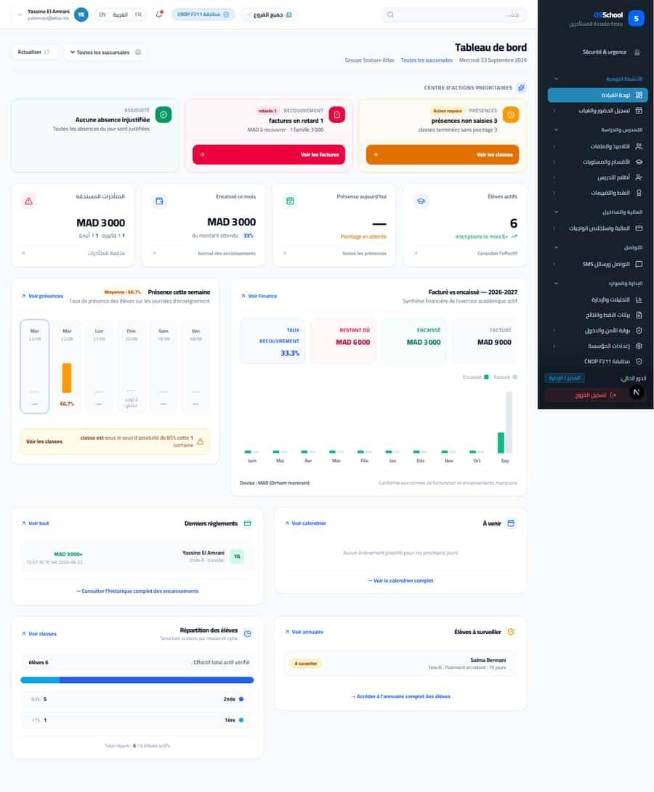
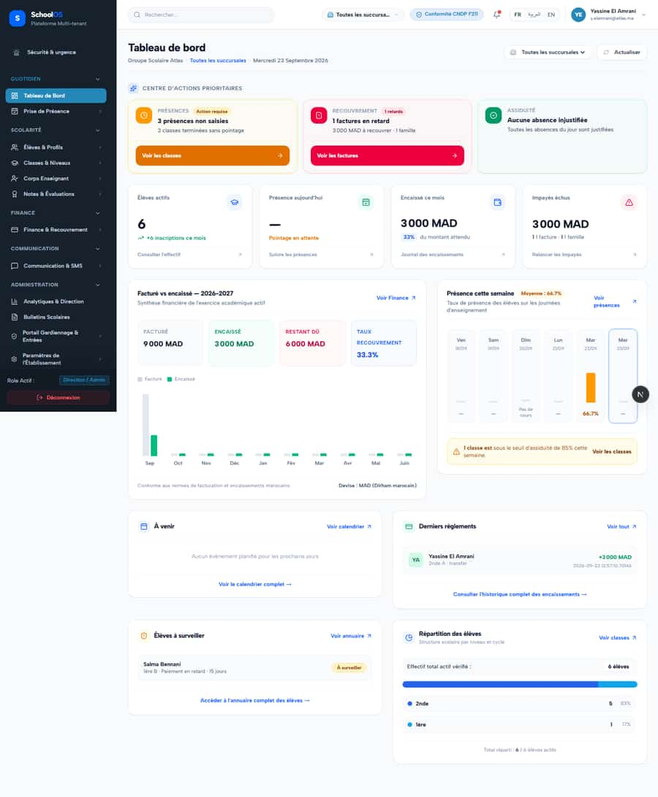
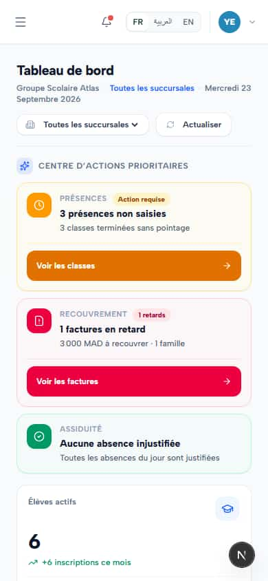
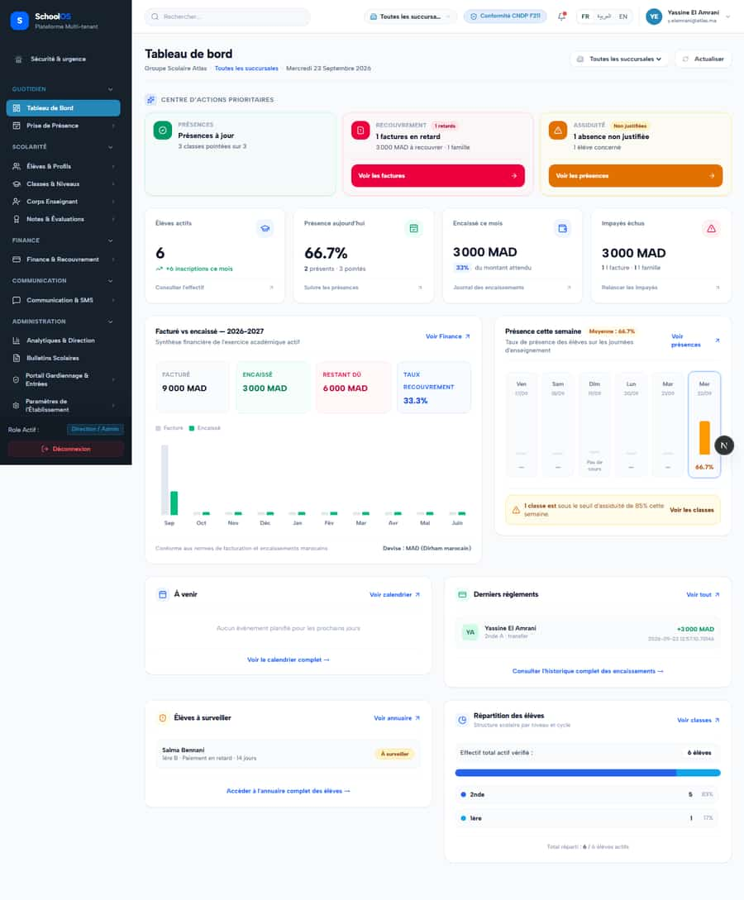
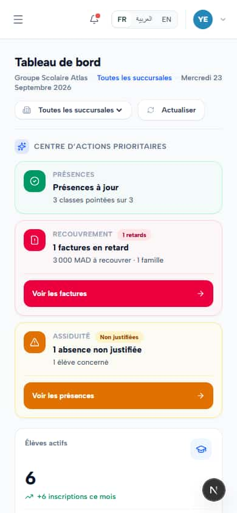
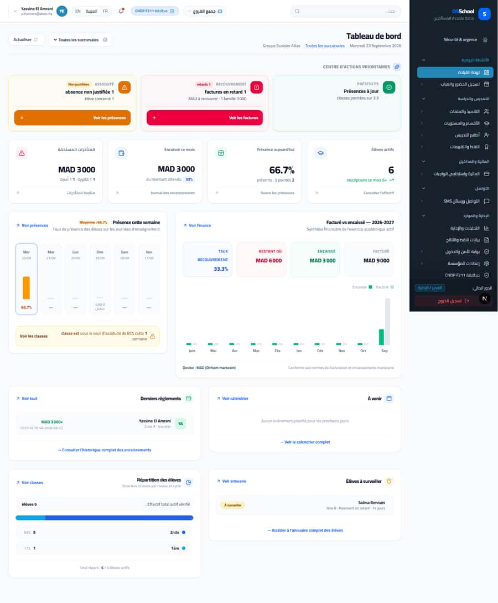

# `/dashboard`

**Status: NEEDS FIX (P2)** · Module: `dashboard-home` · Source: [`src/app/[locale]/(dashboard)/dashboard/page.tsx`](<../../../../../src/app/[locale]/(dashboard)/dashboard/page.tsx>)

**Progress (2026-09-24):** S-15 OPEN · S-37 PARTIAL

Guard: `getServerUserContext`

**Verdict:** 2 finding(s), worst P2. 4 sweep run(s): 4 clean or expected, 0 flagged. 7 screenshot(s).

## Findings on this page

| ID | Sev | Problem | Fix | Code now |
|---|---|---|---|---|
| [S-15](../../findings/S-15.md) | P2 | Two director dashboards with overlapping KPIs; IGP unexplained | Merge or clearly separate; explain IGP on screen; rename "Objectif". | Not re-checked since the sweep. |
| [S-37](../../findings/S-37.md) | P2 | Arabic: dashboard widgets stay French; brand renders "OSSchool" in RTL | Translate widgets; wrap brand in `<bdi>`. | Not re-checked since the sweep. |

## Sweep results

| Pass | Role | URL tested | Result |
|---|---|---|---|
| Pass A | school_admin | `/dashboard` | ok |
| Pass A | school_admin (ar) | `/dashboard` | ok |
| Pass A | school_admin (phone) | `/dashboard` | ok |
| Pass C | anonymous | `/dashboard` | expected: → login (anonymous) |

## Screenshots

**Pass A · main DB (:3111/:3222), 2026-09-22/23** · school_admin · ar · `/dashboard`

**Pass A · main DB (:3111/:3222), 2026-09-22/23** · school_admin · fr · `/dashboard`

**Pass A · main DB (:3111/:3222), 2026-09-22/23** · school_admin · fr phone · `/dashboard`

**Pass C · detail + public pages, 2026-09-23** · anonymous · fr · `/dashboard`

**Pass A · main DB (:3111/:3222), 2026-09-22/23** · school_admin · desktop · `/dashboard`

**Pass A · main DB (:3111/:3222), 2026-09-22/23** · school_admin · phone · `/dashboard`

**Pass A · main DB (:3111/:3222), 2026-09-22/23** · school_admin · ar · `/dashboard`

## Plan

- [ ] **S-15 (P2)** Two director dashboards with overlapping KPIs; IGP unexplained
  - [ ] Pick one home dashboard.
  - [ ] Add an IGP tooltip with weights.
  - [ ] Accept: Each KPI appears once with a clear definition.
- [ ] **S-37 (P2)** Arabic: dashboard widgets stay French; brand renders "OSSchool" in RTL
  - [ ] Fix brand.
  - [ ] Covered by S-7 for strings.
  - [ ] Accept: Arabic dashboard fully Arabic; brand correct.
- [ ] Re-run this page: `echo "/dashboard" > r.txt && AUDIT_BASE=http://localhost:3333 node scripts/visual-sweep.mjs school_admin r.txt`

## Cross-cutting findings that also show here

- [S-7](../../findings/S-7.md) (P1) ~1 375 hardcoded French UI strings bypass translation (Arabic UI stays French)
- [S-14](../../findings/S-14.md) (P2) Sidebar lists add-on modules the tenant has not enabled
- [S-18](../../findings/done/S-18.md) (P1) Header claims CNDP compliance on every page; the school has not filed
- [S-25](../../findings/done/S-25.md) (P2) Header shows a fake identity when the session call is slow
- [S-37](../../findings/S-37.md) (P2) Arabic: dashboard widgets stay French; brand renders "OSSchool" in RTL
- [S-41](../../findings/done/S-41.md) (P1) Auth rate limit counts every page's session check, per IP
