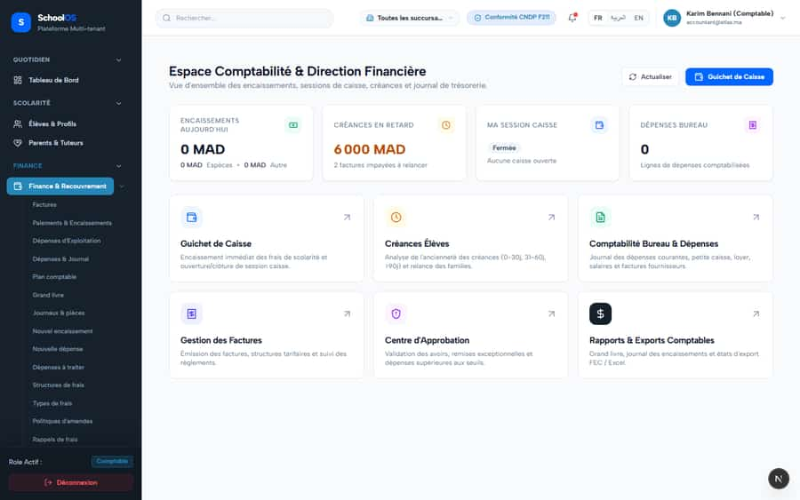
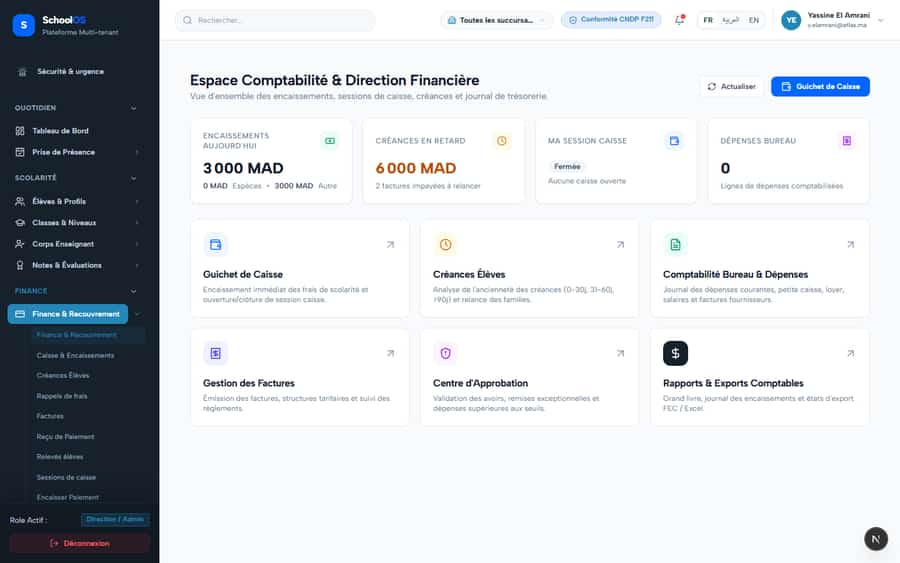
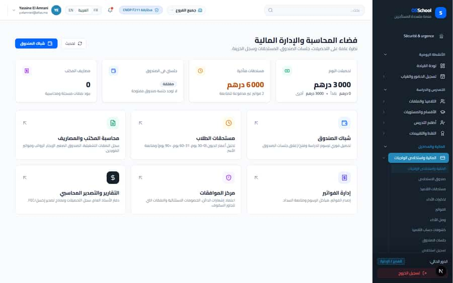

# `/dashboard/finance`

**Status: NEEDS FIX (P1)** · Module: `finance` · Source: [`src/app/[locale]/(dashboard)/dashboard/finance/page.tsx`](<../../../../../src/app/[locale]/(dashboard)/dashboard/finance/page.tsx>)

**Progress (2026-09-23):** V-1 PARTIAL · S-29 PARTIAL

Guard: `requireServerPage` · capability `finance.read`

**Verdict:** 2 finding(s), worst P1. 4 sweep run(s): 3 clean or expected, 1 flagged. 8 screenshot(s).

## Findings on this page

| ID | Sev | Problem | Fix | Code now |
|---|---|---|---|---|
| [V-1](../../findings/V-1.md) | P1 | Finance home shows 6 000 MAD overdue, every other screen shows 3 000 | Make `/api/accountant/me/home`, `/api/accountant/me/receivables`, `features/portal/services/portal-home.ts` and `api/students/route.ts` use the shared definitions: overdue = past due only; balance = netAmount - paidAmount; collected = posted, net of refunds; branch filter applied. | Not re-checked since the sweep. |
| [S-29](../../findings/S-29.md) | P3 | Overdue totals agree everywhere except the finance home (confirms V-1) | See V-1. | Not re-checked since the sweep. |

## Sweep results

| Pass | Role | URL tested | Result |
|---|---|---|---|
| Pass A | school_admin | `/dashboard/finance` | ok |
| Pass A | accountant | `/dashboard/finance` | **S-41**: 429 /api/auth/get-session **S-41**: 429 rate-limited |
| Pass A | school_admin (ar) | `/dashboard/finance` | ok |
| Pass A | school_admin (phone) | `/dashboard/finance` | ok |

## Screenshots

**Pass A · main DB (:3111/:3222), 2026-09-22/23** · accountant · fr · `/dashboard/finance`

**Pass A · main DB (:3111/:3222), 2026-09-22/23** · school_admin · ar · `/dashboard/finance`

**Pass A · main DB (:3111/:3222), 2026-09-22/23** · school_admin · fr · `/dashboard/finance`

**Pass A · main DB (:3111/:3222), 2026-09-22/23** · school_admin · fr phone · `/dashboard/finance`

**Pass A · main DB (:3111/:3222), 2026-09-22/23** · accountant · desktop · `/dashboard/finance`

**Pass A · main DB (:3111/:3222), 2026-09-22/23** · school_admin · desktop · `/dashboard/finance`

**Pass A · main DB (:3111/:3222), 2026-09-22/23** · school_admin · phone · `/dashboard/finance`

**Pass A · main DB (:3111/:3222), 2026-09-22/23** · school_admin · ar · `/dashboard/finance`

## Plan

- [ ] **V-1 (P1)** Finance home shows 6 000 MAD overdue, every other screen shows 3 000
  - [ ] Replace the local overdue query in `/api/accountant/me/home` with the shared helper.
  - [ ] Do the same in the three other call sites.
  - [ ] Add a test: one past-due and one not-yet-due invoice give overdue = the past-due one only, on every endpoint.
  - [ ] Re-sweep `/dashboard/finance` and `/dashboard` and compare the numbers.
  - [ ] Accept: Finance home, dashboard, invoices and reminders show the same overdue amount and count.
- [ ] **S-29 (P3)** Overdue totals agree everywhere except the finance home (confirms V-1)
  - [ ] Fixed by V-1.
  - [ ] Accept: See V-1.
- [ ] Re-run this page: `echo "/dashboard/finance" > r.txt && AUDIT_BASE=http://localhost:3333 node scripts/visual-sweep.mjs accountant r.txt`

## Cross-cutting findings that also show here

- [S-41](../../findings/done/S-41.md) (P1) Auth rate limit counts every page's session check, per IP
- [S-7](../../findings/S-7.md) (P1) ~1 375 hardcoded French UI strings bypass translation (Arabic UI stays French)
- [S-14](../../findings/S-14.md) (P2) Sidebar lists add-on modules the tenant has not enabled
- [S-18](../../findings/done/S-18.md) (P1) Header claims CNDP compliance on every page; the school has not filed
- [S-25](../../findings/done/S-25.md) (P2) Header shows a fake identity when the session call is slow
- [S-37](../../findings/S-37.md) (P2) Arabic: dashboard widgets stay French; brand renders "OSSchool" in RTL
