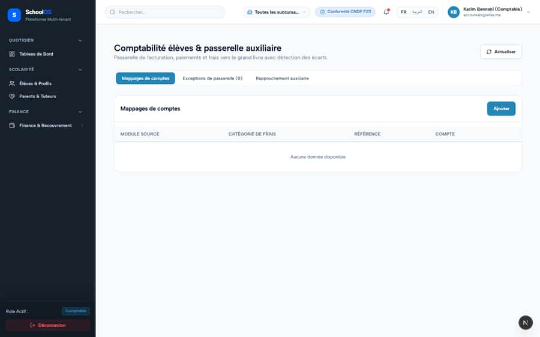
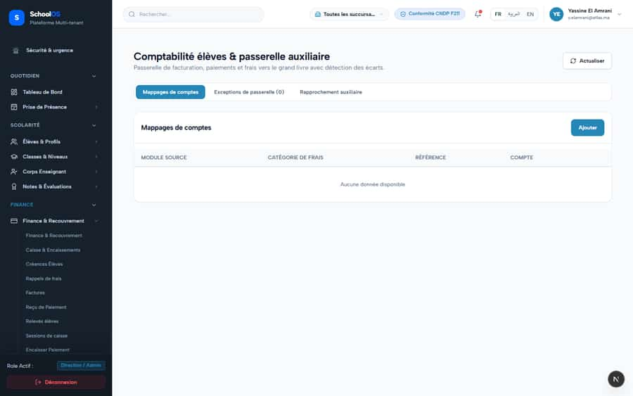

# `/dashboard/finance/accounting/student-accounting`

**Status: FIXED, pending re-sweep** · Module: `finance` · Source: [`src/app/[locale]/(dashboard)/dashboard/finance/accounting/student-accounting/page.tsx`](<../../../../../src/app/[locale]/(dashboard)/dashboard/finance/accounting/student-accounting/page.tsx>)

**Progress (2026-09-26):** S-3 DONE

Guard: `requireServerPage` · capability `accounting.account.read`

**Verdict:** 1 finding(s), worst P1. 2 sweep run(s): 2 clean or expected, 0 flagged. 2 screenshot(s).

## Findings on this page

| ID | Sev | Problem | Fix | Code now |
|---|---|---|---|---|
| [S-3](../../findings/done/S-3.md) | P1 | General ledger silently empty, reports say "Équilibré" | Raise an `accounting_adapter_exceptions` row for skipped payment postings (refunds already do). Setup banner when no period is open. Never show "Équilibré" while source documents are unposted. | Not re-checked since the sweep. |

## Sweep results

| Pass | Role | URL tested | Result |
|---|---|---|---|
| Pass A | school_admin | `/dashboard/finance/accounting/student-accounting` | ok |
| Pass A | accountant | `/dashboard/finance/accounting/student-accounting` | ok |

## Screenshots

**Pass A · main DB (:3111/:3222), 2026-09-22/23** · accountant · fr · `/dashboard/finance/accounting/student-accounting`

**Pass A · main DB (:3111/:3222), 2026-09-22/23** · school_admin · fr · `/dashboard/finance/accounting/student-accounting`

## Plan

- [ ] **S-3 (P1)** General ledger silently empty, reports say "Équilibré"
  - [ ] Add the exception insert in the payment GL path.
  - [ ] Add a banner component on the accounting pages ("Aucun exercice ouvert, N encaissements non passés").
  - [ ] Gate the "Équilibré" label on unposted count = 0.
  - [ ] Test with no fiscal period: payment creates an exception.
  - [ ] Accept: With no fiscal period, statements show the banner and the exception count, not "Équilibré".
- [ ] Re-run this page: `echo "/dashboard/finance/accounting/student-accounting" > r.txt && AUDIT_BASE=http://localhost:3333 node scripts/visual-sweep.mjs school_admin r.txt`

## Cross-cutting findings that also show here

- [S-7](../../findings/S-7.md) (P1) ~1 375 hardcoded French UI strings bypass translation (Arabic UI stays French)
- [S-14](../../findings/done/S-14.md) (P2) Sidebar lists add-on modules the tenant has not enabled
- [S-18](../../findings/done/S-18.md) (P1) Header claims CNDP compliance on every page; the school has not filed
- [S-25](../../findings/done/S-25.md) (P2) Header shows a fake identity when the session call is slow
- [S-37](../../findings/S-37.md) (P2) Arabic: dashboard widgets stay French; brand renders "OSSchool" in RTL
- [S-41](../../findings/done/S-41.md) (P1) Auth rate limit counts every page's session check, per IP
