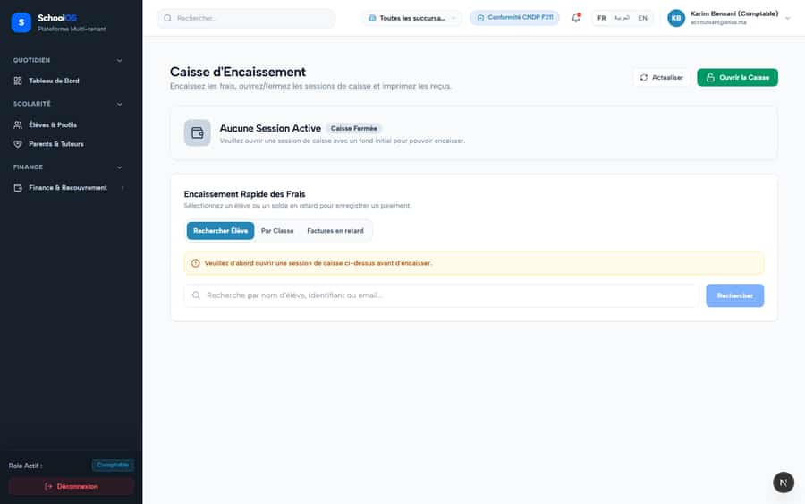
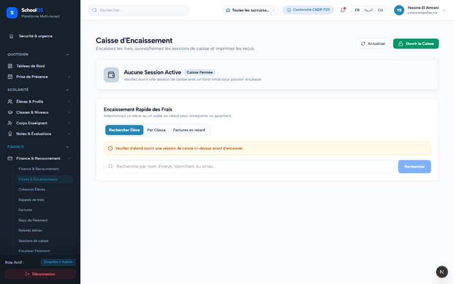

# `/dashboard/finance/payments`

**Status: NEEDS FIX (P2)** · Module: `finance` · Source: [`src/app/[locale]/(dashboard)/dashboard/finance/payments/page.tsx`](<../../../../../src/app/[locale]/(dashboard)/dashboard/finance/payments/page.tsx>)

**Progress (2026-09-26):** S-35 DONE · S-30 PARTIAL

Guard: `requireServerPage` · capability `finance.read`

**Verdict:** 2 finding(s), worst P1. 2 sweep run(s): 0 clean or expected, 2 flagged. 2 screenshot(s).

## Findings on this page

| ID | Sev | Problem | Fix | Code now |
|---|---|---|---|---|
| [S-35](../../findings/done/S-35.md) | P1 | Accountant gets 403 on class sections and semesters on the cash desk | Finance-scoped lookup endpoint or read projection for accountant. | Not re-checked since the sweep. |
| [S-30](../../findings/S-30.md) | P2 | No payment history screen; payments routes land on the cash desk | Build a payment history list (or relabel the link). | Not re-checked since the sweep. |

## Sweep results

| Pass | Role | URL tested | Result |
|---|---|---|---|
| Pass A | accountant | `/dashboard/finance/payments` | **S-30**: → /fr/dashboard/finance/collection-desk **S-35**: 403 /api/academics/class-sections |
| Pass A | school_admin | `/dashboard/finance/payments` | **S-30**: → /fr/dashboard/finance/collection-desk |

## Screenshots

**Pass A · main DB (:3111/:3222), 2026-09-22/23** · accountant · fr · `/dashboard/finance/payments`

**Pass A · main DB (:3111/:3222), 2026-09-22/23** · school_admin · fr · `/dashboard/finance/payments`

## Plan

- [ ] **S-35 (P1)** Accountant gets 403 on class sections and semesters on the cash desk
  - [ ] Add the lookup.
  - [ ] Re-sweep as accountant.
  - [ ] Accept: No 403 for accountant.
- [ ] **S-30 (P2)** No payment history screen; payments routes land on the cash desk
  - [ ] Decide scope.
  - [ ] Implement or relabel.
  - [ ] Accept: The link shows payment history.
- [ ] Re-run this page: `echo "/dashboard/finance/payments" > r.txt && AUDIT_BASE=http://localhost:3333 node scripts/visual-sweep.mjs accountant r.txt`

## Cross-cutting findings that also show here

- [S-7](../../findings/S-7.md) (P1) ~1 375 hardcoded French UI strings bypass translation (Arabic UI stays French)
- [S-14](../../findings/done/S-14.md) (P2) Sidebar lists add-on modules the tenant has not enabled
- [S-18](../../findings/done/S-18.md) (P1) Header claims CNDP compliance on every page; the school has not filed
- [S-25](../../findings/done/S-25.md) (P2) Header shows a fake identity when the session call is slow
- [S-37](../../findings/S-37.md) (P2) Arabic: dashboard widgets stay French; brand renders "OSSchool" in RTL
- [S-41](../../findings/done/S-41.md) (P1) Auth rate limit counts every page's session check, per IP
