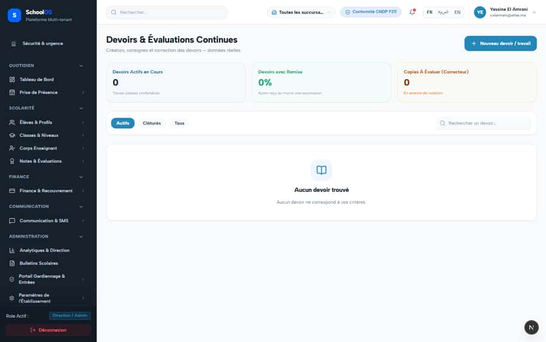
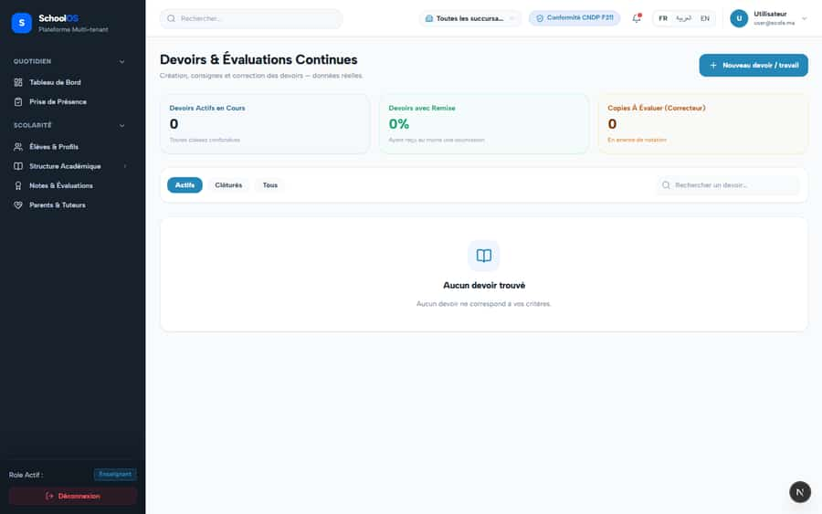

# `/dashboard/homework`

**Status: NEEDS FIX (P1)** · Module: `homework` · Source: [`src/app/[locale]/(dashboard)/dashboard/homework/page.tsx`](<../../../../../src/app/[locale]/(dashboard)/dashboard/homework/page.tsx>)

**Progress (2026-09-24):** S-32 PARTIAL · S-10 DONE

Guard: `requireServerPage` · capability `grading.manage`

**Verdict:** 2 finding(s), worst P1. 3 sweep run(s): 1 clean or expected, 2 flagged. 3 screenshot(s).

## Findings on this page

| ID | Sev | Problem | Fix | Code now |
|---|---|---|---|---|
| [S-32](../../findings/S-32.md) | P1 | Sidebar links looser than their page; denied users land on the public homepage | Derive the sidebar permission from the page guard; denial renders in-app "Accès refusé"; remove dead links; test that walks sidebar vs guards. | Not re-checked since the sweep. |
| [S-10](../../findings/done/S-10.md) | P2 | Homework page shows developer copy and "0 %" for 0/0 | Remove developer copy, fix the button label, "—" for 0/0. | Not re-checked since the sweep. |

## Sweep results

| Pass | Role | URL tested | Result |
|---|---|---|---|
| Pass A | school_admin | `/dashboard/homework` | ok |
| Pass A | teacher | `/dashboard/homework` | **S-41**: 429 /api/auth/get-session **S-41**: 429 rate-limited |
| Pass B | student | `/dashboard/homework` | **S-32**: → /fr (public site) |

## Screenshots

**Pass A · main DB (:3111/:3222), 2026-09-22/23** · school_admin · fr · `/dashboard/homework`

**Pass A · main DB (:3111/:3222), 2026-09-22/23** · teacher · fr · `/dashboard/homework`

**Pass B · seeded audit DB, all add-ons, 2026-09-23** · student · fr · `/dashboard/homework`

## Plan

- [ ] **S-32 (P1)** Sidebar links looser than their page; denied users land on the public homepage
  - [ ] Single permission source per route.
  - [ ] Access-denied page (now exists at `/dashboard/access-denied`, verify every guard uses it).
  - [ ] Sidebar-vs-guard unit test.
  - [ ] Accept: Re-sweep teacher/accountant: 0 redirects to `/fr`.
- [ ] **S-10 (P2)** Homework page shows developer copy and "0 %" for 0/0
  - [ ] Edit the copy.
  - [ ] Guard the percentage.
  - [ ] Accept: No developer wording on screen.
- [ ] Re-run this page: `echo "/dashboard/homework" > r.txt && AUDIT_BASE=http://localhost:3333 node scripts/visual-sweep.mjs teacher r.txt`

## Cross-cutting findings that also show here

- [S-41](../../findings/done/S-41.md) (P1) Auth rate limit counts every page's session check, per IP
- [S-7](../../findings/S-7.md) (P1) ~1 375 hardcoded French UI strings bypass translation (Arabic UI stays French)
- [S-14](../../findings/S-14.md) (P2) Sidebar lists add-on modules the tenant has not enabled
- [S-18](../../findings/done/S-18.md) (P1) Header claims CNDP compliance on every page; the school has not filed
- [S-25](../../findings/done/S-25.md) (P2) Header shows a fake identity when the session call is slow
- [S-37](../../findings/S-37.md) (P2) Arabic: dashboard widgets stay French; brand renders "OSSchool" in RTL
- [S-44](../../findings/S-44.md) (P2) Staff campus switcher renders for parents, students and super admin (403 on every page)
