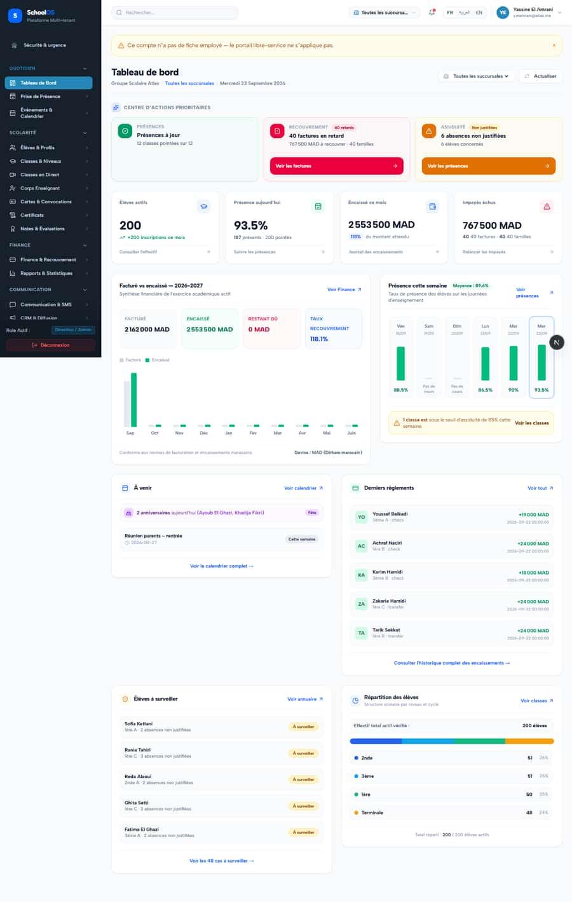
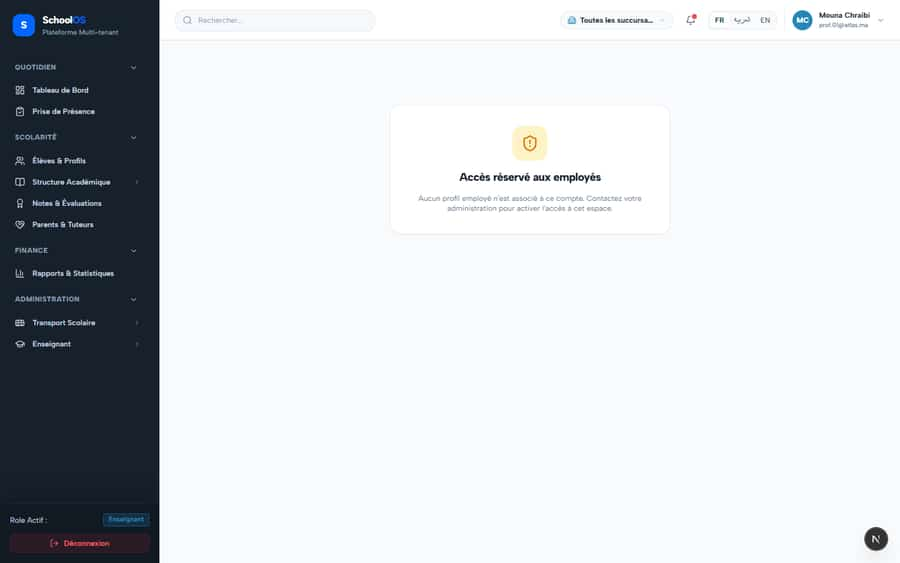

# `/dashboard/hr/self-service`

**Status: FIXED, pending re-sweep** · Module: `hr` · Source: [`src/app/[locale]/(dashboard)/dashboard/hr/self-service/page.tsx`](<../../../../../src/app/[locale]/(dashboard)/dashboard/hr/self-service/page.tsx>)

**Progress (2026-09-23):** S-38 DONE

Guard: `getServerUserContext`, `resolveEmployeeContext`

**Verdict:** 1 finding(s), worst P1. 2 sweep run(s): 1 clean or expected, 1 flagged. 2 screenshot(s).

## Findings on this page

| ID | Sev | Problem | Fix | Code now |
|---|---|---|---|---|
| [S-38](../../findings/done/S-38.md) | P1 | HR self-service locked for every employee | Grant `payroll.self.read` to employee roles; only show "not an employee" for `error.code === NOT_AN_EMPLOYEE`; hide just the failing section otherwise. | STILL OPEN |

## Sweep results

| Pass | Role | URL tested | Result |
|---|---|---|---|
| Pass B | school_admin | `/dashboard/hr/self-service` | expected: → /fr/dashboard (admin without employee profile is redirected) |
| Pass B | teacher (prof.01) | `/dashboard/hr/self-service` | **S-38**: 403 /api/employee/me/payroll **S-38**: 403 /api/employee/me/advances **S-38**: 403 /api/employee/me/awards |

## Screenshots

**Pass B · seeded audit DB, all add-ons, 2026-09-23** · school_admin · fr · `/dashboard/hr/self-service`

**Pass B · seeded audit DB, all add-ons, 2026-09-23** · teacher · fr · `/dashboard/hr/self-service`

## Plan

- [ ] **S-38 (P1)** HR self-service locked for every employee
  - [ ] Add the permission to teacher, accountant, receptionist, guard, librarian, school_admin.
  - [ ] Change the error mapping.
  - [ ] Test: active teacher loads payslips.
  - [ ] Accept: `prof.01` sees payslips, advances and awards.
- [ ] Re-run this page: `echo "/dashboard/hr/self-service" > r.txt && ACCOUNT_EMAIL=prof.01@atlas.ma AUDIT_BASE=http://localhost:3333 node scripts/visual-sweep.mjs teacher r.txt`

## Cross-cutting findings that also show here

- [S-7](../../findings/S-7.md) (P1) ~1 375 hardcoded French UI strings bypass translation (Arabic UI stays French)
- [S-14](../../findings/S-14.md) (P2) Sidebar lists add-on modules the tenant has not enabled
- [S-18](../../findings/done/S-18.md) (P1) Header claims CNDP compliance on every page; the school has not filed
- [S-25](../../findings/done/S-25.md) (P2) Header shows a fake identity when the session call is slow
- [S-37](../../findings/S-37.md) (P2) Arabic: dashboard widgets stay French; brand renders "OSSchool" in RTL
- [S-41](../../findings/done/S-41.md) (P1) Auth rate limit counts every page's session check, per IP
