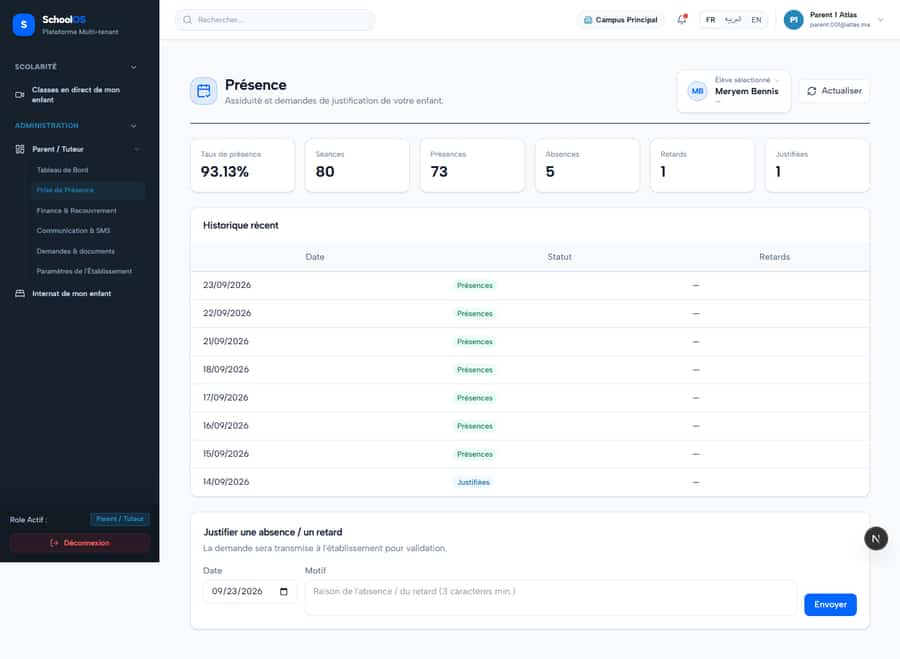

# `/dashboard/parent/attendance`

**Status: NEEDS FIX (P2)** · Module: `parent` · Source: [`src/app/[locale]/(dashboard)/dashboard/parent/attendance/page.tsx`](<../../../../../src/app/[locale]/(dashboard)/dashboard/parent/attendance/page.tsx>)

Guard: `requireServerPage` · roles `parent`

**Verdict:** 2 finding(s), worst P2. 1 sweep run(s): 0 clean or expected, 1 flagged. 1 screenshot(s).

## Findings on this page

| ID | Sev | Problem | Fix | Code now |
|---|---|---|---|---|
| [S-45](../../findings/S-45.md) | P2 | Parent sidebar reuses staff labels | Parent-specific labels ("Présences de mon enfant", "Paiements", "Mes paramètres"). | Not re-checked since the sweep. |
| [S-47](../../findings/S-47.md) | P3 | Empty subtitle rendered as "—" (teacher class card, parent child picker) | Hide the empty part or show the class name. | Not re-checked since the sweep. |

## Sweep results

| Pass | Role | URL tested | Result |
|---|---|---|---|
| Pass B | parent | `/dashboard/parent/attendance` | **S-44**: 403 /api/settings/branches |

## Screenshots

**Pass B · seeded audit DB, all add-ons, 2026-09-23** · parent · fr · `/dashboard/parent/attendance`

## Plan

- [ ] **S-45 (P2)** Parent sidebar reuses staff labels
  - [ ] Parent nav config.
  - [ ] Accept: No staff wording in the parent sidebar.
- [ ] **S-47 (P3)** Empty subtitle rendered as "—" (teacher class card, parent child picker)
  - [ ] Fix both components.
  - [ ] Accept: No lone dash.
- [ ] Re-run this page: `echo "/dashboard/parent/attendance" > r.txt && AUDIT_BASE=http://localhost:3333 node scripts/visual-sweep.mjs parent r.txt`

## Cross-cutting findings that also show here

- [S-44](../../findings/S-44.md) (P2) Staff campus switcher renders for parents, students and super admin (403 on every page)
- [S-7](../../findings/S-7.md) (P1) ~1 375 hardcoded French UI strings bypass translation (Arabic UI stays French)
- [S-18](../../findings/S-18.md) (P1) Header claims CNDP compliance on every page; the school has not filed
- [S-25](../../findings/S-25.md) (P2) Header shows a fake identity when the session call is slow
- [S-37](../../findings/S-37.md) (P2) Arabic: dashboard widgets stay French; brand renders "OSSchool" in RTL
- [S-41](../../findings/S-41.md) (P1) Auth rate limit counts every page's session check, per IP
