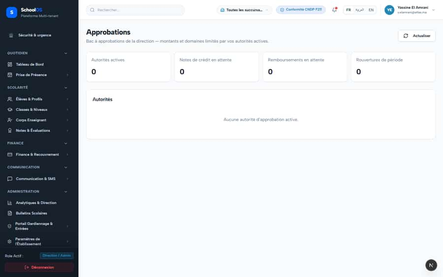

# `/dashboard/portals/leadership/approvals`

**Status: FIXED, pending re-sweep** · Module: `portals` · Source: [`src/app/[locale]/(dashboard)/dashboard/portals/leadership/approvals/page.tsx`](<../../../../../src/app/[locale]/(dashboard)/dashboard/portals/leadership/approvals/page.tsx>)

**Progress (2026-09-25):** S-21 DONE

Guard: `requireLeadershipPage`

**Verdict:** 1 finding(s), worst P1. 1 sweep run(s): 1 clean or expected, 0 flagged. 1 screenshot(s).

## Findings on this page

| ID | Sev | Problem | Fix | Code now |
|---|---|---|---|---|
| [S-21](../../findings/done/S-21.md) | P1 | Approvals inbox shows "0 en attente" when the director has no approval authority | Say "Aucune autorité d'approbation configurée" with a setup link. | Not re-checked since the sweep. |

## Sweep results

| Pass | Role | URL tested | Result |
|---|---|---|---|
| Pass A | school_admin | `/dashboard/portals/leadership/approvals` | ok |

## Screenshots

**Pass A · main DB (:3111/:3222), 2026-09-22/23** · school_admin · fr · `/dashboard/portals/leadership/approvals`

## Plan

- [ ] **S-21 (P1)** Approvals inbox shows "0 en attente" when the director has no approval authority
  - [ ] Detect zero authorities.
  - [ ] Render the message.
  - [ ] Accept: A director with no authority sees the setup message, not 0.
- [ ] Re-run this page: `echo "/dashboard/portals/leadership/approvals" > r.txt && AUDIT_BASE=http://localhost:3333 node scripts/visual-sweep.mjs school_admin r.txt`

## Cross-cutting findings that also show here

- [S-7](../../findings/S-7.md) (P1) ~1 375 hardcoded French UI strings bypass translation (Arabic UI stays French)
- [S-14](../../findings/done/S-14.md) (P2) Sidebar lists add-on modules the tenant has not enabled
- [S-18](../../findings/done/S-18.md) (P1) Header claims CNDP compliance on every page; the school has not filed
- [S-25](../../findings/done/S-25.md) (P2) Header shows a fake identity when the session call is slow
- [S-37](../../findings/S-37.md) (P2) Arabic: dashboard widgets stay French; brand renders "OSSchool" in RTL
- [S-41](../../findings/done/S-41.md) (P1) Auth rate limit counts every page's session check, per IP
