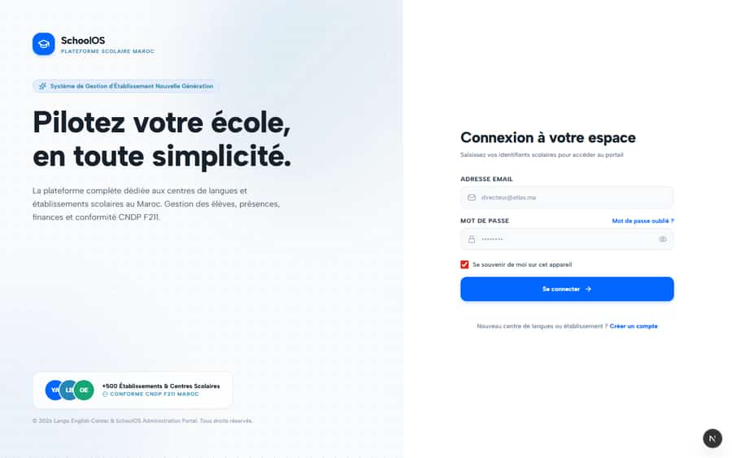
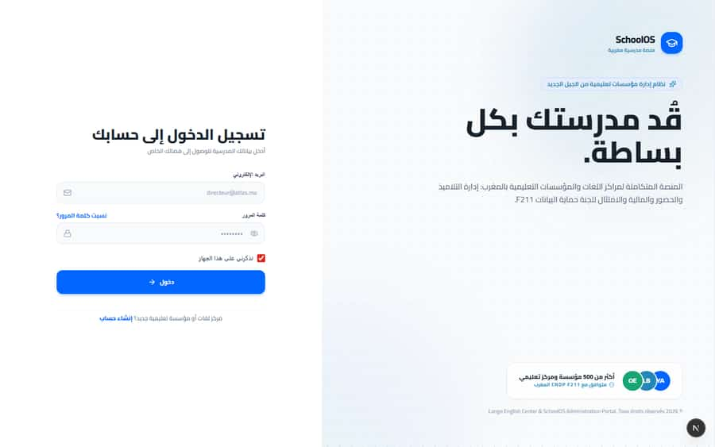

# `/login`

**Status: PASS** · Module: `public-auth` · Source: [`src/app/[locale]/(auth)/login/page.tsx`](<../../../../../src/app/[locale]/(auth)/login/page.tsx>)

Guard: no guard in page.tsx (public page, or protected by its layout or client)

**Verdict:** No page-specific finding. 1 sweep run(s): 1 clean or expected, 0 flagged. 7 screenshot(s).

## Findings on this page

None specific to this page.

## Sweep results

| Pass | Role | URL tested | Result |
|---|---|---|---|
| Pass C | anonymous | `/login` | ok |

## Screenshots

**Pass C · detail + public pages, 2026-09-23** · anonymous · fr · `/login`

**Pass A · main DB (:3111/:3222), 2026-09-22/23** · parent · phone · `/login`

**Pass A · main DB (:3111/:3222), 2026-09-22/23** · parent · ar · `/login`

**Pass A · main DB (:3111/:3222), 2026-09-22/23** · parent · phone · `/login`

**Pass A · main DB (:3111/:3222), 2026-09-22/23** · parent · ar · `/login`

**Pass A · main DB (:3111/:3222), 2026-09-22/23** · parent · phone · `/login`

**Pass A · main DB (:3111/:3222), 2026-09-22/23** · parent · ar · `/login`

## Plan

- No action. Keep this page in the regression sweep.
