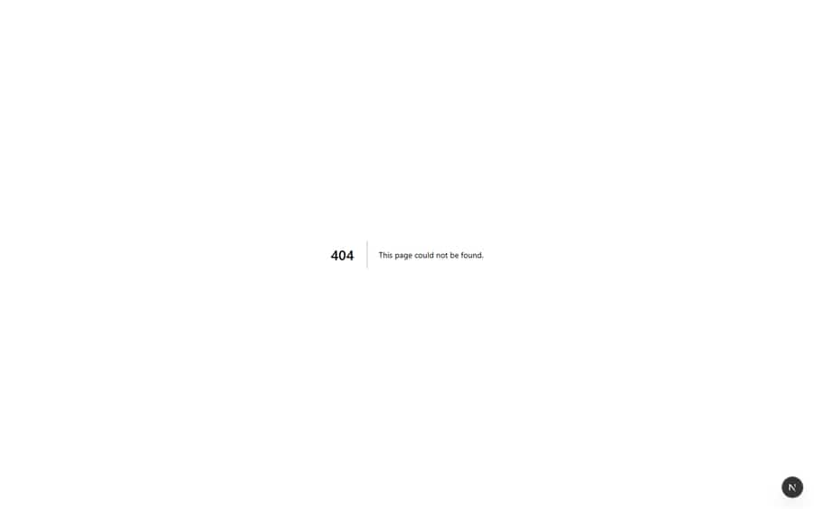
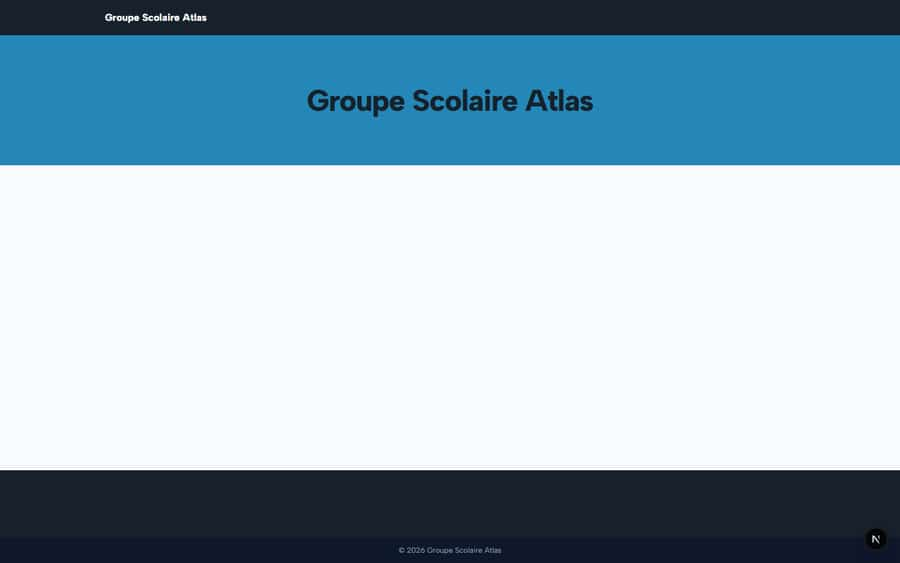

# `/[tenantSlug]`

**Status: NEEDS FIX (P3)** · Module: `public-site` · Source: [`src/app/[locale]/(school-site)/[tenantSlug]/page.tsx`](<../../../../../src/app/[locale]/(school-site)/[tenantSlug]/page.tsx>)

**Progress (2026-09-25):** S-55 PARTIAL

Guard: no guard in page.tsx (public page, or protected by its layout or client)

**Verdict:** 1 finding(s), worst P3. 3 sweep run(s): 3 clean or expected, 0 flagged. 3 screenshot(s).

## Findings on this page

| ID | Sev | Problem | Fix | Code now |
|---|---|---|---|---|
| [S-55](../../findings/S-55.md) | P3 | Public school site: no menu, home ignores news, low-contrast hero | Default menu from fixed pages; latest news on home; contrast-safe hero text. | Not re-checked since the sweep. |

## Sweep results

| Pass | Role | URL tested | Result |
|---|---|---|---|
| Pass C | anonymous | `/atlas` | ok |
| Pass C | anonymous | `/no-such-school` | ok |
| Pass C | anonymous | `/atlas` | ok |

## Screenshots

**Pass C · detail + public pages, 2026-09-23** · anonymous · fr · `/atlas`

**Pass C · detail + public pages, 2026-09-23** · anonymous · fr · `/no-such-school`

**Pass C · public site after publishing content** · anonymous · fr · `/atlas`

## Plan

- [ ] **S-55 (P3)** Public school site: no menu, home ignores news, low-contrast hero
  - [ ] Default menu fallback.
  - [ ] News block on home.
  - [ ] Contrast fix.
  - [ ] Accept: Visitor can reach every page from the header.
- [ ] Re-run this page: `echo "/atlas" > r.txt && NO_LOGIN=1 AUDIT_BASE=http://localhost:3333 node scripts/visual-sweep.mjs anonymous r.txt`
