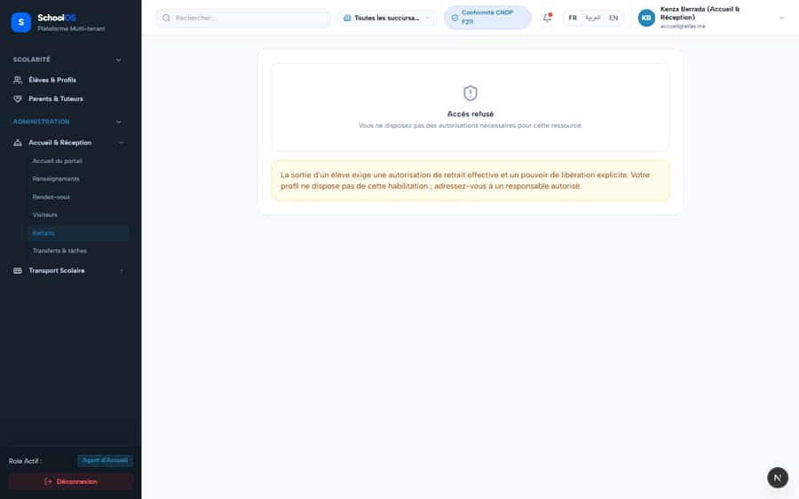

# `/dashboard/receptionist/pickups`

**Status: FIXED, pending re-sweep** · Module: `receptionist` · Source: [`src/app/[locale]/(dashboard)/dashboard/receptionist/pickups/page.tsx`](<../../../../../src/app/[locale]/(dashboard)/dashboard/receptionist/pickups/page.tsx>)

**Progress (2026-09-25):** S-8 DONE

Guard: `requireServerPage` · capability `reception.portal.use`

**Verdict:** 1 finding(s), worst P1. 1 sweep run(s): 1 clean or expected, 0 flagged. 1 screenshot(s).

## Findings on this page

| ID | Sev | Problem | Fix | Code now |
|---|---|---|---|---|
| [S-8](../../findings/done/S-8.md) | P1 | Gate pickup does not re-check guardianship at release | Re-check the live guardian link (active, canPickup) inside the release transaction. | Not re-checked since the sweep. |

## Sweep results

| Pass | Role | URL tested | Result |
|---|---|---|---|
| Pass B | receptionist | `/dashboard/receptionist/pickups` | expected: 403 /api/reception/pickups/authorizations (needs the explicit reception.pickup.release override; the page should explain this instead of failing) |

## Screenshots

**Pass B · seeded audit DB, all add-ons, 2026-09-23** · receptionist · fr · `/dashboard/receptionist/pickups`

## Plan

- [ ] **S-8 (P1)** Gate pickup does not re-check guardianship at release
  - [ ] Add the link check under the existing FOR UPDATE lock.
  - [ ] Test: revoke `canPickup` after creating an authorization, release is refused with a clear error.
  - [ ] Accept: Release fails after the guardian link is revoked.
- [ ] Re-run this page: `echo "/dashboard/receptionist/pickups" > r.txt && AUDIT_BASE=http://localhost:3333 node scripts/visual-sweep.mjs receptionist r.txt`

## Cross-cutting findings that also show here

- [S-7](../../findings/S-7.md) (P1) ~1 375 hardcoded French UI strings bypass translation (Arabic UI stays French)
- [S-18](../../findings/done/S-18.md) (P1) Header claims CNDP compliance on every page; the school has not filed
- [S-25](../../findings/done/S-25.md) (P2) Header shows a fake identity when the session call is slow
- [S-37](../../findings/S-37.md) (P2) Arabic: dashboard widgets stay French; brand renders "OSSchool" in RTL
- [S-41](../../findings/done/S-41.md) (P1) Auth rate limit counts every page's session check, per IP
