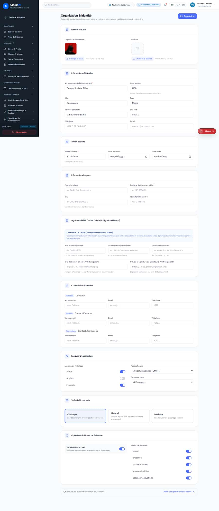

# `/dashboard/settings/onboarding`

**Status: NEEDS TRIAGE** · Module: `settings` · Source: [`src/app/[locale]/(dashboard)/dashboard/settings/onboarding/page.tsx`](<../../../../../src/app/[locale]/(dashboard)/dashboard/settings/onboarding/page.tsx>)

Guard: `requireServerPage` · capability `settings.organization.manage`

**Verdict:** No page-specific finding. 1 sweep run(s): 0 clean or expected, 1 flagged. 1 screenshot(s).

## Findings on this page

None specific to this page.

## Unclassified flags (need a human look)

- Pass A / school_admin: console: A tree hydrated but some attributes of the server rendered HTML didn't match the client properties. This won't be patched up. This can happe

## Sweep results

| Pass | Role | URL tested | Result |
|---|---|---|---|
| Pass A | school_admin | `/dashboard/settings/onboarding` | **?** console: A tree hydrated but some attributes of the server rendered HTML didn't match the client properties. This won't be patched up. This can happe |

## Screenshots

**Pass A · main DB (:3111/:3222), 2026-09-22/23** · school_admin · fr · `/dashboard/settings/onboarding`

## Plan

- [ ] Review the unclassified flags above and either file a finding or mark them expected.

## Cross-cutting findings that also show here

- [S-7](../../findings/S-7.md) (P1) ~1 375 hardcoded French UI strings bypass translation (Arabic UI stays French)
- [S-14](../../findings/done/S-14.md) (P2) Sidebar lists add-on modules the tenant has not enabled
- [S-18](../../findings/done/S-18.md) (P1) Header claims CNDP compliance on every page; the school has not filed
- [S-25](../../findings/done/S-25.md) (P2) Header shows a fake identity when the session call is slow
- [S-37](../../findings/S-37.md) (P2) Arabic: dashboard widgets stay French; brand renders "OSSchool" in RTL
- [S-41](../../findings/done/S-41.md) (P1) Auth rate limit counts every page's session check, per IP
