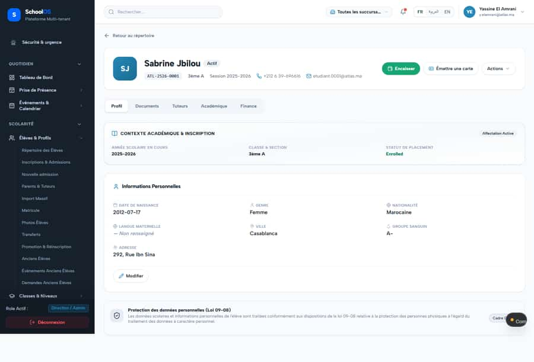
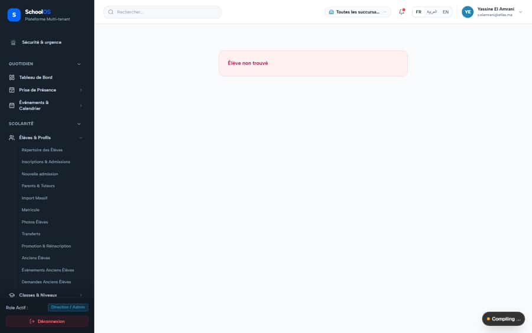
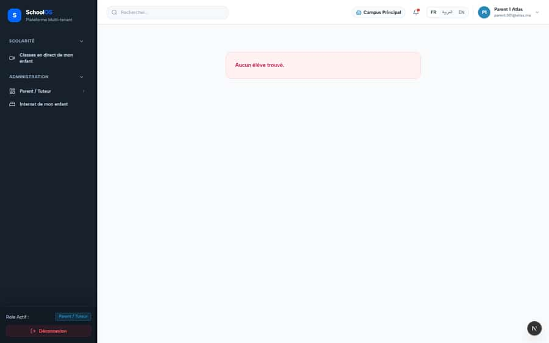

# `/dashboard/students/[id]`

**Status: NEEDS FIX (P3)** · Module: `students` · Source: [`src/app/[locale]/(dashboard)/dashboard/students/[id]/page.tsx`](<../../../../../src/app/[locale]/(dashboard)/dashboard/students/[id]/page.tsx>)

Guard: `requireServerPage` · capability `students.read`

**Verdict:** 1 finding(s), worst P3. 3 sweep run(s): 3 clean or expected, 0 flagged. 3 screenshot(s).

## Findings on this page

| ID | Sev | Problem | Fix | Code now |
|---|---|---|---|---|
| [S-57](../../findings/S-57.md) | P3 | Raw enum values, two money formats, stale "current" year, overlapping widget | Translate enums; one MAD formatter; check active year; move the widget. | Not re-checked since the sweep. |

## Sweep results

| Pass | Role | URL tested | Result |
|---|---|---|---|
| Pass C | school_admin | `/dashboard/students/STU-0001` | ok |
| Pass C | school_admin | `/dashboard/students/STU-9999` | expected: 404 /api/students (expected not-found) expected: 404 /api/students/documents (expected not-found) |
| Pass C | parent | `/dashboard/students/STU-0001` | ok, 403 /api/students/documents (data blocked, expected) ok, 403 /api/settings/branches (data blocked, expected) ok, 403 /api/students (data blocked, expected) ok, 403 /api/academics/academic-years (data blocked, expected) |

## Screenshots

**Pass C · detail + public pages, 2026-09-23** · school_admin · fr · `/dashboard/students/STU-0001`

**Pass C · detail + public pages, 2026-09-23** · school_admin · fr · `/dashboard/students/STU-9999`

**Pass C · parent typing staff URLs (expected: blocked)** · parent · fr · `/dashboard/students/STU-0001`

## Plan

- [ ] **S-57 (P3)** Raw enum values, two money formats, stale "current" year, overlapping widget
  - [ ] Enum label maps.
  - [ ] Single formatter.
  - [ ] Accept: No raw enum values on these pages.
- [ ] Re-run this page: `echo "/dashboard/students/STU-0001" > r.txt && AUDIT_BASE=http://localhost:3333 node scripts/visual-sweep.mjs school_admin r.txt`

## Cross-cutting findings that also show here

- [S-7](../../findings/S-7.md) (P1) ~1 375 hardcoded French UI strings bypass translation (Arabic UI stays French)
- [S-14](../../findings/S-14.md) (P2) Sidebar lists add-on modules the tenant has not enabled
- [S-18](../../findings/S-18.md) (P1) Header claims CNDP compliance on every page; the school has not filed
- [S-25](../../findings/S-25.md) (P2) Header shows a fake identity when the session call is slow
- [S-37](../../findings/S-37.md) (P2) Arabic: dashboard widgets stay French; brand renders "OSSchool" in RTL
- [S-41](../../findings/S-41.md) (P1) Auth rate limit counts every page's session check, per IP
- [S-44](../../findings/S-44.md) (P2) Staff campus switcher renders for parents, students and super admin (403 on every page)
