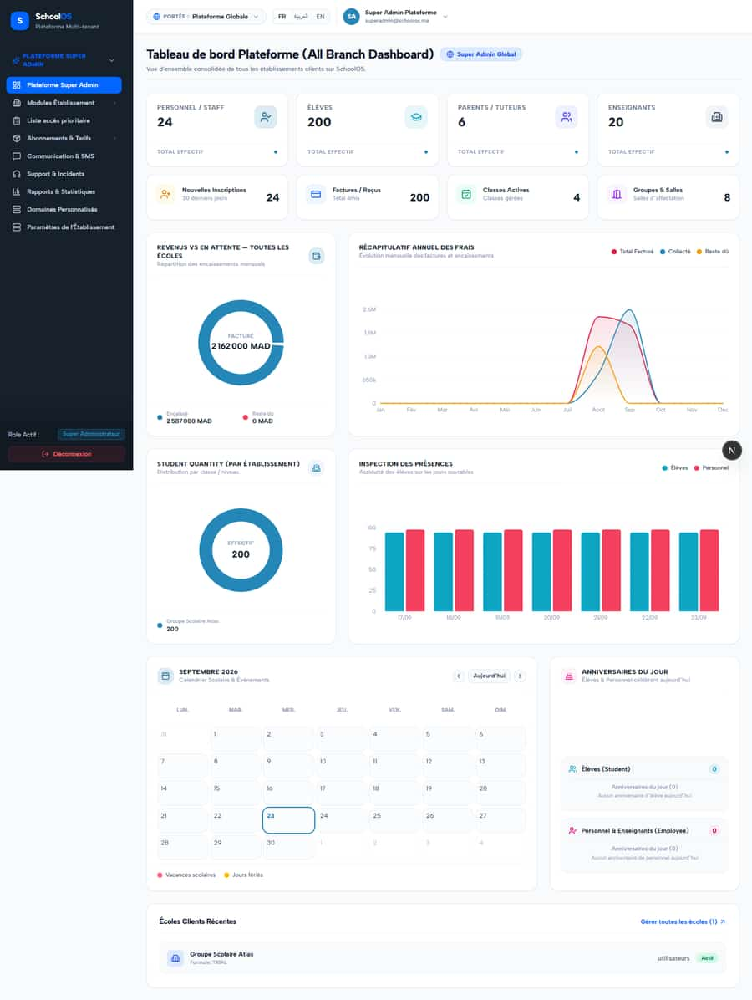

# `/dashboard/super-admin`

**Status: FIXED, pending re-sweep** · Module: `super-admin` · Source: [`src/app/[locale]/(dashboard)/dashboard/super-admin/page.tsx`](<../../../../../src/app/[locale]/(dashboard)/dashboard/super-admin/page.tsx>)

**Progress (2026-09-25):** S-39 DONE · S-40 DONE · S-49 DONE

Guard: `requireServerPage` · roles `super_admin`

**Verdict:** 3 finding(s), worst P1. 2 sweep run(s): 1 clean or expected, 1 flagged. 2 screenshot(s).

## Findings on this page

| ID | Sev | Problem | Fix | Code now |
|---|---|---|---|---|
| [S-39](../../findings/done/S-39.md) | P1 | Super-admin dashboard shows invented numbers | Compute from real tables or remove the field (UI shows "—"). | STILL OPEN |
| [S-40](../../findings/done/S-40.md) | P1 | Super-admin revenue: collected > billed, "Reste dû 0" | Outstanding = open invoice balances (exclude cancelled/draft); collected = `netCollectedSumSql` for the month; separate figures. | STILL OPEN |
| [S-49](../../findings/done/S-49.md) | P3 | Super-admin dashboard text glitches | Fix apostrophe, add the count, translate titles. | Not re-checked since the sweep. |

## Sweep results

| Pass | Role | URL tested | Result |
|---|---|---|---|
| Pass A | super_admin | `/dashboard/super-admin` | ok |
| Pass B | super_admin | `/dashboard/super-admin` | **S-44**: 403 /api/settings/branches |

## Screenshots

**Pass A · main DB (:3111/:3222), 2026-09-22/23** · super_admin · fr · `/dashboard/super-admin`

**Pass B · seeded audit DB, all add-ons, 2026-09-23** · super_admin · fr · `/dashboard/super-admin`

## Plan

- [ ] **S-39 (P1)** Super-admin dashboard shows invented numbers
  - [ ] Delete the constants and factors.
  - [ ] Real admissions (30 days) and section counts.
  - [ ] Real attendance by school day or remove the chart.
  - [ ] Accept: No constant or derived-by-factor values in the summary response.
- [ ] **S-40 (P1)** Super-admin revenue: collected > billed, "Reste dû 0"
  - [ ] Rewrite the two queries with the shared finance helpers.
  - [ ] Remove the clamp.
  - [ ] Test: August invoice paid in September.
  - [ ] Accept: Outstanding matches the sum of open balances.
- [ ] **S-49 (P3)** Super-admin dashboard text glitches
  - [ ] Edit copy.
  - [ ] Accept: Clean French.
- [ ] Re-run this page: `echo "/dashboard/super-admin" > r.txt && AUDIT_BASE=http://localhost:3333 node scripts/visual-sweep.mjs super_admin r.txt`

## Cross-cutting findings that also show here

- [S-44](../../findings/done/S-44.md) (P2) Staff campus switcher renders for parents, students and super admin (403 on every page)
- [S-7](../../findings/S-7.md) (P1) ~1 375 hardcoded French UI strings bypass translation (Arabic UI stays French)
- [S-18](../../findings/done/S-18.md) (P1) Header claims CNDP compliance on every page; the school has not filed
- [S-25](../../findings/done/S-25.md) (P2) Header shows a fake identity when the session call is slow
- [S-37](../../findings/S-37.md) (P2) Arabic: dashboard widgets stay French; brand renders "OSSchool" in RTL
- [S-41](../../findings/done/S-41.md) (P1) Auth rate limit counts every page's session check, per IP
