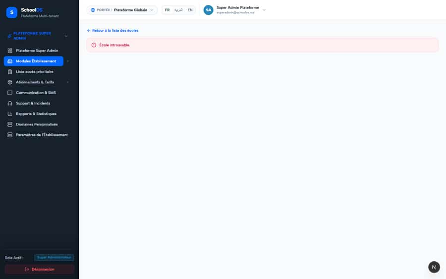
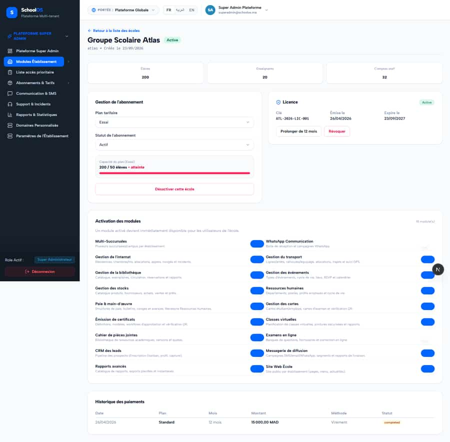

# `/dashboard/super-admin/schools/[id]`

**Status: PASS** · Module: `super-admin` · Source: [`src/app/[locale]/(dashboard)/dashboard/super-admin/schools/[id]/page.tsx`](<../../../../../src/app/[locale]/(dashboard)/dashboard/super-admin/schools/[id]/page.tsx>)

Guard: `requireServerPage` · roles `super_admin`

**Verdict:** No page-specific finding. 2 sweep run(s): 0 clean or expected, 2 flagged. 2 screenshot(s).

## Findings on this page

None specific to this page.

## Sweep results

| Pass | Role | URL tested | Result |
|---|---|---|---|
| Pass C | super_admin | `/dashboard/super-admin/schools/bf635991-1c38-41d7-9999-41f5a04262f9` | **S-44**: 403 /api/settings/branches |
| Pass C | super_admin | `/dashboard/super-admin/schools/00000000-0000-4000-8000-000000000000` | **S-44**: 403 /api/settings/branches expected: 404 /api/super-admin/schools (expected not-found) expected: 404 /api/super-admin/subscriptions/00000000-0000-4000-8000-000000000000 (expected not-found) |

## Screenshots

**Pass C · detail + public pages, 2026-09-23** · super_admin · fr · `/dashboard/super-admin/schools/00000000-0000-4000-8000-000000000000`

**Pass C · detail + public pages, 2026-09-23** · super_admin · fr · `/dashboard/super-admin/schools/bf635991-1c38-41d7-9999-41f5a04262f9`

## Plan

- No action. Keep this page in the regression sweep.

## Cross-cutting findings that also show here

- [S-44](../../findings/S-44.md) (P2) Staff campus switcher renders for parents, students and super admin (403 on every page)
- [S-7](../../findings/S-7.md) (P1) ~1 375 hardcoded French UI strings bypass translation (Arabic UI stays French)
- [S-18](../../findings/done/S-18.md) (P1) Header claims CNDP compliance on every page; the school has not filed
- [S-25](../../findings/done/S-25.md) (P2) Header shows a fake identity when the session call is slow
- [S-37](../../findings/S-37.md) (P2) Arabic: dashboard widgets stay French; brand renders "OSSchool" in RTL
- [S-41](../../findings/done/S-41.md) (P1) Auth rate limit counts every page's session check, per IP
